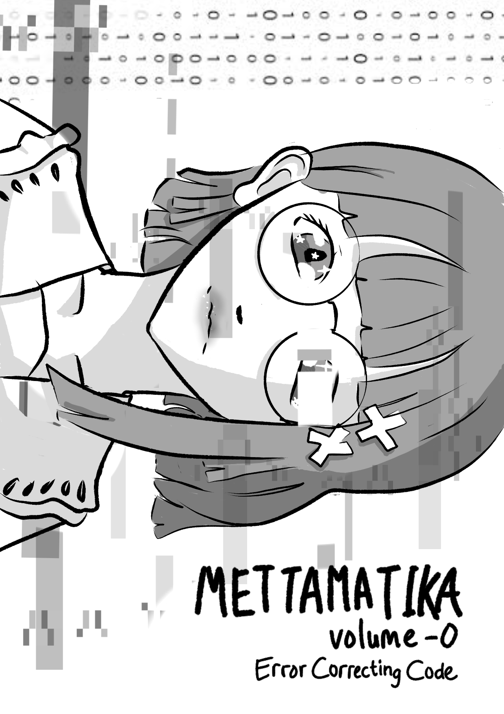
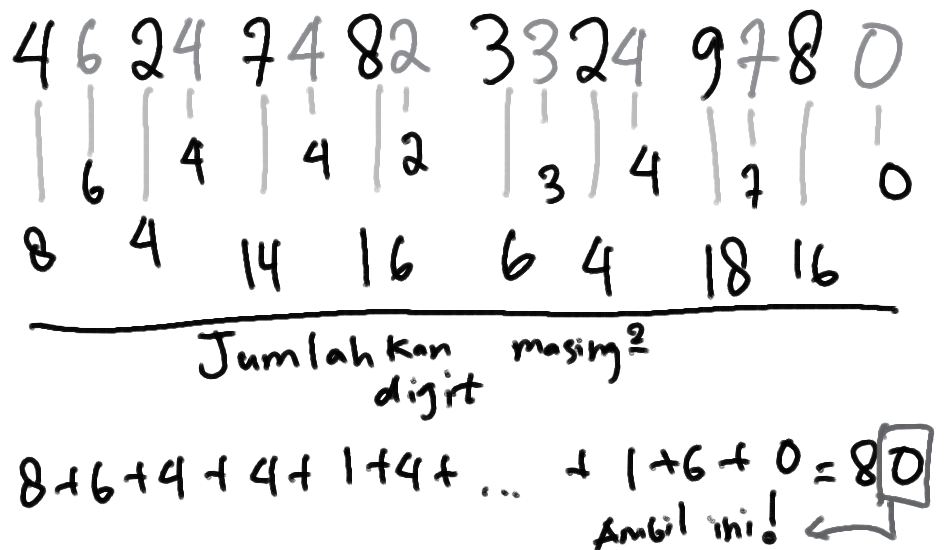
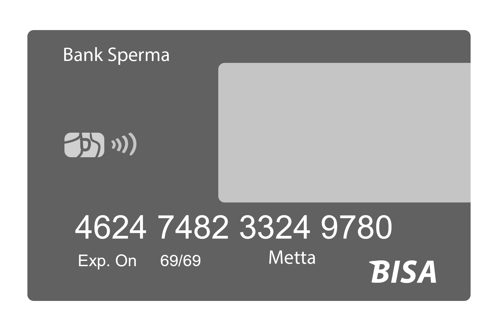
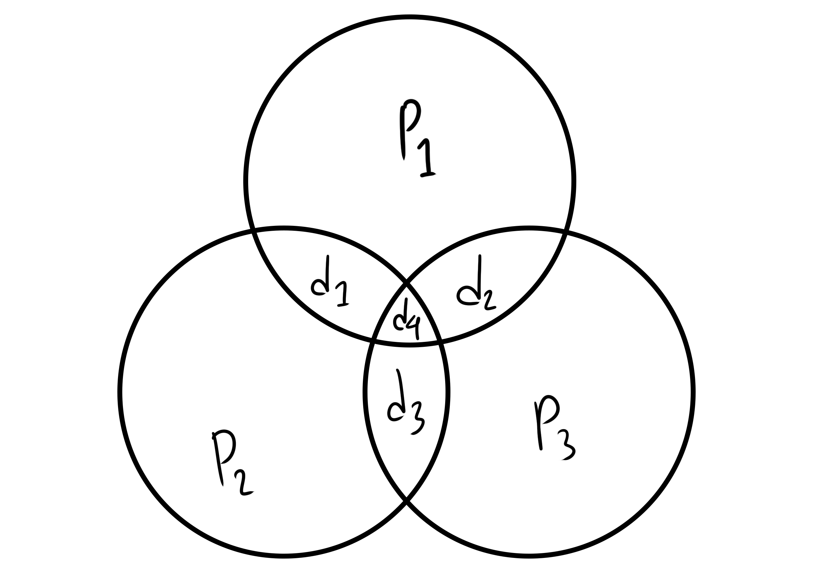
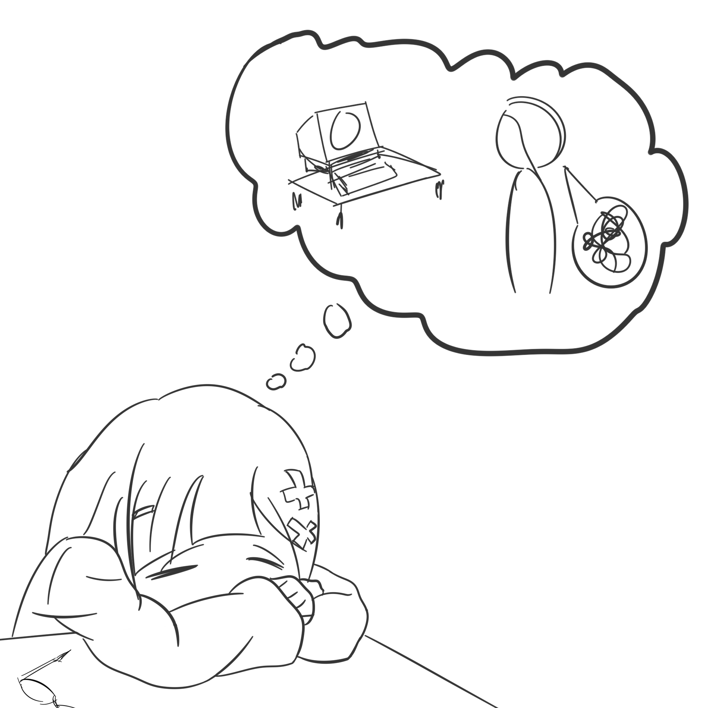

+++
title = "Mettamatika vol. 0: Error Correcting Code"
date = "2023-12-16"
description = "Mettamatika volume 0: Error Correcting Code"
tags = [
    "Mettamatika",
    "Mettamatika vol. 0",
    "Mettamatika Paruh"
]
+++

Metta sedang membongkar koleksi CD lama miliknya untuk kemudian diarsipkan di rak khusus. Dilihatnya CD album dari pelbagai pemusik kondang. Beberapa terlihat CD lama yang menyimpan karya Godbless dan Koes Plus peninggalan ayahnya. Entah merasa terpanggil atau apa, Abdul Malik, kucing milik Metta, tiba-tiba meloncat ke atas CD yang sedang dikurasi oleh Metta. Metta segera mengusirnya, tetapi sial, CD tersebut terlanjur tergores. 

“Duhhh Malik, kamu ini ya main loncat aja sembarangan!”

“Miaw”

Metta segera mengamankan CD lainnya ke dalam boks masing-masing, tetapi ia penasaran apakah CD yang tergores tersebut masih bisa diputar atau tidak. Segera dikeluarkannya pemutar CD yang sedikit berdebu karena lama tak digunakan.

“Wah, ini mah CD rekaman lomba 17an waktuku kecil dulu. Kenapa bisa ada di dalam boks CD musik yah…. Perlu dicek satu-persatu lagi nih koleksinya. Untungnya CD ini masih bisa diputar sih walau tergores, tapi kok bisa yah? Bukannya CD ini menaruh informasinya di piringannya?”

Alih-alih lanjut mengkurasi CD koleksinya, Metta beranjak ke depan PC dan mulai menggali lubang kelinci terkait galat dan pengoreksi galat.

“Waduh, benda apaan nih *cross-interleaved Reed-Solomon coding*? Hm, kayaknya perlu tahu dulu deh coding di sini merujuk ke mana.”

“Oke, pada dasarnya coding di sini merujuk ke cara mengemas informasi. Sederhananya sih kayak kalau kita mau berbagi contekan sama teman ketika ujian, kalau kita kedip mata berarti A, ketuk pensil berarti B, dan sebagainya. Kita mengkodekan informasi menjadi satu hal lainnya.”

Metta lalu menemukan apa yang disebut sebagai cek paritas. Sebagai contoh, jika kita memasukkan kartu kredit dengan nomor 4624 7482 3324 9780 untuk membayar, sistem akan mengecek terlebih dahulu dengan cara mencacah mundur nomor kartu kreditnya, dengan aturan seperti berikut:
* dikalikan dua bila digit ada di posisi genap
* dibiarkan bila digit ada di posisi ganjil

Misal kalau dengan nomor kartu yang di atas, dia akan menghitung pertama digit-digitnya yang telah dikali dua dan menjumlahkan masing-masing digit 

Dari hasil penjumlahan tersebut, akan dilihat digit paling belakangnya. Jika ia berakhir dengan 0, berarti nomor kartunya valid dan sistem transaksi dapat melakukan pengecekan lain yang lebih rumit (seperti mengecek siapa pemilik kartunya, bank mana yang mengeluarkan, dan apakah saldo/limitnya mencukupi). Proses di atas disebut sebagai algoritma Luhn. Ini merupakan salah satu cara untuk mengecek apakah ada kesalahan dalam informasi yang diterima. Jika tidak percaya, coba jalankan algoritma Luhn nomor kartu berikut: 5379 4135 5191 8998 dan periksa apakah sistem pengecek nomor kartu akan menerima nomor tersebut.

“Oke, nemu satu cara untuk mendeteksi adanya galat pada informasi. Namun, dia kan hanya memberi tahu bahwa ada galat, tidak memberi tahu galatnya di mana dan mestinya apa. Yang dilakukan oleh CD kan lebih dari itu. Dia bukan hanya bisa mendeteksi ada galat, tetapi juga tetap bisa mendapatkan informasi yang seharusnya walaupun ada galat.”
Metta terpikir sesuatu. Sebenarnya mudah saja untuk CD tetap bisa mendapatkan informasi yang seharusnya walau ada galat. Simpan saja seluruh informasinya tiga kali. Begitu ada kesalahan, bisa cek dari dua lainnya. 

“Kenapa tidak dua kali saja?” Tanya Abdul Malik.

“Simpan dua kali nggak bisa karena nanti ketika kita dapat keduanya tidak sama, kita tidak tahu mana yang benar. Setidaknya asalkan tidak terlalu parah kesalahannya, hal ini bisa menyelesaikan masalah. Namun, sayang sekali jika harus menggunakan ruang sangat banyak sekadar untuk mengantisipasi kesalahan”, Balas Metta. Metta mulai ke komputernya untuk menggali bagaimana cara melakukan proses koreksi ini seefisien mungkin. Metta mulai membaca beberapa referensi terkait kode pengoreksi galat.

Untuk menyederhanakan, tinjau informasi yang dikodekan menjadi empat buah angka 0/1 saja. Masing-masing nilai ini bisa kita terjemahkan kemudian menjadi pesan tertentu. Misal, kita bisa saja mengartikan 0101 sebagai pesan “Beli dua buah semangka” dan 1101 sebagai pesan “Jual tiga buah anggur”. Kita sebut masing-masing angka itu sebagai **bit data**. Jika hanya ingin mengecek eksistensi galat, kita bisa saja menambahkan satu **bit paritas (bit pengecekan)** lalu melakukan serangkaian operasi (seperti pada algoritma Luhn) agar kalkulasinya menghasilkan suatu angka yang kita tentukan. Bit paritas di sini bisa kita kontrol nilainya agar menghasilkan angka yang barusan kita tentukan. Sebagai contoh, kita mengatur agar jumlah seluruh bitnya (termasuk bit paritas) haruslah genap. Jadi, untuk bit data 1101:
* Kita bisa menambah 1 angka sebagai bit paritas agar hasil penjumlahan digitnya genap. Informasi kita menjadi 11011. Jika ada satu bit yang berubah (misal 11011 berubah menjadi 11010), kita segera tahu bahwa ada kesalahan pada bit data, tetapi tidak tahu ada di mana. Ketika ada dua bit yang berubah kita juga tidak akan tahu bahwa ada kesalahan.
* Atau kita bisa sedikit lebih cerdas, kita bisa menyimpan jumlah dari kombinasi tiga bit data. Notasikan bit data ke-n sebagai \(d_n\), kita bisa menyimpan \(d_1+d_2+d_4\), \(d_1+d_3+d_4\), dan \(d_2+d_3+d_4\). Tentu karena pada skema kode kita hanya menginginkan angka 0 atau 1 saja, kita cukup simpan sebagai 0 bila hasil penjumlahannya genap dan 1 bila ganjil. Sebagai konsekuensi dari sistem penjumlahan seperti ini, jumlah dari dua bilangan yang sama senantiasa nol (karena jumlah dua bilangan apapun pastilah genap – dengan kata lain, \(x+x = 2x\)). Tiga jumlahan ini cukup untuk kita menyimpan informasi dari bit-bit data kita lainnya, seperti yang terlihat pada diagram Venn di bawah.

Dari diagram di atas, terlihat juga kenapa kita tidak perlu menyimpan kombinasi \(d_1+d_2+d_3\), yakni karena informasi untuk mengecek bila terjadi galat pada salah satu dari \(d_1\), \(d_2\), atau \(d_3\) kita akan mendeteksinya via kombinasi lainnya. Kita namai masing-masing kombinasinya \(p_1\), \(p_2\), dan \(p_3\) (p dari kata “paritas”). 

|     \(p_1\)     |     \(p_2\)     |     \(p_3\)     |
|-----------------|-----------------|-----------------|
| \(d_1+d_2+d_4\) | \(d_1+d_3+d_4\) | \(d_2+d_3+d_4\) |

Jika informasi yang kita ingin kirimkan adalah 1011, kita simpan dia dalam bentuk (\(p_1\), \(p_2\), \(d_1\), \(p_3\), \(d_2\), \(d_3\), \(d_4\)), atau menjadi 0110011. Kita sebut ini sebagai **katakode**. Andai terdapat kesalahan, misal ia berubah menjadi 0110010, kita langsung tahu bahwa ada galat pada data yang kita terima karena \(d_1+d_2+d_4\) bernilai 1 dari seharusnya bernilai 0. Lebih canggih lagi, kita bisa mendesain kalkulasi berikut. 

Misal kita menerima kode (\(a_1\), \(a_2\), \(a_3\), \(a_4\), \(a_5\), \(a_6\), \(a_7\)). Kita bisa menghitung

|       \(h_1\)       |       \(h_2\)       |       \(h_3\)       |
|---------------------|---------------------|---------------------|
| \(a_1+a_3+a_5+a_7\) | \(a_2+a_3+a_6+a_7\) | \(a_4+a_5+a_6+a_7\) |

Pada contoh di atas tadi, bila kita menerima 0110010, kita akan mendapatkan:

| \(h_1\) | \(h_2\) | \(h_3\) |
|---------|---------|---------|
|    1    |    1    |    1    |

Jika kita jejer menjadi 111, kita dapatkan konversi biner ke desimal 111 → 7 (yakni \(1*2^0 + 1*2^1 + 1*2^2\)), kita ketahui bahwa galat terjadi pada digit ketujuh (dan bisa segera kita koreksi dengan menukar 0 ke 1). Salah satu ide jenius dari penyusunan ini adalah skema \(h_1\), \(h_2\), dan \(h_3\) yang dapat memberi tahu di mana ada galat dan mengoreksi galatnya. Misalkan tidak terjadi galat, kita dapatkan bahwa:

$$
\begin{align}
h_1 & = a_1+a_3+a_5+a_7
   = p_1+d_1+d_2+d_4
   = - (d_1+d_2+d_4) + d_1+ d_2+d_4
   = 0
\end{align}
$$

dan serupa juga untuk \(h_2\) dan \(h_3\) (cobalah!). Jadi, jika kita mendapatkan  \(h_1\), \(h_2\), dan \(h_3\) semuanya nol, setidaknya kita bisa tahu bahwa tidak terjadi satu atau dua buah kesalahan bit (skema ini bisa mendeteksi dua buah kesalahan bit, tetapi hanya bisa mengoreksi satu buah kesalahan bit).
Jika ada kesalahan, misal a4 berubah menjadi \(a_4 + ε\), kita akan mendapatkan

| \(h_1\)         | \(h_2\)         | \(h_3\)             |
|-----------------|-----------------|---------------------|
| \(a1+a3+a5+a7\) | \(a2+a3+a6+a7\) | \((a4+ε)+a5+a6+a7\) |
| \(= 0\)         | \(= 0\)         | \(= ε\)             |

Karena skema kita hanyalah 0 atau 1, ε berarti bernilai 1 (karena 0 + 1 = 1 dan 1 + 1 = 0, *bit flip* sama saja dengan penjumlahan dengan 1). Dengan kata lain, kita dapatkan 100 (pada basis 2) yang berarti 4 pada basis 10 (desimal). Jadi, galat terjadi pada bit keempat. Bagaimana bila terjadi dua kesalahan? Untuk menjawab pertanyaan tersebut, kita perlu mengenal satu konsep lagi. Misalkan \(A =(a_1, a_2, a_3,a_4,a_5,a_6,a_7)\) dan \(B = (b_1, b_2, b_3,b_4,b_5,b-6,b_7)\) dua buah kata kode. Kita katakan **jarak Hamming** dari A dan B sebagai banyaknya bit yang berbeda di posisi yang sama dari A dan B. Kita notasikan jarak Hamming dari A dan B sebagai d(A,B) (dari kata *distance*). Sebagai contoh, katakode A = 0000000 dan B = 1110000 memiliki jarak Hamming 3, karena tiga bit pertama dari B bernilai berbeda dari A. Sekarang, dengan skema pengkodean yang kita miliki, kita mengkodekan \((d_1,d_2, d_3, d_4)\) menjadi \((p_1, p_2, d_1, p_3, d_2, d_3, d_4)\). Mungkinkah pengkodean tersebut menghasilkan dua katakode dengan jarak Hamming 2?

Andaikan A dan B memiliki dua perbedaan dan keduanya perbedaannya adalah pada bit data, misalkan pada d1 dan d2, maka karena \(p2=d_1+d_3+d_4\) dan \(p_3=d_2+d_3+d_4\), dijamin \(p_2\) dan \(p_3\) pada A dan B juga akan berbeda. Mudah diverifikasi dengan cara serupa untuk menunjukkan bahwa pemilihan perbedaan pada bit data lain akan menghasilkan hasil serupa. Akibatnya, A dan B memiliki lebih dari dua perbedaan.

Bila perbedaannya ada pada bit paritas, misalkan pada \(p_1\) dan \(p_2\), kita akan mendapatkan jumlahan d1+d2+d4 pada A dan B berbeda (dan demikian juga jumlahan \(d_1+d_3+d_4\) ). Akibatnya, salah satu dari \(d_1\), \(d_2\), \(d_3\), atau \(d_4\) haruslah berbeda juga, sehingga tidak mungkin A dan B berbeda hanya pada dua posisi. Lagi-lagi kita bisa jalankan argumen serupa untuk bit paritas lainnya.

Terakhir, bila perbedaan ada pada salah satu dari bit data dan salah satu dari bit paritas. Misalkan perbedaan terjadi pada \(d_1\) dan \(p_1\). Berarti jumlahan \(d_1+d_3+d_4\) pada A dan B berbeda. Akibatnya, haruslah setidaknya salah satu dari \(d_3\) dan \(d_4\) juga berbeda. Jadi, lagi-lagi perbedaannya tidak mungkin terjadi hanya pada dua buah bit. Kita bisa dengan penuh kegigihan menjalankan hal serupa untuk kombinasi lainnya untuk mendapat hasil serupa. 

Karena skema kita tidak akan menghasilkan katakode dengan jarak Hamming 2, kesalahan pada dua posisi akan menghasilkan katakode yang tidak valid. Dengan demikian, kita akan tahu bahwa terjadi kesalahan (tetapi kita tidak bisa memperbaikinya).

*(Note: Pembaca yang cukup rajin dapat mencoba membuktikan bahwa skema pengkodean yang kita miliki akan menghasilkan katakode dengan jarak Hamming minimal 3)*

Kita bisa cukup pede mengoreksi jika terjadi satu buah kesalahan, tetapi jika kita dapatkan \(h_3h_2h_1\) = 000, belum tentu kode yang kita terima bebas dari kesalahan. Namun, hal ini lebih baik daripada tidak menggunakan skema pengoreksi galat sama sekali jika kita membutuhkan sistem yang lebih resilien terhadap kesalahan.

*(Note: untuk pembaca yang pernah belajar aljabar linear, skema hitungan di atas lebih bagus dinyatakan sebagai perkalian matriks)*

Skema di atas disebut sebagai kode Hamming, diciptakan oleh Richard Hamming pada tahun 1950. Lebih spesifiknya, skema di atas adalah kode Hamming(7,4), karena ia menggunakan 7 bit untuk mengkodekan 4 bit informasi. Sejak saat itu, banyak sekali skema lainnya yang lebih kompleks bermunculan, terinspirasi dari ide Pak Hamming. Salah satunya adalah skema CIRC (*cross interleaved Reed-Solomon code*) yang ditemui Metta di awal. Inilah yang digunakan untuk mengoreksi galat dari goresan pada CD. Modifikasi dari skema Reed-Solomon juga digunakan untuk berbagai hal, seperti mentransmisikan data dari satelit, menambah redundansi data pada penyimpanan server yang perlu reliabilitas tinggi (skema RAID, misalnya), dan lain-lain.

Metta melihat jam sudah menunjukkan pukul 2 pagi ketika ia selesai *googling*. Dengan tumpukan CD yang masih berantakan, ia memutuskan untuk melanjutkan kurasinya selepas ia tidur. Mimpi indah Metta kala itu dihiasi dengan pertemuannya dengan Pak Richard Hamming yang sedang marah-marah pada komputer karena hanya memberi tahu ada galat tanpa bisa memberi tahu di mana galatnya. 

## References:
* “History of Hamming Codes”. Archive link https://web.archive.org/web/20071025020847/https://biobio.loc.edu/chu/web/Courses/Cosi460/hamming_codes.htm.
* Moon, Todd K. (2005). Error Correction Coding. New Jersey: John Wiley & Sons. ISBN 978-0-471-64800-0.
* IBM documentation. (n.d.). https://www.ibm.com/docs/en/order-management-sw/9.3.0?topic=cpms-handling-credit-cards.

Tim:
* adriantom9
* izzako
* ValeSuamiSahHayaseYuuka
* Muhammad Pambudi Wicaksono
* AuvioraA
* kucingeprek
* Furra
* Rubi

Mettamatika vol. 0 – Error Correcting Code

Text: ValeSuamiSahHayaseYuuka

Illustration: izzako

Cover: kucingeprek

Spearhead Circle @ D-54 Comic Frontier 17