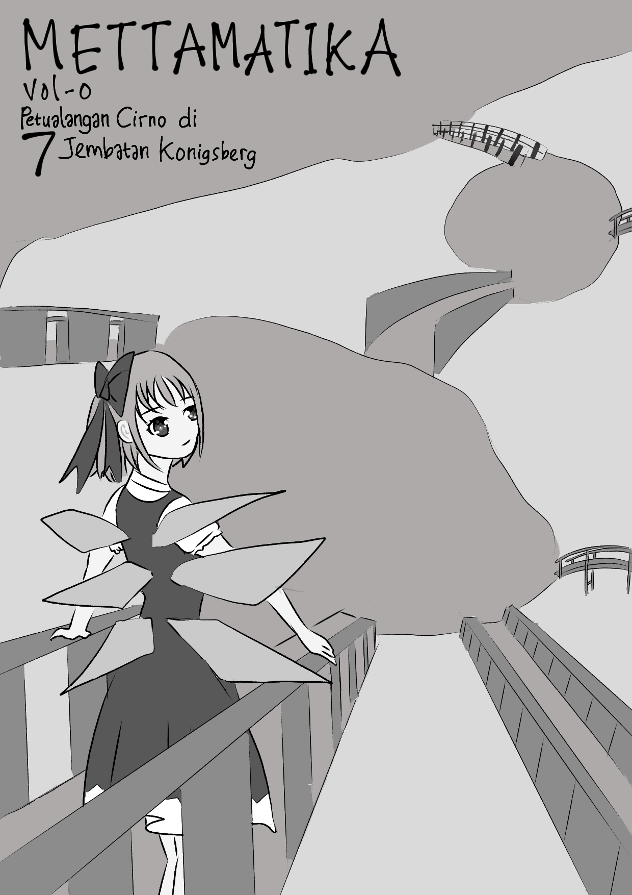
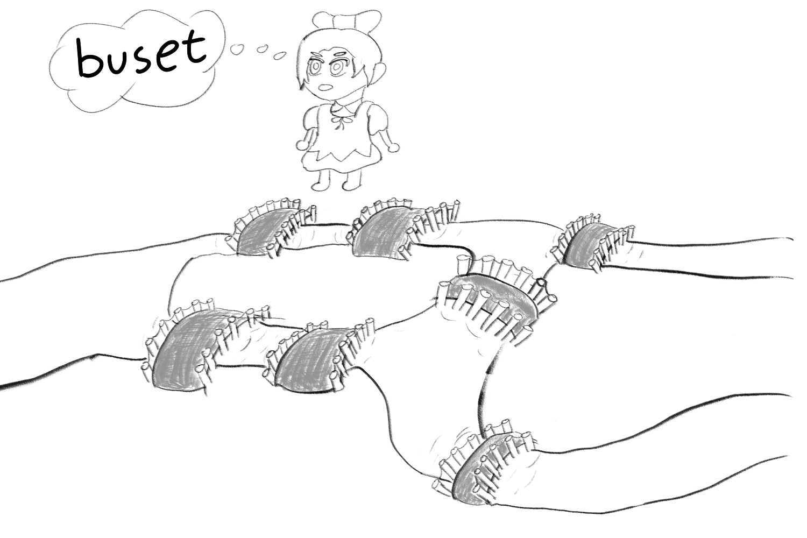
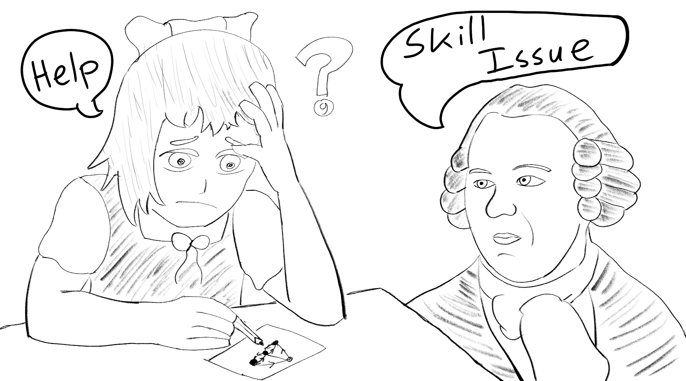
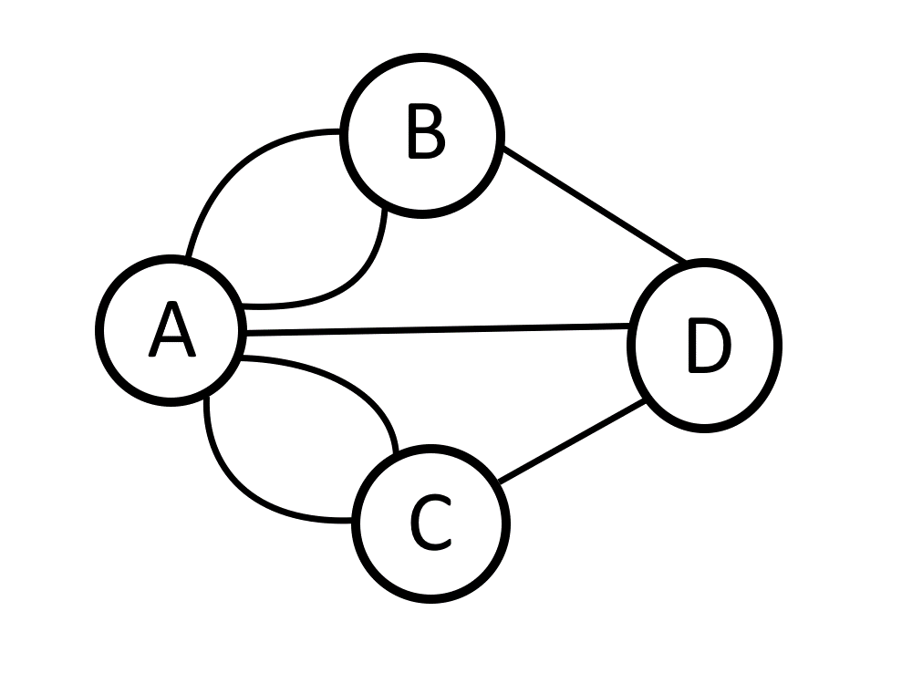
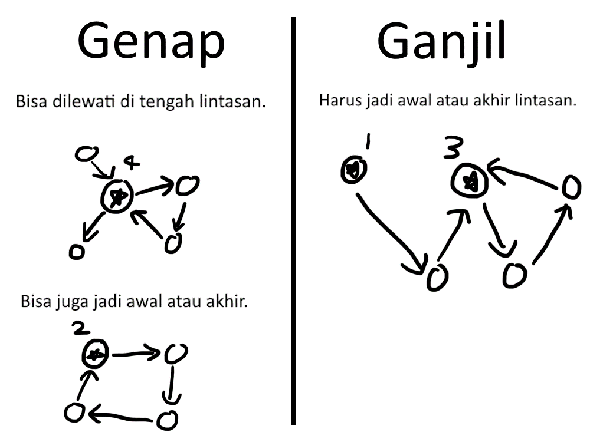
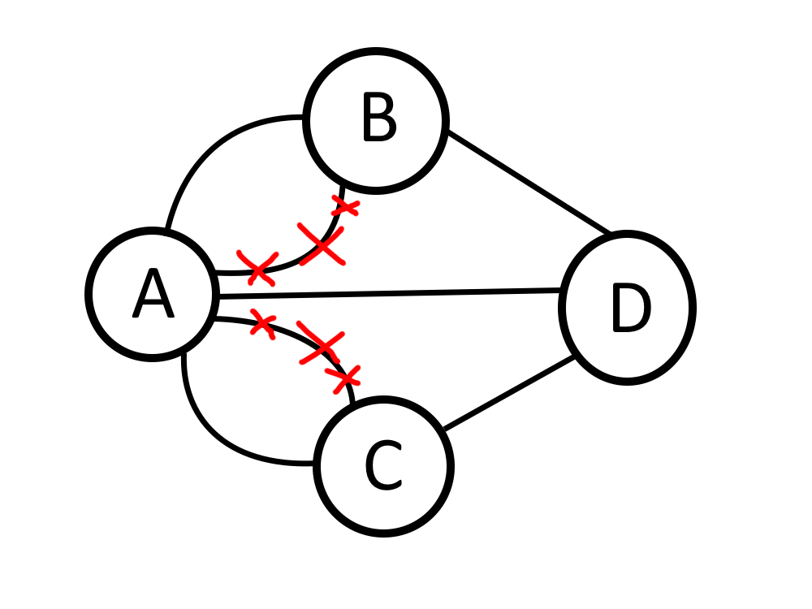
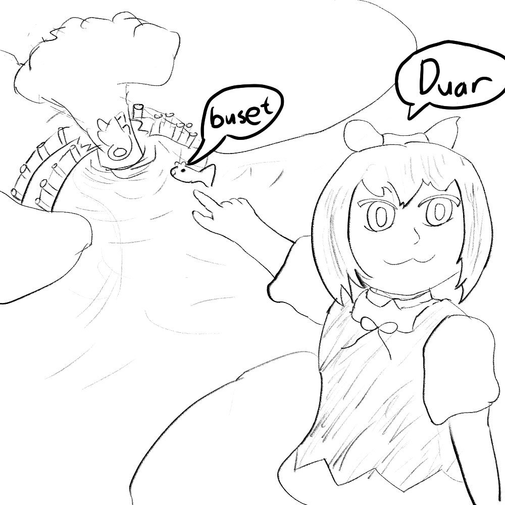
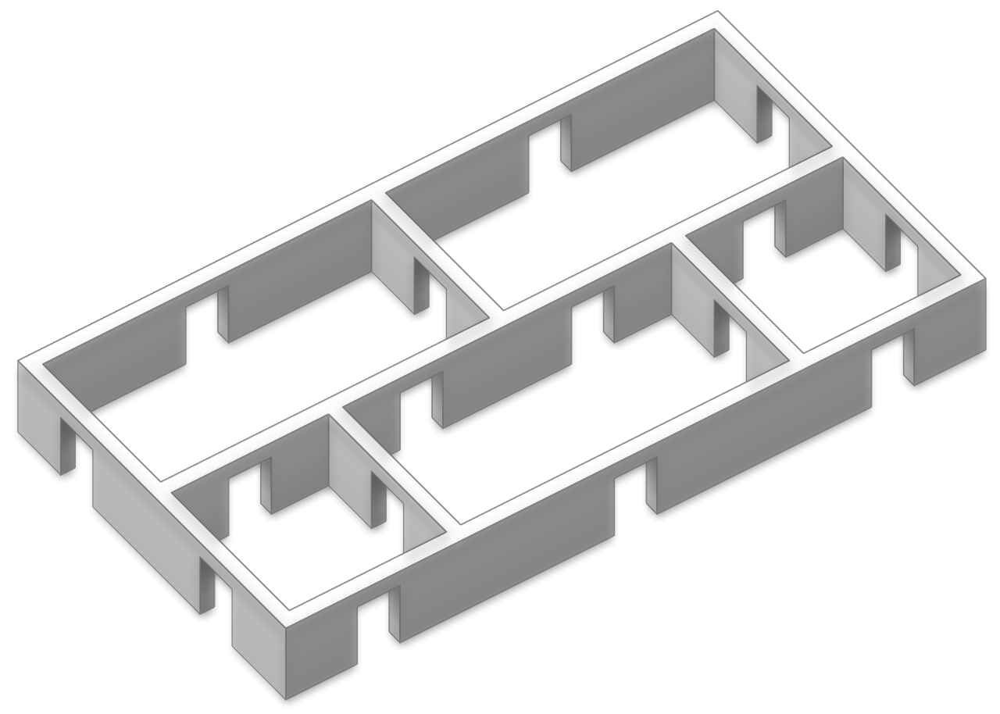

+++
title = "Mettamatika vol. 0: Petualangan Cirno di 7 Jembatan Konigsberg"
date = "2023-12-16"
description = "Mettamatika volume 0: Petualangan Cirno di 7 Jembatan Königsberg"
tags = [
    "Mettamatika",
    "Mettamatika vol. 0",
    "Mettamatika Paruh"
]
+++

# Selamat Datang di Königsberg!

Cirno sedang kebingungan menghadapi sebuah persoalan di Königsberg. Sebuah soal matematika yang hanya menggunakan sedikit saja angka dan rumus. Dapatkah kalian membantu Cirno memecahkannya?

 
**Soal**: Bisakah Cirno berjalan melalui 7 jembatan ini, tanpa melintasi jembatan yang sama dua kali?

# Kok Susah Ya?

Setelah mencoba beberapa kali, mungkin kalian akan merasa bahwa tidak mungkin membuat lintasan yang sesuai permintaan di soal. Atau lebih tepatnya, jawaban dari pertanyaan di depan adalah **tidak bisa**. Tapi bagaimana kita bisa tahu bahwa jawaban itu tepat?

Salah satu cara adalah dengan mencoba dan mencatat semua **lintasan** yang mungkin, tapi tentu saja sangat banyak jumlahnya. Ratusan, bahkan mungkin ribuan! Ini cara yang bisa menghasilkan jawaban yang tepat, tapi **tidak efisien**. Apabila besok ada yang membangun jembatan yang baru, kita harus **mengulang proses ini dari awal lagi**. Sepuh matematika, tolonglah Cirno!

Seorang matematikawan bernama **Leonhard Euler** dapat menyelesaikan masalah ini. Bahkan jika terdapat **ratusan pulau** dengan **ribuan jembatan**, Dia bisa menemukan jawaban soal **dalam 5 menit**, tanpa **menggambar satu pun lintasan.**

Teori yang dia ciptakan untuk memecahkan masalah ini sekarang dikenal sebagai teori graf. Teori graf sekarang diterapkan dalam berbagai ilmu, terutama ilmu komputer.

# Teori Graf 101

Pertama, supaya saya tidak lelah menggambar, kita harus **menyederhanakan bentuk** pulau dan jembatan, menjadi sebuah **graf** yang terbentuk dari **titik** dan **sisi**. Banyaknya sisi yang terhubung ke sebuah titik disebut **derajat** dari titik tersebut. Contohnya titik A punya derajat 5, sementara titik-titik yang lain punya derajat 3. 

# Jurus Ganjil Genap (Bukan Jakarta)

Sekarang kita ingin mencari sebuah lintasan yang melintasi semua sisi sebuah graf, tanpa melintasi sisi yang sama dua kali. Lintasan yang memenuhi aturan disebut **Lintasan Euler**. 

Kuncinya adalah melihat derajat tiap titik, apakah **ganjil** atau **genap**. Setelah mencoba membuat lintasan, kita akan menyadari bahwa titik yang **dilewati di tengah** lintasan **harus berderajat genap**. Sementara titik berderajat **ganjil harus jadi awal atau akhir** lintasan.
 

**Mengapa** titik **di tengah lintasan harus berderajat genap**? Karena setiap kali kita **masuk**, kita harus **keluar**. Artinya, sisi yang masuk dan keluar **berpasangan**, maka jumlah totalnya genap.

Sebuah graf **memiliki** lintasan Euler apabila:
1. **Semua** titik derajatnya genap.
2. Atau, ada **tepat dua titik** dengan derajat **ganjil**.

Sebaliknya, sebuah graf tidak memiliki lintasan Euler apabila ada **lebih dari dua titik** berderajat **ganjil**.

Semua titik di Königsberg memiliki derajat ganjil. Apabila kita pilih 1 titik sebagai awal dan 1 titik sebagai akhir, 2 titik lainnya juga memiliki derajat ganjil, namun dia bukan awal ataupun akhir.

Artinya, **tidak mungkin** membuat **Lintasan Euler** untuk graf **7 jembatan Königsberg**.

# Epilog

Kisah Euler berakhir di sini, namun kisah Königsberg masih berlanjut. Kota ini menjadi sasaran bom oleh sekutu saat Perang Dunia 2. 

Dua jembatan hancur karena bom tersebut. Sekarang ada Lintasan Euler! Sukses! Cirno senang!

Soal Bonus
1. Adakah lintasan yang melewati semua pintu, tanpa melewati pintu yang sama dua kali?

2. Gambar contoh graf yang tidak punya lintasan Euler.
3. Gambar 2 contoh graf yang punya lintasan Euler.
3. Adakah graf dengan tepat satu buah titik berderajat ganjil? Hint: Jumlahkan derajat dari semua titik. Adakah sebuah pola? 

## Curhatan Penulis
Halo, saya Rubi! Mahasiswa matematika yang sedang menikmati/menderita studi lanjut. Salam kenal! 

Aku ingin membuat matematika.menjadi keilmuan yang terlihat lebih keren. Aku ingin menyampaikan sisi matematika yang jarang terlihat di sekolah dan di Indonesia. Matematika sebagai ilmu yang indah, bermanfaat, dan memuaskan. Kalian tidak harus menjadi ahli matematika, minimal mau mengapresiasi dan mencoba sedikit.

Medsos dan Portofolio:
* [https://twitter.com/Rubicoded](https://twitter.com/Rubicoded)
* [https://linktr.ee/mugmugrubio](https://linktr.ee/mugmugrubio)

 
## Referensi
* [https://en.wikipedia.org/wiki/Seven_Bridges_of_Königsberg](https://en.wikipedia.org/wiki/Seven_Bridges_of_Königsberg)
* https://en.wikipedia.org/wiki/Five_room_puzzle
* https://en.touhouwiki.net/wiki/Cirno

Tim:
* adriantom9
* izzako
* ValeSuamiSahHayaseYuuka
* Muhammad Pambudi Wicaksono
* AuvioraA
* kucingeprek
* Furra
* Rubi

Mettamatika vol. 0 – Petualangan Cirno di 7 Jembatan Königsberg

Text: Rubi

Illustration: Rubi

Cover: kucingeprek

Spearhead Circle @ D-54 Comic Frontier 17