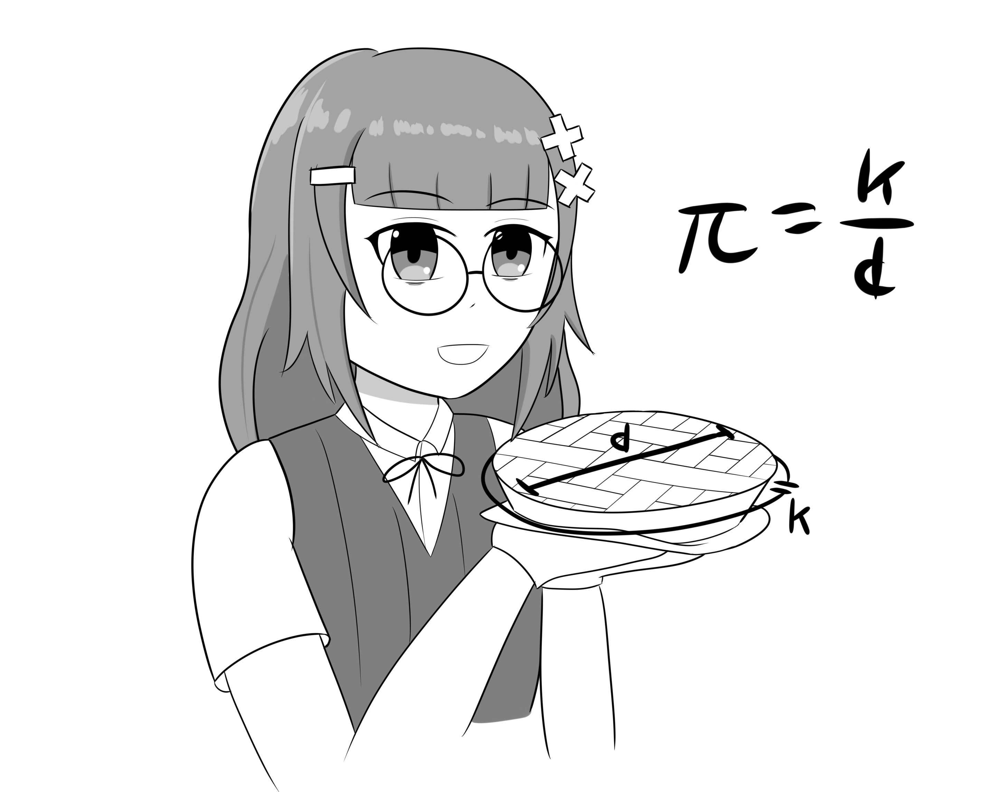
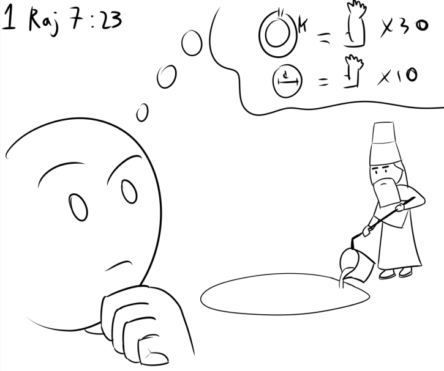
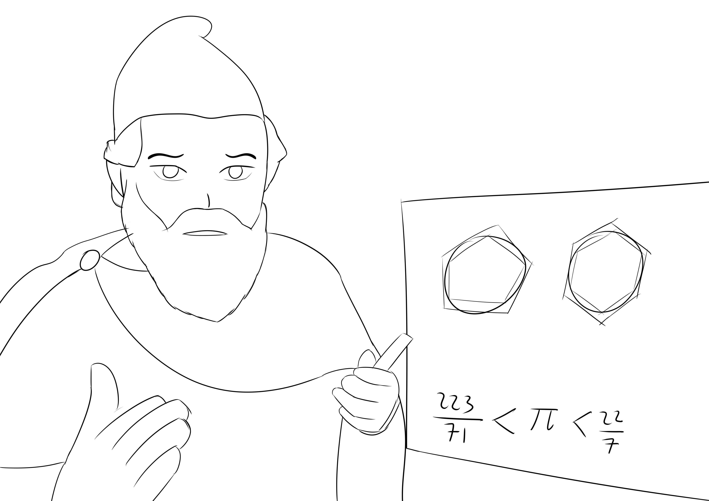
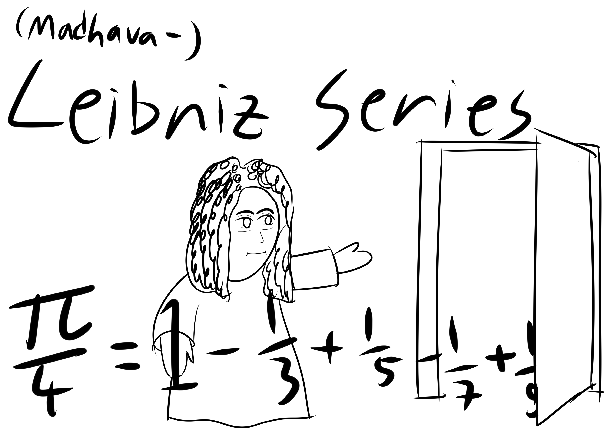
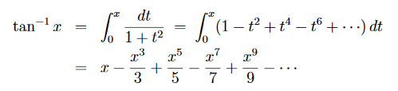
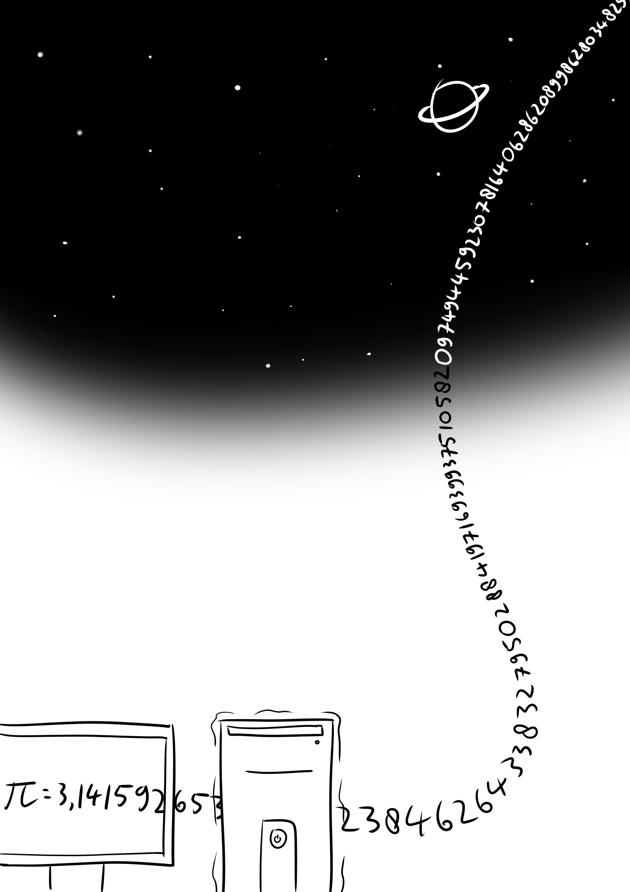

+++
title = "Mettamatika vol. 0: Pi"
date = "2023-12-16"
description = "Mettamatika volume 0: Pi"
tags = [
    "Mettamatika",
    "Mettamatika vol. 0",
    "Mettamatika Paruh"
]
+++

Coba lihat ban mobil, jam dinding, tutup gelas, bundaran tugu Pamulang, apa kesamaan yang dimiliki oleh objek-objek ini? Benar, objek-objek ini berbentuk lingkaran dan semuanya buatan manusia! Tapi, bagaimana lebih tepatnya manusia membuat objek-objek yang berbentuk lingkaran? Bagaimana cara mereka menghitung keliling lingkaran? Mungkin untuk bentuk-bentuk seperti bujur sangkar dan persegi panjang dapat diketahui dengan mudah panjang keliling dan luas bangunnya, tapi bagaimana dengan lingkaran? Bentuknya yang melengkung membuat perhitungan keliling dan luas tidak semudah itu.

Inilah ketika bilangan **pi** berperan. Bentuk lingkaran dan bilangan pi selalu berhubungan erat, dan segala perhitungan yang melibatkan lingkaran pasti memiliki pi di rumusnya. Tapi, sebenarnya apakah bilangan pi itu?

Ambil benda apapun yang berbentuk lingkaran, contoh: ban motor, gelas plastik, planet Mars, dll. Ukur kelilingnya (bisa menggunakan meteran baju, benang, dll), kemudian ukur diameternya. Bagikan antara keliling dengan diameter, apapun benda yang diukur, pasti hasil dari pembagian antara keliling dan diameter tidak jauh dari 3. Itulah bilangan **pi**, rasio antara keliling lingkaran dengan diameter. Bilangan pi sendiri sebesar **3,14**.

Sejak tahun 2000 sebelum Masehi, manusia sudah mengenal konsep bilangan pi. Saat ini reporter kami, Metta, sudah berada bersama warga Mesir kuno dan Babylon kuno di dalam ruangan meeting online. Mari kita tanya kepada mereka, berapa nilai pi itu?

*Mesir: 256/81!*

*Babylon: 3,125!*

*Waduh, malah berantem.*

*Dikutip dari 1 Raja-raja 7:23, “Kemudian dibuatnyalah "laut" tuangan yang sepuluh hasta dari tepi ke tepi, bundar keliling, lima hasta tingginya, dan yang dapat dililit berkeliling oleh tali yang tiga puluh hasta panjangnya.”, kira2 970–931 SM*

Karena keterbatasan teknologi pada masa itu, manusia masih menggunakan cara manual, yaitu mengukur perbandingan antara keliling dengan diameter dari benda lingkaran apapun yang dapat mereka temukan. Pencarian bilangan pi yang dilakukan secara teliti dan mendalam pertama kali dilakukan oleh Archimedes pada tahun 250 SM dengan metode poligon.
 

Metode poligon ini berangkat dari asumsi bahwa lingkaran adalah bentuk segi-tak-terbatas. Bayangkan sebuah lingkaran, kemudian bayangkan ada dua segitiga sama sisi, yang satu mengelilingi dan mengurung lingkaran tersebut, kemudian menyusut hingga sisinya mentok dengan lingkaran itu, yang satu lagi berada di dalam dan terkurung oleh lingkaran tersebut, kemudian membesar sampai ujungnya mentok dengan sisi lingkaran tersebut. Hitung keliling dari kedua segitiga tersebut, nilai keliling lingkaran pasti berada diantara kedua segitiga tersebut.

Sekarang tambah jumlah sisi pada kedua segitiga tersebut. Segiempat luar dan dalam akan terlihat lebih mepet ke lingkaran. Tambah lagi sisinya, semakin banyak jumlah sisinya kedua poligon luar dan dalam akan semakin mepet ke lingkaran.

Dengan metode ini, Archimedes berhasil mendapatkan nilai pi berada di antara 223/71 dengan 22/7, atau dalam bentuk desimal, 3,1408… < pi < 3,1428, dengan menggunakan bentuk poligon segi-96. Metode serupa digunakan untuk meraih nilai-nilai pi yang lebih akurat, seperti Ptolemy (150 M) (pi = 377/120) dan Tsu Chung-Chih (abad kelima) (pi akurat sampai ke tujuh digit).

Metode poligon sudah ada selama sekitar 1600 tahun, dan rekor angka pi terakurat masih berada di 14 bilangan di belakang koma. Rekor tersebut dipegang oleh Al-Kashi dari Samarkand pada sekitar tahun 1430. Penemuan kalkulus oleh Newton dan Leibniz pada tahun 1600an menyumbangkan banyak rumus-rumus baru dalam penemuan digit-digit pi lainnya, dengan salah satu metode umum yang dipakai adalah dengan ekspansi deret Taylor.

Sampai pada tahun 1946, penghitungan nilai pi dilakukan secara manual di atas kertas dengan rekor tertinggi 620 digit oleh D.F. Ferguson. Terobosan berikutnya dalam penghitungan digit pi datang bersamaan dengan ditemukannya teknologi baru: **komputer**.
 

Dengan terobosan baru berupa komputer, pemecahan rekor digit terbanyak pi hanyalah masalah performa prosesor. Sejak tahun 1989, semua komputasi digit pi menggunakan algoritma Chudnovsky. Sampai saat ini, digit pi terbanyak yang berhasil ditemukan sebanyak 100 triliun digit.

Kenapa matematikawan rela mencari banyak digit pi sampai triliunan? Sebelum era komputer, motivasi untuk mencari sebanyak mungkin digit pi adalah untuk mencari pola berulang dalam pecahan pi, atau dalam kata lain mencoba membuktikan bahwa pi adalah bilangan rasional. Barulah di abad ke-18 akhir Lambert dan Legendre membuktikan bahwa pi adalah bilangan irasional, atau bilangan yang tak dapat dinyatakan dalam pecahan bilangan bulat.

1/11=0.090909…

Angka “09” berulang, oleh karena itu 1/11 adalah bilangan rasional.

π=3.1415…

Tidak ada angka berulang, oleh karena itu π bukanlah bilangan rasional.

Mungkin untuk kegiatan sehari-hari, seperti membangun rumah, jumlah digit pi yang diperlukan hanyalah sampai 3,14 saja. Namun, ada beberapa aplikasi dimana toleransi yang dibutuhkan jauh lebih sempit. Contohnya, NASA menggunakan pi dengan 15 digit di belakang koma: 3.141592653589793.

Walaupun standar NASA, yang saat ini merupakan standar paling tinggi, hanya butuh **15 digit** di belakang koma, mengapa para matematikawan masih terus mencoba menembus rekor jumlah angka di belakang koma? Karena… penasaran aja. Rasa penasaran manusia yang ingin mengetahui lebih banyak lagi digit pi dari dulu memaksa manusia untuk menemukan metode-metode komputasi yang lebih efisien, dan metode-metode numerik ini lah yang juga dapat diterapkan dalam bidang-bidang lain.

## References
* David H. Bailey, J. M. (1997). The Quest for Pi. Mathematical Intelligencer, 50-57.
* NASA/JPL Edu. (2022, October 24). How Many Decimals of Pi Do We Really Need? Retrieved from NASA/JPL Edu: https://www.jpl.nasa.gov/edu/news/2016/3/16/how-many-decimals-of-pi-do-we-really-need/

Tim:
* adriantom9
* izzako
* ValeSuamiSahHayaseYuuka
* Muhammad Pambudi Wicaksono
* AuvioraA
* kucingeprek
* Furra
* Rubi

Mettamatika vol. 0 – Pi
Text: adriantom9
Illustration: adriantom9
Cover: kucingeprek

Spearhead Circle @ D-54 Comic Frontier 17