+++
title = "Mettamatika vol. 0: Survivorship Bias"
date = "2023-12-16"
description = "Mettamatika volume 0: Survivorship Bias"
tags = [
    "Mettamatika",
    "Mettamatika vol. 0",
    "Mettamatika Paruh"
]
+++

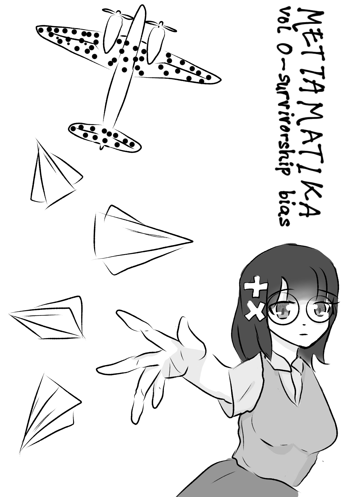

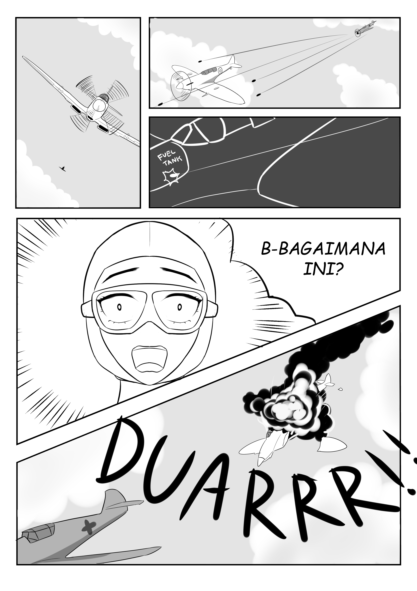

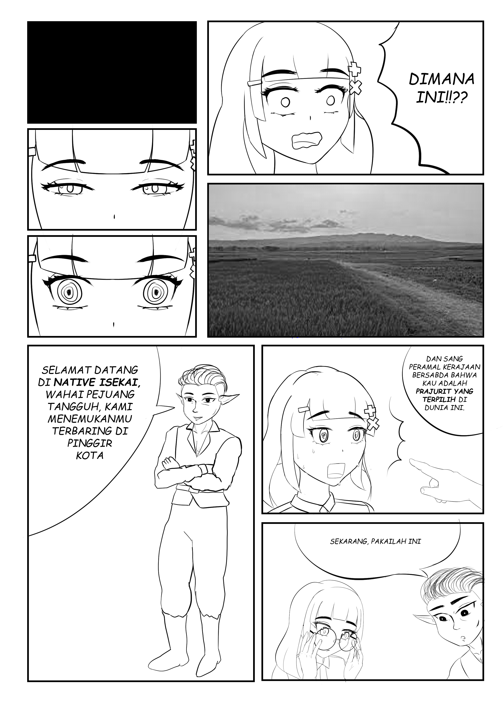

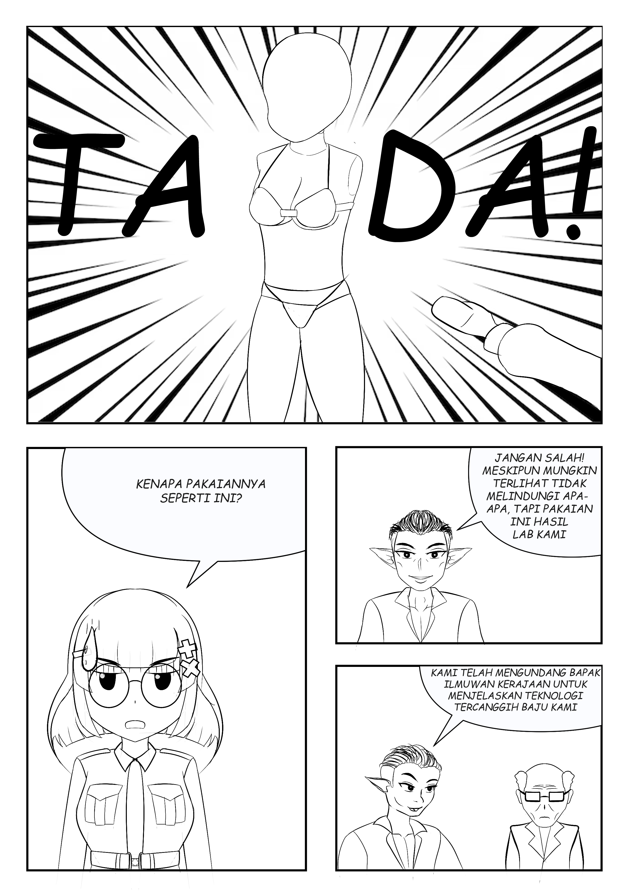

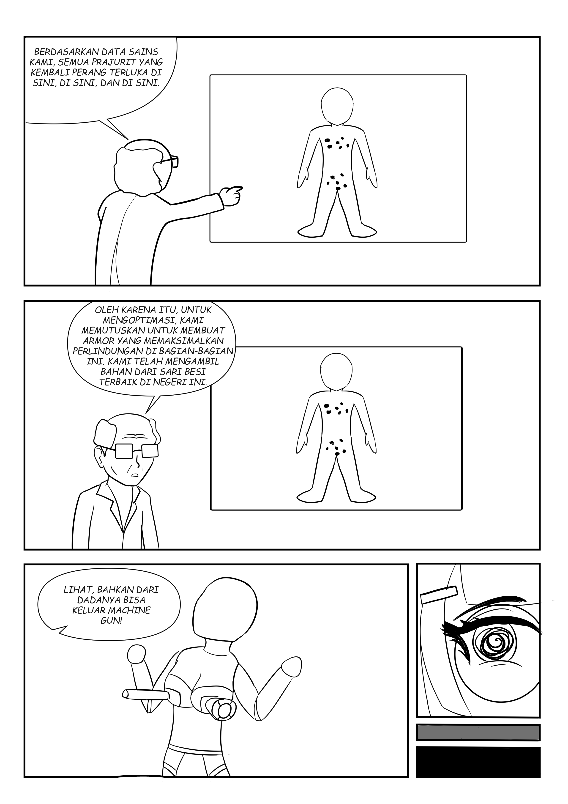

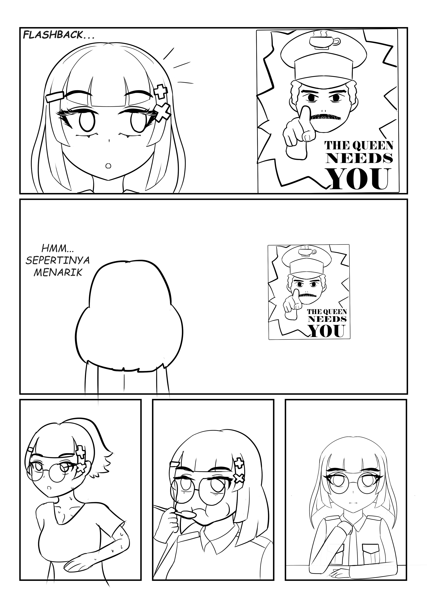

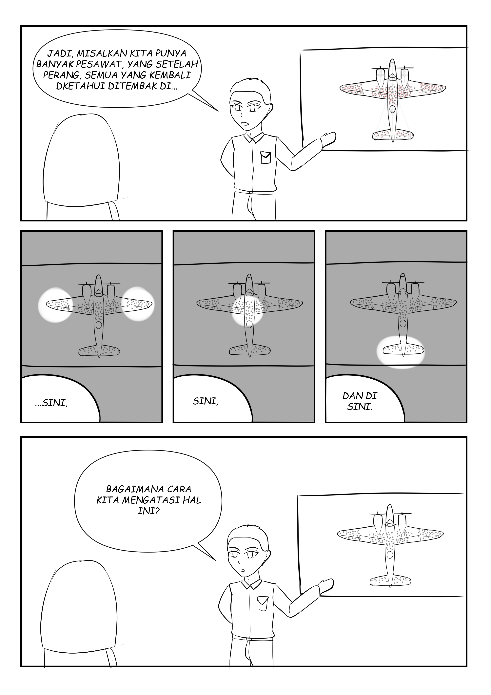

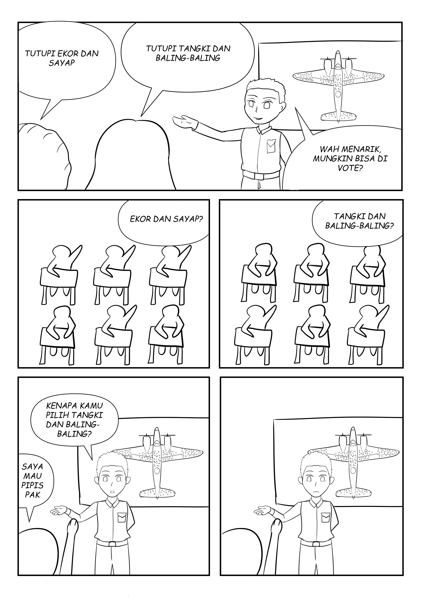

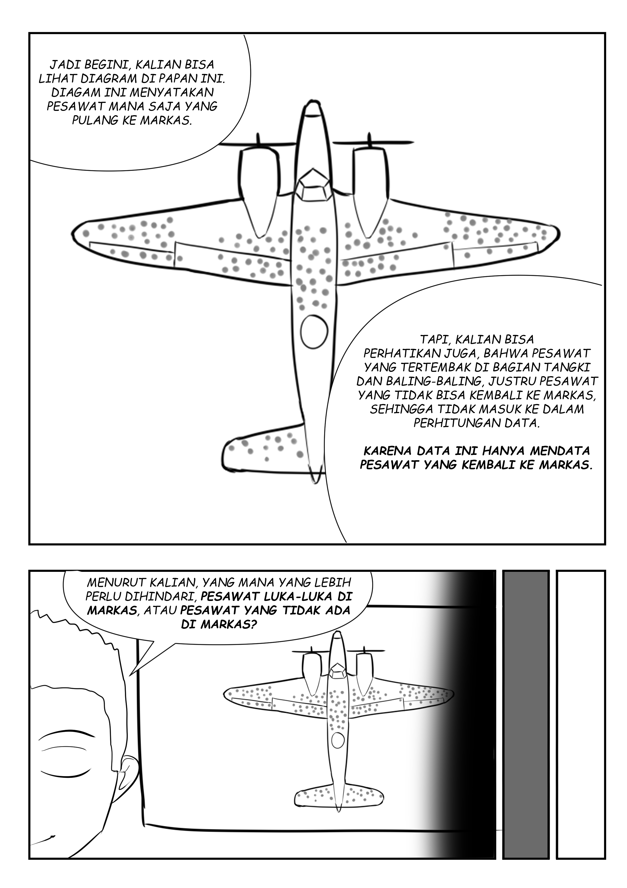

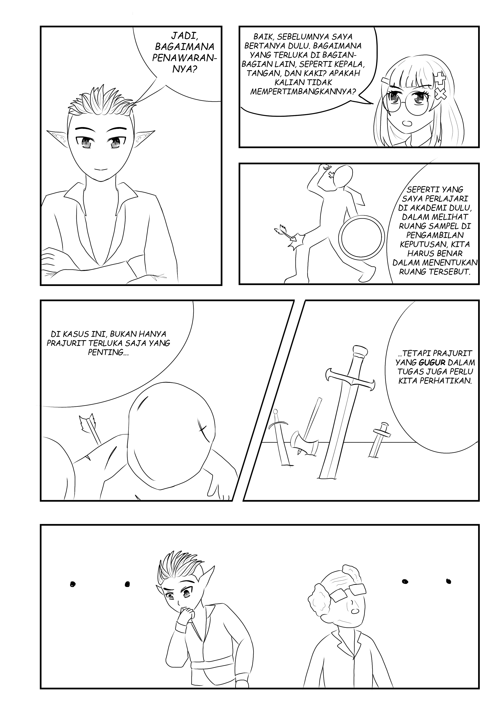

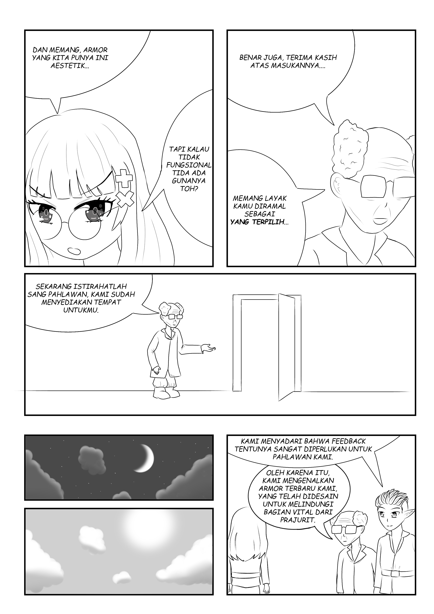

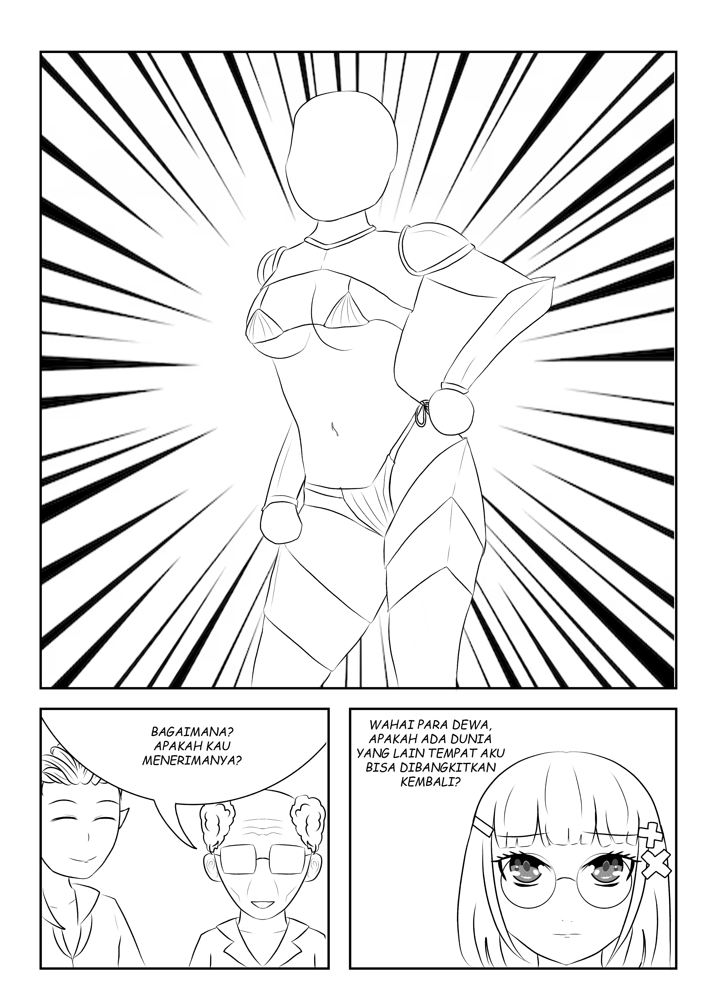

Terima kasih telah memutuskan untuk mengambil booklet ini di Comic Frontier 17. Booklet ini merupakan bagian dari Mettamatika #0, sebuah usaha kecil dari Spearhead Circle untuk berkarya pop di bidang matematika.

Booklet yang Anda pegang ini membahas singkat mengenai "survivorship bias", sebuah adagio penting dalam pengambilan dan analisis data di statistika. Prinsip ini dipopulerkan Abraham Wald di era Perang Dunia II, dan tetap dikaji secara berulang hingga sekarang.

Secara garis besar, prinsip ini bisa dirangkum sebagai berikut: Anda bisa saja menganalisis data, tapi apakah data yang Anda pegang lengkap? Nantikan jawabannya bersama Metta di booklet ini.

Terima kasih terhadap Spearhead Circle atas kesempatan ini ~~yang bisa dijadikan sebagai sarana penulis menghindar mengerjakan proyek S3 AOKAOWKAOWKWOWKAOAK.~~

Terima kasih sudah membaca kata pengantar ini. Selamat menikmati, dan nantikan kami di Mettamatika #1. Selamatkan diri Anda.

Atas nama tim Mettamatika #0, seri Survivorship Bias,

Furra.

Desember 2023. 

Tim:
* adriantom9
* izzako
* ValeSuamiSahHayaseYuuka
* Muhammad Pambudi Wicaksono
* AuvioraA
* kucingeprek
* Furra
* Rubi

Mettamatika vol. 0 – Survivorship Bias
Text: Furra
Storyboard: AuvioraA
Illustration: Muhammad Pambudi Wicaksono, adriantom9, kucingeprek
Cover: kucingeprek

Spearhead Circle @ D-54 Comic Frontier 17