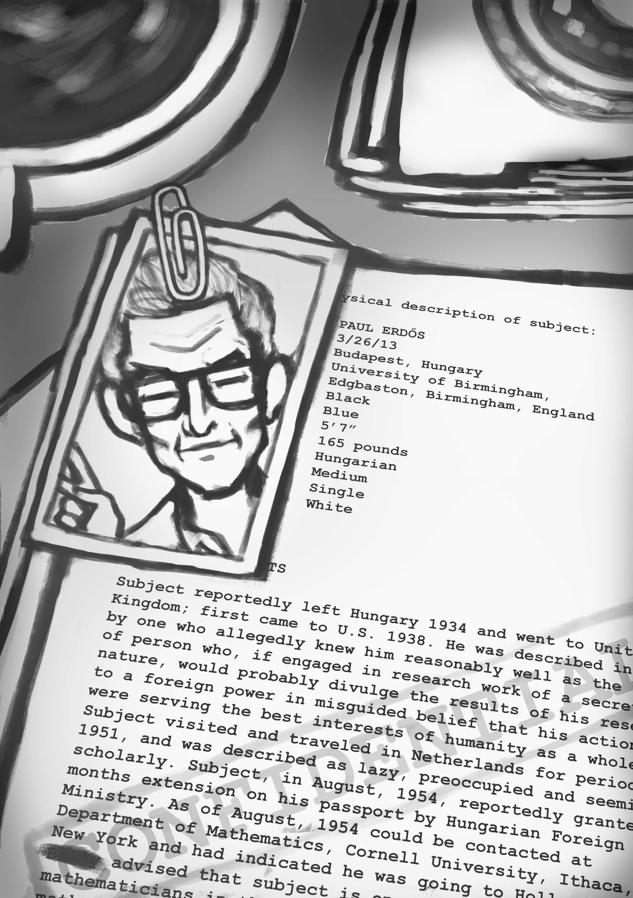

+++
title = "Mettamatika vol. 1,5: Paul Erdos"
date = "2024-11-09"
description = "Mettamatika volume 1,5: Paul Erdos"
tags = [
    "Mettamatika",
    "Mettamatika vol. 0",
    "Mettamatika Paruh"
]
+++

# Origins

Erdős lahir di Budapest Hungaria, pada tanggal 26 Maret 1913. Erdős lahir sebagai anak ketiga dari Anna dan Lajos Erdős, keduanya guru matematika dari etnis Yahudi. Kedua kakak perempuan Erdős meninggal karena Scarlet Fever, beberapa hari sebelum Erdős lahir. Lajos menjadi tahanan perang di tahun 1914– 1920, jadi Anna harus bekerja keras untuk menafkahi keluarga. Erdős dibesarkan oleh pengasuh. 

Dari kecil, Erdős sudah berminat terhadap matematika. Saat umur empat tahun, Erdős sudah memahami konsep bilangan negatif. Saat umur lima tahun, Erdős dapat menghitung banyaknya detik dalam umur orang, dan menghitung jarak dari bumi ke matahari. Paper pertama Erdős ditulis pada tahun 1932 sebagai mahasiswa di Budapest. Erdős menulis bukti untuk teorema Chebyshev. Meski teorema ini sudah terbukti sebelumnya, buktinya Erdős metode- metode yang lebih dasar, sehingga lebih elegan dan mengejutkan.

Tidak mudah bagi Erdős untuk memulai karirnya. Terdapat kuota maksimal bagi mahasiswa keturunan Yahudi di Hungaria. Erdős mendapat nilai tertinggi di ujian nasional saat itu, jadi dia bisa masuk sebagai mahasiswa di Universitas Pázmány Péter di Budapest pada tahun 1930. Beliau mendapatkan gelar doktor pada tahun 1934, kemudian pindah ke Manchester, UK. Pada tahun 1938, Erdős pindah ke Amerika Serikat untuk menghindari anti-semitisme di Eropa. 

Kontribusi matematika dari Erdős sangatlah luas. Erdős dikenal dengan gaya bermatematika yang cenderung lebih *problem-solver* daripada *theory-builder*. Erdős bekerja dengan berbagai bidang tapi fokus utamanya adalah matematika diskrit, terutama kombinatorika, teori graf, dan teori bilangan. Erdős juga menyukai bukti yang elegan. Beliau berpendapat bahwa bukti yang bagus harus dapat memberikan *insight* mengapa suatu teorema itu benar.

# Matematikawan Mendunia 

Erdős adalah matematikawan yang sangat produktif. Dia menulis 1525 *paper* dengan 511 kolaborator. Mengapa beliau mau berkolaborasi sebanyak itu? Dari awal, Erdős percaya bahwa matematika adalah aktivitas sosial, dan dia sangat suka bersosialisasi dengan matematika. Erdős bukanlah tipe jenius yang menyendiri selama bertahun-tahun. Beliau adalah jenius yang membagikan semua ide-idenya. Demi matematika, kehidupan sehari-hari Erdős diisi dengan bepergian dan bekerja. Beliau keliling dunia untuk menghadiri konferensi dan berkolaborasi dengan matematikawan lainnya. Ketika bertamu, beliau sering menyapa teman kolaboratornya dengan berkata “*My brain is open.*”

Gaya bepergiannya sangat minimalis. Satu koper berisi baju, dan satu koper berisi matematika. Urusan hidup sehari-hari seperti makanan dan tempat menginap diserahkan ke temannya. Beliau bahkan mengaku bahwa beliau tidak pernah memasak air. Janos Path, salah satu kolaborator Erdős mengatakan bahwa beliau pernah menumpahkan jus tomat di rumahnya, karena Erdős membuka kotaknya dengan pisau. 

Erdős tidak memegang banyak harta. Uang yang dia dapatkan dari konferensi dan penghargaan, digunakan untuk bepergian. Selain bepergian, Erdős juga sering berbagi uang untuk komunitas matematika. Beliau pernah memberikan $1000 kepada seorang calon mahasiswa Harvard yang kekurangan dana untuk berangkat. 

Erdős juga menyisihkan uang untuk penghargaan orang-orang yang bisa memecahkan Erdős problems. Erdős problems adalah soal-soal matematika yang menurut Erdős sulit dan menarik. Semakin sulit, semakin besar penghargaannya. Total nilai semua soal adalah $53117, dengan $19200 sudah terpecahkan. Setelah Erdős meninggal, teman-temannya mengambil alih dan menyediakan dana untuk soal soal tersebut. Salah satu Erdős problem terbesar mengenai *prime gaps* bernilai $10000, dan baru dipecahkan di tahun 2017 oleh kolaborasi Maynard, Ford, Green, Konyagin, dan Tao. 

Saking seringnya Erdős bepergian, FBI sampai curiga dengan dirinya. Insiden pertama terjadi di tahun 1941, ketika Erdős tertangkap menerobos menara radio militer di Long Island. Beliau berkata bahwa dia tidak sengaja, karena sibuk memikirkan matematika waktu itu. FBI terus mengawasi Erdős karena ia memiliki banyak kolaborator di negara-negara komunis. Erdős sendiri merupakan warga Hungaria, yang merupakan negara komunis di masa itu. Petugas imigrasi Amerika Serikat juga pernah menolak visa Erdős pada tahun 1951 dan 1954.

# Mesin Matematika Tenaga Kopi 

Bagi Erdős, matematika adalah hidup. Beliau sering berkata bahwa matematikawan yang pensiun adalah matematikawan yang *mati*, sementara matematikawan yang mati hanyalah *pergi*. Isi pikirannya hanyalah matematika. Bahkan Erdős bisa bermatematika selama 19 jam dalam satu hari. Dari mana dia mendapatkan energi untuk bekerja sekeras ini? Salah satu sumbernya adalah kopi. 

Erdős seringkali berkata bahwa “A mathematician is a machine that turns coffee into theorems.” Ini merupakan kutipan dari koleganya, Alfréd Rényi. Sampai saat ini banyak orang yang mengira bahwa kutipan ini berasal dari Erdős. Rényi dan Erdős keduanya memang peminum kopi kelas berat. 

Bagi Erdős, kopi adalah bagian esensial dari hidup bermatematika. Lajos Po sa adalah seorang matematikawan yang mulai bekerja meneliti dengan Erdős saat masih berumur 13 tahun. Ibunya Po sa pernah matah kepada Erdős, karena beliau memberikan anaknya kopi yang sangat kuat. Erdős berkata bahwa Lajos harusnya menjawab kepada ibunya sendiri, “Madam, I do mathematician’s work and drink a mathematician’s drink.” 

Tidak hanya kopi, Erdős juga punya kebiasaan mengkonsumsi obat-obat antidepresan dan amfetamin. Ronald Graham, salah satu teman sekaligus “pengasuh” Erdős khawatir dengan kebiasaan ini. Graham pernah taruhan dengan Erdős supaya beliau berhenti mengkonsumsi amfetamin. Kalau Erdős berhenti selama sebulan, Graham akan membayar Erdős $500. Erdős sepakat, dan dia berhasil tidak mengkonsumsi amfetamin selama sebulan, membuktikan bahwa dirinya tidak kecanduan. Tapi Erdős kesal karena selama satu bulan itu, dia tidak bisa fokus bekerja. Erdős berkata kepada Graham, “You've set mathematics back a month."

# Bermatematika Sampai Akhir 

Erdős sendiri pernah menceritakan bahwa dia punya skenario ideal yang agak dramatis untuk meninggal dunia. Beliau ingin mempresentasikan sebuah bukti besar dalam sebuah kuliah, kemudian ketika ada yang bertanya mengenai generalisasi dari bukti itu, beliau akan menjawab “I’ll leave that to the next generation.”, kemudian meninggal di tempat. 

Dan impiannya terwujud, meski tidak sedramatis skenario yang dia bayangkan. Pada tanggal 20 September 1996, Erdős meninggal dunia karena serangan jantung saat menghadiri sebuah konferensi di Warsaw, Poland. Erdős meninggal tanpa meninggalkan keturunan. Beliau dimakamkan bersama orangtuanya di Kozma Street Cemetery, di Budapest. Sebagai *epitaph* di batu nisannya, beliau pernah mengusulkan “*Végre nem butulok tovább*”, yang berarti “Akhirnya, aku berhenti bertambah bodoh.” Meski nisan aslinya tidak bertuliskan itu, kata- kata tersebut akan selalu dikenang bersama kontribusi-kontribusi lainnya.

# The Book 

Salah satu kontribusi Paul Erdős terhadap budaya matematika adalah kisah tentang The Book. Beliau sering berkata bahwa Tuhan mempunyai sebuah buku yang berisi semua bukti paling elegan dari semua teorema matematika yang ada. Saat memberikan kuliah, dia pernah berkata “*You don't have to believe in God, but you should believe in The Book.*”

Bagi banyak matematikawan, The Book adalah anekdot yang menarik dan inspiratif. Martin Aigner dan Günter M. Ziegler menulis buku berjudul “Proofs from The Book” untuk membuat *The Book* menjadi buku yang nyata. Atau setidaknya, membuat buku versi kecil dari The Book yang bisa dijangkau oleh manusia. Erdős terlibat dalam proses awal menulis buku tersebut, namun sayangnya Erdős sudah meninggal saat buku tersebut terbit pada tahun 1998. 

Jadi bukti seperti apa sih yang ada dalam The Book? Menurut Ziegler dalam sebuah interview dengan Quanta Magazine, tidak ada definisi yang pasti untuk sebuah bukti yang elegan. Ada beberapa unsur yang umumnya dimiliki bukti yang elegan. Bukti yang singkat, yang jelas, yang memiliki ide yang spesial, yang menunjukkan hubungan baru yang tidak terduga. Tapi pada akhirnya keindahan bukti tergantung sudut pandang pembaca. Tujuan bukti adalah membuat seorang pembaca yakin akan kebenaran suatu pernyataan matematika. Karena tiap pembaca punya latar belakang dan selera yang berbeda, bukti apa yang menurut mereka elegan tentunya berbeda juga. 

# Erdős Number 

Untuk mengenang Erdős, komunitas matematika menciptakan Erdős number. Erdős number adalah bilangan yang mengukur jarak seorang matematikawan dari Erdős. Semakin kecil bilangannya, artinya semakin dekat dengan Erdős. 

Sebagai contoh, Alfred Renyi pernah menulis paper dengan Erdős. Artinya Renyi mempunyai Erdős number 1. Kemudian misalkan ada seorang kolaborator Renyi yang belum punya Erdős number, dia akan mendapatkan Erdős number 2. Kemudian kolaborator mereka akan mendapatkan Erdős number 3, dan seterusnya. Salah satu kontributor Mettamatika memiliki Erdős number 3! Mungkin ini berarti Metta dan kontributor Mettamatika lainnya secara *unofficial* punya Erdős number 4...

Apakah Erdős number yang lebih kecil berarti matematikawan yang lebih kuat? Belum tentu, karena ada faktor-faktor yang lain yang mempengaruhi Erdős number. Matematikawan yang bekerja di bidang kombinatorika, cenderung memiliki Erdős number yang lebih kecil. Matematikawan yang lebih muda juga cenderung memiliki Erdős number yang lebih besar, karena mereka terpisahkan dari Erdős oleh waktu. Seiring waktu berjalan, banyaknya pemenang Erdős number kecil akan selalu berkurang, karena mereka menua dan berhenti matematika. 

Di sisi lain, matematikawan kuat cenderung punya paper dan kolaborasi yang lebih banyak, dan ini membantu mereka punya Erdős number yang lebih kecil. Dari populasi pemenang Fields medal, nilai median Erdős number mereka adalah 3. Sementara untuk matematikawan pada umumnya, median nya 5. Secara kasar dapat disimpulkan bahwa Erdős number lebih kecil tidak berarti matematikawan yang lebih kuat, tapi matematikawan yang lebih kuat ada kecenderungan untuk memiliki Erdős number lebih kecil. 

Selain Erdős number, trend yang serupa muncul di bidang-bidang lain. Di dunia perfilman, ada yang disebut Bacon number untuk bintang film. Bacon number mengukur jarak kolaborasi film dengan bintang film dari Kevin Bacon. Di dunia musik, Sabbath number mengukur jarak kolaborasi musisi dengan band Black Sabbath. Bahkan di dunia *video game*, ada Ryu number untuk karakter dari game. Ryu number mengukur jarak crossover dengan Ryu, karakter dari game Street Fighter. 

Bahkan ada orang-orang yang punya beberapa number sekaligus! Erdős-Bacon-Sabbath number adalah jumlah total dari 3 number tersebut. Rekor Erdős-Bacon-Sabbath number terendah di dunia dipegang 2 orang, yaitu Stephen Hawking dan Ray Kurzweill. Mereka berdua punya Erdős-Bacon-Sabbath number 8.

## Daftar Pustaka
* Bloom, T. (n.d.). Retrieved from Erdos Problems: https://www.erdosproblems.com/
* Erdős, P. (1995). Child Prodigies. *Mathematics Competitions*, 7-16.
* Erdős-Bacon-Sabbath Wiki. (2021). *Erdős-Bacon-Sabbath Wiki*. Retrieved from https://erdosbaconsabbath.fandom.com/wiki/Erd%C5%91s-Bacon-Sabbath_Wiki
* Hartnett, K. (2017, June 5). *Cash for Math: The Erdős Prizes Live On*. Retrieved from Nautilus: https://nautil.us/cash-for-math-the-erdos-prizes-live-on-236641/
* Hoffman, P. (1998). *The Man Who Loved Only Numbers*. New York: Hyperion.
* Hoffman, P. (2024, September 16). *Paul Erdős*. Retrieved from Britannica: https://www.britannica.com/biography/Paul-Erdos
* Klarreich, E. (2018, March 19). *In Search of God’s Perfect Proofs*. Retrieved from Quanta Magazine: https://www.quantamagazine.org/gunter-ziegler-and-martin-aigner-seek-gods-perfect-math-proofs-20180319/
* Krauthammer, C. (1996, September 27). *Paul Erdős, Sweet Genius*. The Washington Post.
* Lipton, B. (2015, July 21). *The FBI spent decades tracking mathematician Paul Erdős, only to conclude that the guy was just really into math*. Retrieved from Muckrock: https://www.muckrock.com/news/archives/2015/jul/21/nothing-indicate-nothing-indicate-subject-had-any-/
* O'Connor, J. J., & Robertson, E. F. (2000, January). *Paul Erdős*. Retrievedfrom MacTutor: https://mathshistory.st-andrews.ac.uk/Biographies/Erdos/

Mettamatika vol. 1,5

Tim:
* adriantom9
* Furra
* Rubi
* AuvioraA
* ReaVix
* arisu
* Celestia Alucard
* vicerne28
* izzako

Mettamatika vol. 1,5 – Paul Erdos

Text: Rubi

Illustration: Celestia Alucard

Cover: Celestia Alucard

Spearhead Circle @ F-02/03 Comic Frontier 19