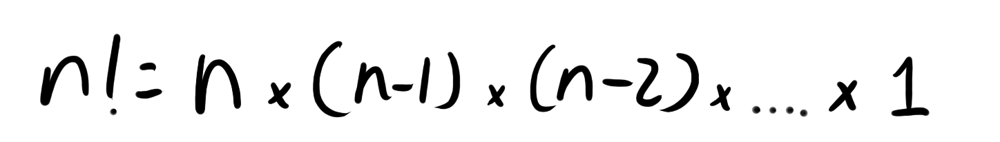

+++
title = "Mettamatika vol. 1,5: Gacha Kombinatorik"
date = "2024-11-09"
description = "Mettamatika volume 1,5: Gacha Kombinatorik"
tags = [
    "Mettamatika",
    "Mettamatika vol. 1,5",
    "Mettamatika Paruh"
]
+++

# Intro

Hanni: Untuk acara Comic Frontier depan, bagaimana kalau kita adain gacha?

Metta: Menarik, tapi bagaimana sistem gachanya?

Hanni: Gimana ya, aku sih pengen ada tier barang dan ada rate gacha seperti di game-game gacha, dan ratenya bisa sampai sekecil 1%

Metta: Bagaimana kalau undian kertas?

Hanni: Nggak mau ah, udah motong-motong kertasnya ribet, tidak ramah lingkungan, ratenya bakal berubah kalau ada kertas yang hilang

Metta: Bagaimana kalau mystery box?

Hanni: Barang-barang kita tuh terlalu banyak jenisnya, ada gantungan kunci, art print, buku, dll. Kalau mau pakai mystery box akan susah packingnya

Metta: Hmmmm, oh aku tahu, bagaimana kalau kita pakai bola pingpong!

Hanni: Yang bener aja, masa mau pakai kotak isinya 100 bola pingpong!

Metta: Tenang, kita hanya butuh 15 bola pingpong untuk bisa mencapai rate sekecil 1%! 

Hanni: Hah, bagaimana tuh??

# Pembahasan

Misal nih, ada empat buah bola ping pong dalam satu kotak dengan nomor urut 1, 2, 3, dan 4. Misalkan kamu ingin bola nomor 1, jika kamu ambil acak bola di dalam kotak itu tanpa melihat isinya, maka akan ada peluang ¼ kamu mendapatkan bola nomor 1. Mengapa demikian? ¼  dalam peluang berarti 1 dari 4 kemungkinan. Di dalam kotak, jumlah bola yang bisa diambil hanya ada 4 buah, yaitu bola ping pong bernomor 1, 2, 3, dan 4. Tidak ada bola lainnya yang berada dalam kotak ini seperti bola ping pong nomor 5, bola basket, bola beton di pinggir Jalan Asia Afrika Bandung, bola sepak Jabulani yang dibenci oleh semua pesepak bola selain Diego Forlan pada kompetisi Piala Dunia 2010. Di antara keempat bola tersebut, hanya satu bola yang mempunyai angka 1. Oleh karena itu, peluang terambil bola nomor satu adalah 1 dari 4.

Sekarang, bagaimana kalau kasusnya kamu ingin mengambil dua bola, misalkan bola nomor 4 dan 1 dan pengambilannya dilakukan satu-persatu? Untuk skenario terambilnya bola nomor 4 dahulu, baru bola nomor 1. Untuk pengambilan bola nomor 4, peluang terambilnya adalah ¼ , karena bola nomor 4 adalah satu bola di antara 4 bola. Selanjutnya, untuk mengambil bola nomor 1, peluang terambilnya adalah ⅓, karena bola nomor 1 ini merupakan satu bola di antara 3 bola (bola nomor 4 sudah terambil). Lalu, karena dua kemungkinan ini berpasangan (kejadian saling mempengaruhi), kita mengalikan kedua kemungkinan ini. (Ya, pasangan memang saling mempengaruhi satu sama lain, bukan? hehe). Sehingga, ¼  dikali ⅓  sama dengan 1/12. Jadi, kemungkinan bola nomor 4 terambil pertama dan setelahnya terambil bola nomor 1 adalah 1/12. 

Apakah jawabannya 1/12? Oh sayangnya bukan, kan ada juga skenario terambilnya bola nomor 1 terlebih dahulu, baru kemudian terambil bola nomor 4. (Jangan dilupain dong, dilupain tuh sakit tau) Jadi, untuk menghitung kemungkinan hal tersebut, lakukan juga hal yang sama seperti tadi, jadilah didapat angka 1/12 juga. Lalu, setelahnya, karena kejadian tersebut merupakan dua skenario yang berbeda, kita jumlahkan kemungkinan dua skenario tersebut, sehingga didapatlah 1/12 + 1/12 = 2/12 = 1/6.

Hmm.. masih bingung? Oke, coba kita gambarkan dengan tabel. 

Di bawah ini, ditampilkan tabel dengan segala kemungkinan pengambilan bola. Pada setiap bagian, hanya ada 3 baris tabel, karena pada pengambilan kedua, bola sudah diambil satu.

<table id="borderless">
    <tr id="borderless">
        <td colspan="2" id="borderless">Bola 1 sebagai bola pertama:</td>
        <td id="borderless"></td>
        <td colspan="2" id="borderless">Bola 2 sebagai bola pertama:</td>
    </tr>
    <tr id="borderless">
        <td>Bola pertama</td>
        <td>Bola kedua</td>
        <td id="borderless"></td>
        <td>Bola pertama</td>
        <td>Bola kedua</td>
    </tr>
    <tr id="borderless">
        <td>1</td>
        <td>2</td>
        <td id="borderless"></td>
        <td>2</td>
        <td>1</td>
    </tr>
    <tr id="borderless">
        <td>1</td>
        <td>3</td>
        <td id="borderless"></td>
        <td>2</td>
        <td>3</td>
    </tr>
    <tr id="borderless">
        <td>1</td>
        <td>4</td>
        <td id="borderless"></td>
        <td>2</td>
        <td>4</td>
    </tr>
    <tr id="borderless">
        <td colspan="2" id="borderless">Bola 3 sebagai bola pertama:</td>
        <td id="borderless"></td>
        <td colspan="2" id="borderless">Bola 4 sebagai bola pertama:</td>
    </tr>
    <tr id="borderless">
        <td>Bola pertama</td>
        <td>Bola kedua</td>
        <td id="borderless"></td>
        <td>Bola pertama</td>
        <td>Bola kedua</td>
    </tr>
    <tr id="borderless">
        <td>3</td>
        <td>1</td>
        <td id="borderless"></td>
        <td>4</td>
        <td>1</td>
    </tr>
    <tr id="borderless">
        <td>3</td>
        <td>2</td>
        <td id="borderless"></td>
        <td>4</td>
        <td>2</td>
    </tr>
    <tr id="borderless">
        <td>3</td>
        <td>4</td>
        <td id="borderless"></td>
        <td>4</td>
        <td>3</td>
    </tr>
</table>

Dapat dilihat, bahwa dari total 12 kemungkinan, hanya ada dua kejadian yang memenuhi hasil yang diharapkan (bola 1 dan 4 terambil). Sehingga, kemungkinannya adalah 2/12 atau 1/6.

# Kombinasi

Dalam matematika, hal ini disebut juga dengan **kombinasi**. Jika kamu pernah mempelajari kombinasi di kelas matematika SMA, maka kamu juga tidak asing mendengar pasangannya: permutasi. Ada pun rumus kombinasi sebagai berikut:

Notasi (istilah keren dari cara penulisan secara matematis) kombinasi ini menunjukkan berapa banyak susunan beberapa benda apabila diambil sebanyak **r** benda dari sekumpulan **n** benda, tanpa memperhatikan urutan benda yang diambil. Sebenarnya, dari mana sih rumus ini diambil?

 
Kita mundur dulu sejenak ke yang namanya **faktorial**. Operasi bilangan faktorial adalah perkalian dari sebuah angka bulat (sebut saja n) dan semua bilangan yang lebih kecil dari n, dan operasi bilangan ini biasa ditulis dengan n! (nggak, ini lagi nggak teriak)

Kalau sebelumnya kita berbicara tentang pengambilan 2 dari 4 bola, sekarang kita berbicara tentang pengambilan 4 dari 4 bola. Jika kamu mengambil 4 bola secara berurutan, berapa banyak semua kemungkinan urutan bola tersebut? Seperti 1-2-3-4, 1-4-2-3, 4-2-3-1, dan lain-lain. Pengambilan 2 dari 4 bola (dengan memperhatikan urutan) sebelumnya memiliki peluang 1/12, yaitu 1 dari 12 kemungkinan. Jika kita lanjutkan pengambilan ketiga, di dalam kotak tinggal ada dua bola, sehingga hanya ada dua bola yang terambil. Oleh karena itu, dari yang sebelumnya ada 12 kemungkinan, kita kalikan lagi dengan dua, sehingga kita punya 24 kemungkinan. Bagaimana dengan pengambilan keempat? Kita semua tahu bahwa di pengambilan terakhir hanya akan ada satu bola, sehingga total kemungkinannya tetap sama, yaitu 24 kemungkinan. Apabila kita hitung 4! (4 faktorial), maka hasilnya adalah 4 x 3 x 2 x 1 = 24, cocok dengan rumusnya.

Tabel kemungkinan untuk 4 bola

<table>
    <tr>
        <th>1234</th>
        <th>1243</th>
        <th>2134</th>
        <th>2143</th>
    </tr>
    <tr>
        <th>3124</th>
        <th>3142</th>
        <th>4123</th>
        <th>4132</th>
    </tr>
    <tr>
        <th>1324</th>
        <th>1342</th>
        <th>2314</th>
        <th>2341</th>
    </tr>
    <tr>
        <th>3214</th>
        <th>3241</th>
        <th>4213</th>
        <th>4231</th>
    </tr>
    <tr>
        <th>1423</th>
        <th>1432</th>
        <th>2413</th>
        <th>2431</th>
    </tr>
    <tr>
        <th>3412</th>
        <th>3421</th>
        <th>4312</th>
        <th>4321</th>
    </tr>
</table>

Selanjutnya, kita berbicara tentang abangnya kombinasi terlebih dahulu, yaitu **permutasi**. Pengambilan 2 dari 4 bola sebelumnya adalah salah satu contoh permutasi. Rumus permutasi adalah sebagai berikut.

Mungkin terlihat rumit, namun mari kita masukkan angka-angkanya.

Kalau kita masukkan angka-angkanya, rumusnya sesuai dengan banyaknya kejadian dalam pengambilan dua dari empat bola tadi. Sekarang, apa yang membedakan permutasi dengan kombinasi?

Karena kombinasi tidak memperhatikan urutan, maka permutasi dari pengambilan 2 dari 4 bola dibagi dengan **banyaknya urutan bola yang dapat dibuat dari 2 bola**. Karena hanya akan ada dua susunan dari dua bola, maka permutasi dibagikan dengan 2, sehingga kita mendapatkan 6, sesuai dengan perhitungan awal.

# Ending

Hanni: Jadi gimana caranya kita bikin gacha dengan rate 1%?

Metta: Ya sama aja kayak penjelasanku tadi, pakai dua pengambilan bola yang berurutan, tapi ditambah aja bolanya, jadi 15 gitu.

Hanni: Emang bakal jadi sekecil 1%?

Metta: Yah, masa gak percaya, itung aja sendiri kalo ga percaya

Hanni: Aku males ngitung sih, jadi aku percaya kamu aja deh hehe

Hanni: Terus, kalau mau lebih kejam lagi gachanya biar kayak tatanan takdir besar gimana?

Metta: Ya, tinggal tambah lagi aja total bolanya, makin kecil kan itu rate nya

Hanni: Oh iya ya, ide bagus! Pinter juga kamu Metta, gak sia sia aku temenan sama kamu

Metta: Jadi, selama ini, kamu temanan sama aku buat manfaatin aku aja??

Hanni: \*poof\* *menghilang*

Mettamatika vol. 1,5

Tim:
* adriantom9
* Furra
* Rubi
* AuvioraA
* ReaVix
* arisu
* Celestia Alucard
* vicerne28
* izzako

Mettamatika vol. 1,5 – Gacha Kombinatorik

Text: adriantom9, AuvioraA

Illustration: adriantom9

Cover: adriantom9

Spearhead Circle @ F-02/03 Comic Frontier 19