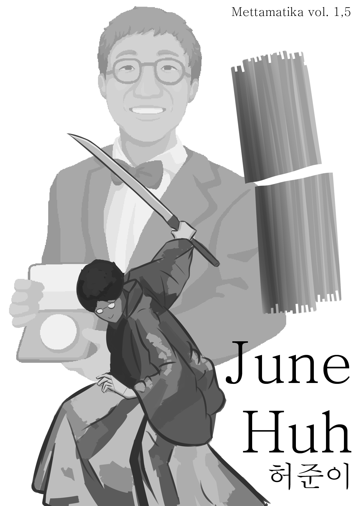
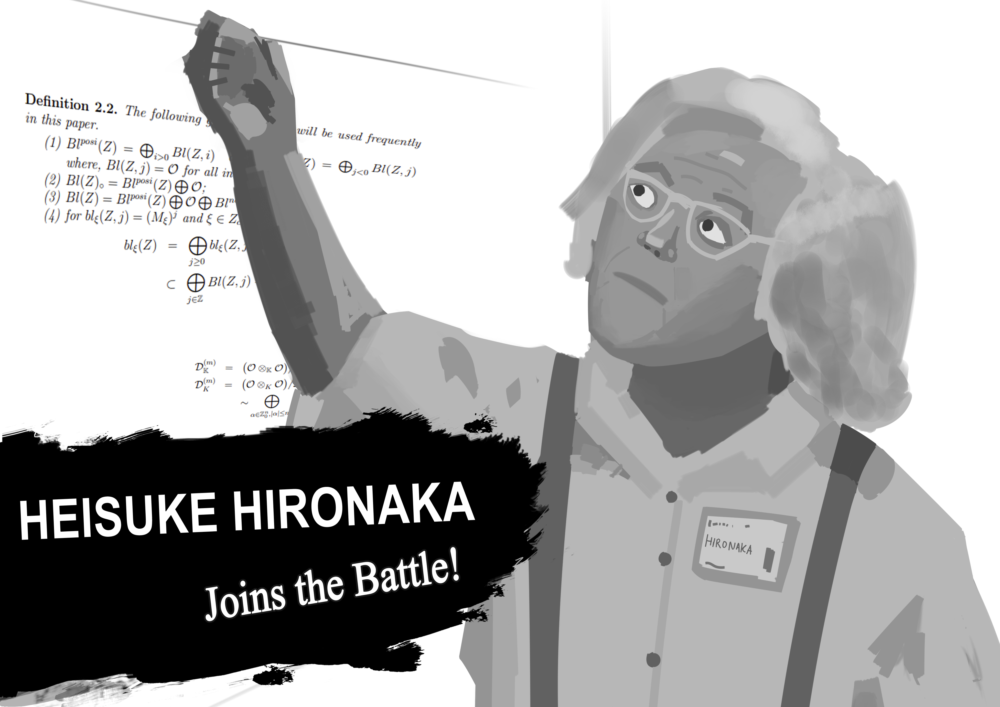
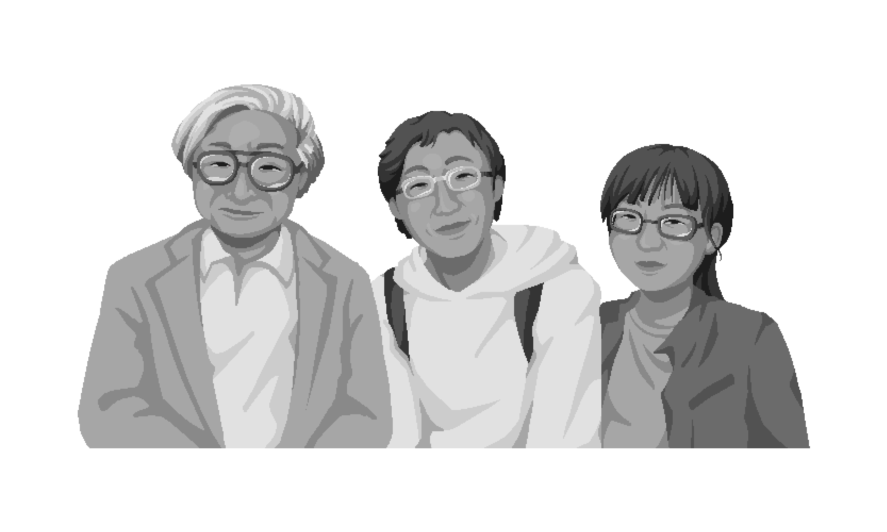
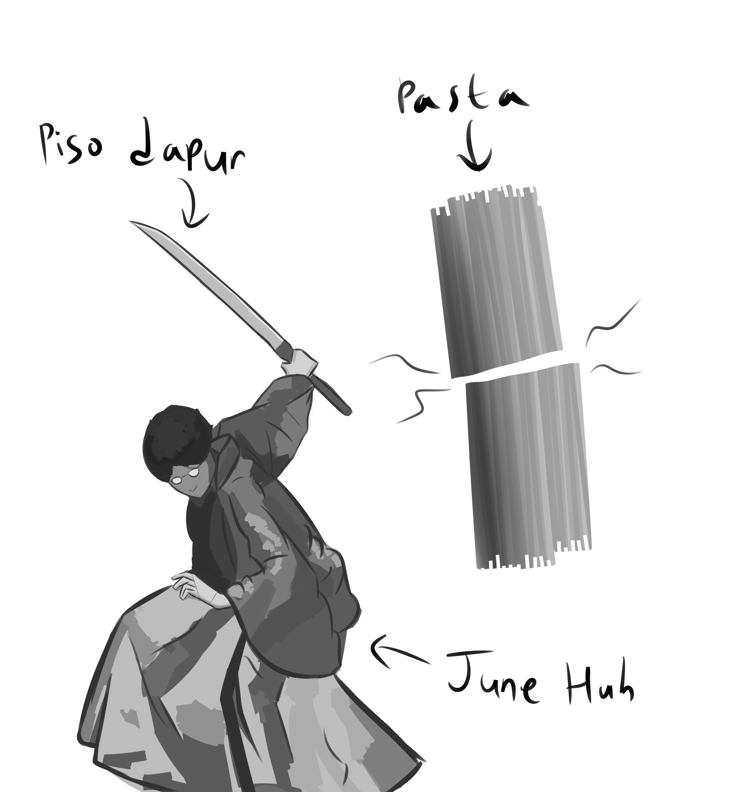
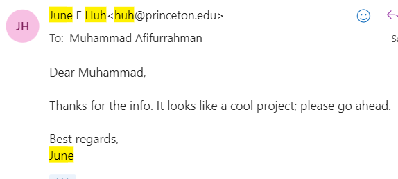

+++
title = "Mettamatika vol. 1,5: June Huh"
date = "2024-11-09"
description = "Mettamatika volume 1,5: June Huh"
tags = [
    "Mettamatika",
    "Mettamatika vol. 1,5",
    "Mettamatika Paruh"
]
+++

# Prolog

Seoul, tahun 2000an.

Anda melihat seorang bocah SMA berbaring di kali Seoul, terdapat buku tulis di sampingnya. Saat remaja seumurannya siang-malam belajar, ia sibuk rebahan di pinggir kali, mencoba menulis cerita fiksi.

*freeze frame*

Bagaimana kalau saya bilang, ia akan memenangkan salah satu penghargaan matematika terkemuka, setara medali Nobel, pada 2022?

Inilah kisah June Huh.

# Masa kecil, SMA, dan awal kuliah

Seperti orang pada umumnya, June Huh trauma dengan pelajaran matematika setelah mendapat nilai jelek saat ujian di sekolah. Tapi June perlu mengerjakan PR matematika dari buku teks sekolahnya, dan June mau nilai bagus. Apa yang ia lakukan?

Ya tentu saja, June melihat kunci jawaban di belakang bukunya dan menconteknya sebagai jawaban. Bapaknya, seorang dosen matematika di Korea, merobek kunci jawaban tersebut. Dan June memutuskan untuk pergi ke toko buku terdekat dan menyalin jawaban dari buku teks yang dijual di sana. 

Dan seperti kita lihat di prolog, ia menghabiskan masa SMAnya dengan menulis. Bahkan katanya, ia sempat DO dari SMA agar supaya ia dapat berfokus menjadi pujangga. Sebagai seorang yang dilanda gejolak masa remaja, June anggap puisi sebagai ekspresi jati diri. Ia hasilkan berbagai puisi dan berbagai novella, tapi sang pujangga remaja kita tidak berhasil menerbitkan karya-karya tersebut, seperti para calon pujangga pada umumnya (contohnya penulis zine ini). Akhirnya ia berpindah cita-cita dan banting setir menjadi mahasiswa jurusan fisika dan astronomi di Seoul National University, mulai 2002. Apakah ia mengganti cita-citanya menjadi fisikawan atau astronom? Bukan; ia ingin menjadi jurnalis sains.

Dengan dibumbui beberapa mata kuliah yang diulang, ia akhirnya memasuki tahun keenam dari studi sarjananya, pada umur 24 tahun.  Lalu semua berubah ketika salah satu karakter pendukung datang di penghujung kuliahnya.

Perkenalkan, Heisuke Hironaka

# Hironaka, dan kelasnya

Heisuke Hironaka adalah matematikawan Jepang termasyhur, dan merupakan matematikawan pertama dari Asia yang berhasil meraih medali Fields pada 1970. Penghargaan ini merupakan penghargaan tertinggi yang hanya diberikan empat tahun sekali, untuk empat matematikawan muda di bawah 40 tahun. Ya, bisa dibilang medali Fields laksana penghargaan muda untuk matematika lah.

Hironaka datang di SNU sebagai dosen tamu, dan ia membuka kelas yang bisa diikuti mahasiswa umum. Sebagai mahasiswa yang sempat bermimpi menjadi jurnalis sains, June kemudian memutuskan untuk menyusup masuk ke kelas Hironaka. Ia pikir, siapa tahu ia bisa mewawancarai beliau dan menghasilkan artikel ringan. Mungkin dengan artikel ini, ia bisa kembali memupuk mimpinya menjadi jurnalis.

Sialnya, kuliah tamu Hironaka bukanlah kuliah tamu biasa. Memang judul materi yang beliau ajarkan waktu itu adalah aljabar geometri, mata kuliah yang lazim diambil mahasiswa S2/S3 matematika di luar negeri. Akan tetapi, isi materi yang beliau ajarkan bukanlah materi yang lazim dipelajari mahasiswa S2/S3. Lebih dari itu, materi yang beliau ajarkan adalah materi-materi “(singularity theory)”, yang… anggap saja topik penelitian utama dia sebagai matematikawan lah. Heh, bahkan penulis zine ini tidak mengerti apa itu “*singularity theory*”.

Karena materi yang diajarkan beliau *anti-mainstream*, cara pengajarannya pun tidak lazim pula. Alur materinya bisa dibilang tidak berdasarkan buku teks aljabar geometri apapun. Karena topik ini adalah topik riset beliau, pendekatan beliau dalam mengajarkan topik ini laksana pendekatan orang yang meriset matematika; masih berdasar *mood* dan oret-oretan penelitiannya di hari sebelumnya.

Wajarlah dengan kelas ini, jumlah mahasiswa yang mengikuti kelasnya menyusut; dari 200 mahasiswa di awal kelas, lama-kelamaan hanyalah lima-enam saja per minggunya. Mungkin dikarenakan materinya yang terlalu mutakhir, jadi sedikitlah yang mengerti apa yang diracau Hironaka.

June Huh adalah satu dari sedikit yang bertahan, meskipun ia juga tidak mengerti apa-apa yang diajar Hironaka. Lalu kenapa ia tetap bertahan? Kalau pendeknya sih, ia berkata, “toh yang penting saya paham contoh-contoh yang diberikan Profesor Hironaka, harusnya aman *lah* ya saya di kelas ini.”

Jawaban lebih panjang: June suka melihat ke”tegang”an Hironaka saat bermatematika ria di kelasnya. June suka melihat Hironaka berupaya, mencoba menunjukkan sesuatu di papan tulis. Hal yang bahkan tiada satu orangpun pernah coba sebelumnya. June suka melihatnya berjalan dalam kegelapan, tanpa arahan, dan tanpa tujuan. Hal ini berbeda dengan rerata kelas matematika yang biasa ditawarkan, yang sudah “rapi” jali dalam buku teks-buku teks, suatu jalan yang siap untuk dikendarai. June suka dengan matematika yang “liar”, yang ditunjukkan di kelas Hironaka.

June pun akhirnya mulai kembali menemukan matematika, dan mulai mencoba bersua dengan Heisuke Hironaka. Lewat makan siang, June berusaha mengenal lebih dalam beliau; akan tetapi, ujung-ujungnya Hironaka mengalihkan topik ke matematika. June sendiri memutuskan untuk “iya-iya” saja dengan topik matematika yang diobrolkan beliau. Ia berhati-hati agar Hironaka tidak tahu bahwa di depannya hanyalah seorang mahasiswa fisika tingkat akhir yang tidak pernah belajar matematika lanjutan sebelumnya.

Hironaka-pun akhirnya tertarik dengannya, dan mulailah June mengabdi di bawah Hironaka.

June sendiri memutuskan untuk lanjut studi S2  matematika di SNU, sembari dibimbing Hironaka untuk mempertajam kemampuan matematika. Bimbingan Hironaka tidak hanya berakhir secara akademis saja. June menemani Hironaka jalan-jalan kemanapun, sembari membawakan tasnya. Bahkan saat Hironaka pulang kampung ke Tokyo dan Kyoto, June tetap mengikutinya dan tidur di ruang tamunya.

===

Ohya, saat mengikuti studi master, June Huh bertemu dengan seorang mahasiswi bernama Nayoung Kim, cinta pertamanya. June merasa Nayoung-lah tempat berlabuhnya untuk pertama kali, dan Nayoung menganggap June sebagai teman yang sangat *imba*; teman sekelas, teman makan, dan teman mengerjakan tugas kuliah dari pagi hingga malam. Sayangnya, mereka memutuskan mengambil jalur S3 yang berbeda; Nayoung tetap di Seoul, dan June memutuskan untuk mencoba peruntungan di universitas di Amerika.

# Bagaimana cara Anda bertahan di S3?

Dengan semangat 45 [tahun kemerdekaan Korea Selatan] dan surat rekomendasi Hironaka, June memberanikan diri untuk melamar banyak universitas di Amerika. June berharap rekomendasi dari seorang matematikawan masyhur akan membantunya melanjutkan karir S3nya. Tapi perlu diingat; masa lalu June sebagai mahasiswa telat lulus dengan nilai acak-acakan masih membayangi di berkas pendaftarannya. Ditambah lagi, ia “bukan” mahasiswa matematika saat S1.

Alhasil seluruh universitas Amerika yang ia daftar menolaknya, kecuali satu; University of Illinois Urbana-Champaign. Itupun setelah digantung di “daftar cadangan”.

Ya sudah, masih dengan semangat 45, pergilah June ke sana, meninggalkan cinta pertamanya di Korea.

Pada saat awal, June memilih jalan yang berbeda dengan rerata teman seangkatannya. Biasanya, tahun pertama mahasiswa S3 di Amerika diisi dengan menyiapkan diri lewat mata kuliah matematika lanjut untuk menghadapi ujian kualifikasi. Adapun June, dengan modal bertahun-tahun membuntuti Hironaka, mencoba membangun jalan risetnya sendiri. Di semester awalnya, June justru menggunakan waktunya untuk mencari cara agar si “*singularity theory*” yang digawangi Hironaka dapat digunakan di bidang-bidang matematika lain, sebutlah, teori graf. Dan ia berhasil.

Baru masuk sebagai mahasiswa tahun pertama di Illinois, June berhasil menggemparkan jagat permatematikaan dunia. Konjektur Read, sebuah konjektur di teori graf, yang sudah menunggu jawaban selama 40 tahun, diselesaikan oleh tokoh utama kita. June-pun akhirnya diundang University of Michigan, salah satu universitas yang menolak pendaftarannya tahun lalu. Ia, seorang mahasiswa S3 semester ketiga, berhasil mempresentasikan penemuan risetnya di hadapan para dosen yang menolak berkasnya. Beberapa bulan kemudian, University of Michigan menawari June untuk pindah ke kampusnya, dan pindahlah ia.

Saat di Michigan, June mulai mengerjakan disertasinya bersama Mircea Mustata, salah satu dosen Michigan yang berkeahlian di bidang aljabar geometri. Seperti yang terlihat dari reputasinya sebelum ke Michigan, June sendiri dianggap sebagai mahasiswa spesial oleh Mircea. Tak seperti rerata mahasiswa S3, June bukanlah seorang mahasiswa yang “perlu” dibimbing Mircea. Akan tetapi, ia memandang keilmuan June “laksana kolega dosen”. Performa ini tergolong mengejutkan dari seorang yang beberapa tahun sebelumnya lebih memilih menyairkan sajak dibandingkan bersekolah.

Hal serupa tidak bisa dikatakan tentang kehidupan sehari-hari June. Pada saat awal ia di Michigan, ia perlu membeli selimut karena angin dingin di sana lebih menusuk dibandingkan Illinois, apalagi Seoul. June mencari toko terdekat yang menjual selimut, akan tetapi terlalu jauh. Yang dilakukan June: ia membeli beberapa kain “fabric” kotak-kotak dan staples dari minimarket terdekat, dan menstaples kain-kain tersebut menjadi sebuah selimut ala-ala. Begitulah salah satu kisah June Huh semasa kuliah.

Di sisi lain, bagaimana kisah cinta June dan Nayoung? Nayoung mengunjungi June pada saat ia masih di Illinois, dan perjalanan ini membuat Nayoung memikirkan hubungan lintas-negara mereka. Salah satunya dikarenakan June “tidak punya kemampuan bertahan hidup di dunia nyata.”

Bagaimana contohnya? Menurut Nayoung, June baru bisa belajar memasak saat 2013, di kala ia nyaris lulus sebagai mahasiswa S3. Sebelumnya, ia pernah hanya hidup dari pizza instan di supermarket terdekat selama berbulan-bulan, karena terlalu *mager* belanja harian. Masakan pertamanya adalah pasta, ditumis dalam minyak. Ia belajar selama enam bulan, setiap hari memasak resep yang sama persis, hingga akhirnya ia berhasil membuat pasta yang “sempurna”.

Konon, sampai sekarang, June hanya bisa memasak pasta saja.

Tokoh utama kita akhirnya lulus dari Michigan pada 2014, dengan penghargaan disertasi dari kampusnya. Ia pun resmi mengikat janji pernikahan dengan Nayoung Kim, yang juga baru lulus dari SNU. Setelah itu, mereka mempunyai anak pertama, dengan sedikit kontroversi karena June masih sibuk mengerjakan riset matematika pada saat persalinan. Pada saat zine ini ditulis, mereka sudah dianugerahi dua anak.

# Epilog

Selepas lulus S3, June mengambil pekerjaan pertamanya sebagai peneliti pascadoktoral [posisi lebih tinggi dari S3, tapi sebelum dosen tetap] di Institute for Advanced Study, Princeton, dari 2014 sampai 2020. Institusi yang sama dulunya juga merupakan rumah dari Albert Einstein dan R. Joseph Oppenheimer. Saat di sana, June mendapatkan kontrak pascadoktoral jangka panjang di IAS. Hanya tiga orang sebelumnya yang mendapatkan kontrak serupa di bidang matematika, dan dua di antaranya merupakan peraih medalis Fields: Vladimir Voevodsky and Ngô Bảo Châu.

Selepas itu, ia mendapat tawaran menjadi profesor tetap di Stanford University selama setahun. Tak lama kemudian, ia ditarik ke Princeton University sejak 2021 sebagai profesor tetap, hingga saat *zine* ini ditulis.

Meskipun karir utamanya di Amerika, ia tetap menyumbang keilmuan ke negara asalnya. Setiap musim panas di Amerika Serikat, ia pulang kampung ke Korea sebagai periset tamu di Korea Institute for Advanced Study.

Karir matematikanya sendiri berlangsung sangat lancar. Karya ilmiah demi karya ilmiah dihasilkan, penghargaan demi penghargaan didapat, utamanya *Breakthrough Prize in Mathematics* pada 2019.

Pada puncaknya, June akhirnya berhasil mengikuti jejak Hironaka dan mendapatkan medali Fields pada 2022, sebagai satu dari empat matematikawan paling berpengaruh di bawah 40 tahun.

Dua tahun kemudian, seorang mahasiswa S3 matematika sedang tidak ingin mengerjakan disertasinya - hal yang wajar. Sang mahasiswa sendiri dulunya aktif di unit literasi (dan wibu) pada saat berkuliah S1. Oleh karena itu, ia memiliki ide untuk menggabungkan kedua *fandom*-nya dan mencoba menulis “otobiografi” matematikawan. Tapi bukan matematikawan era jadul, melainkan matematikawan “zaman sekarang”.

Setelah mensurvei, mahasiswa tersebut memutuskan untuk mengirim izin ke June Huh, yang dijawab beberapa hari kemudian:

Dan begitulah zine ini bisa tercipta; terima kasih semua.

# Penutup

Terima kasih telah membaca *zine* singkat ini. Buku singkat ini merupakan bagian dari *Mettamatika 1.5*, sebuah seri kecil dari Spearhead Circle untuk berkarya di bidang matematika. 

*Zine* yang Anda pegang ini membahas salah satu matematikawan masyhur di zaman kiwari, June Huh. Ide dari buku ini berawal dari diskusi penulis dengan kawan penulis, Laurence Wijaya, di masa pandemi, saat penulis sedang tidak mengerjakan tesis S2. Setelah membaca kisah hidup beliau, penulis merasa “wow, kisah hidup beliau layak diadaptasi jadi karakter utama anime *shounen*”. Penulis berharap semoga kesan ini tersampaikan lewat karya ini.

Pada saat tim Spearhead menggodok rapat untuk *zine* Mettamatika 1.5, penulis kemudian terpikir untuk mengenalkan kisah matematikawan zaman kiwari ke khalayak umum. Mengapa matematikawan era kini? Kalau diperhatikan, buku-buku pelajaran matematika di sekolah atau di kuliah seakan hanya merujuk ke nama-nama matematikawan era Yunani, Arab, pertengahan, atau paling mentok 1900an. Padahal, seperti yang penulis rasakan sebagai mahasiswa S3 matematika [yang sedang tidak ingin menulis disertasi], matematika masihlah hidup di era sekarang, dengan manusia-manusia yang punya cerita sendiri di baliknya. Dan terjadilah buku ini, beberapa bulan kemudian.

Terima kasih terkhusus untuk vicerne28, izzako dan Auviora karena telah bersedia meminjamkan tenaga untuk memberi gegambaran di buku ini. Tentunya saya juga berterima kasih kepada June Huh atas kesediaan beliau untuk ditulis dalam buku ini.

Selain seri ini, saya juga membuat seri zine Mettamatika 0.5 dan buku Mettamatika 1: Kalkulus. Seri zine pertama dapat diakses secara gratis di laman pribadi saya.

Akhir kata, selamat menikmati zine ini. Nantikan kami di karya berikutnya, Mettamatika 2.

Atas nama tim Mettamatika 1.5,

Sydney, 1 November 2024

Furra

[afifurra.github.io](https://afifurra.github.io)

Sydney, 

Sumber
* Burch, A. (2022, July 5). June Huh, high school dropout, wins the Fields Medal. Quanta Magazine. https://www.quantamagazine.org/june-huh-high-school-dropout-wins-the-fields-medal-20220705/
* Kahn, J. (2022, July 5). A mathematician’s journey from dropout to Fields Medal winner. The New York Times. https://www.nytimes.com/2022/07/05/science/june-huh-heisuke-hironaka-math-chromatic-geometry.html
* Kwon, M. (2017, June 27). A path less taken to the peak of the math world. Quanta Magazine. https://www.quantamagazine.org/a-path-less-taken-to-the-peak-of-the-math-world-20170627/
* O'Connell, M. (2019, October 29). Late-blooming mathematician busts the child prodigy myth. Australian Financial Review. https://www.afr.com/politics/federal/late-blooming-mathematician-busts-the-child-prodigy-myth-20191029-p5358j
* SNU College of Natural Sciences. Cover story: June Huh. Seoul National University. https://people.snu.ac.kr/bbs/board.php?bo_table=70_en&wr_id=1&sca=Cover+story

Mettamatika vol. 1,5

Tim:
* adriantom9
* Furra
* Rubi
* AuvioraA
* ReaVix
* arisu
* Celestia Alucard
* vicerne28
* izzako

Mettamatika vol. 1,5 – June Huh

Text: Furra

Illustration: AuvioraA, vicerne28, izzako

Cover: adriantom9

Spearhead Circle @ F-02/03 Comic Frontier 19