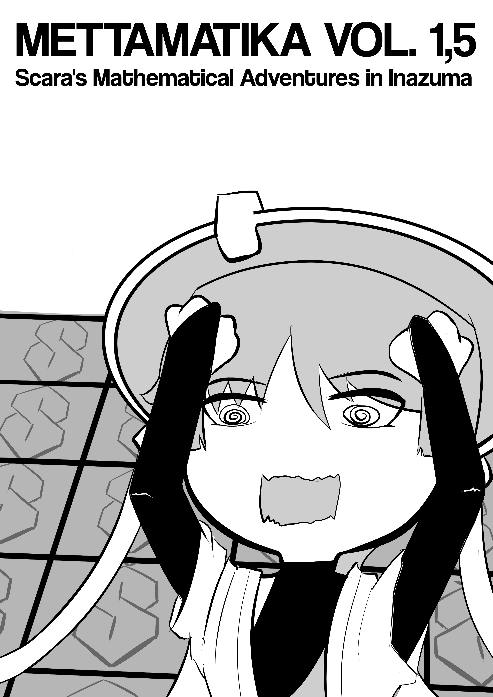
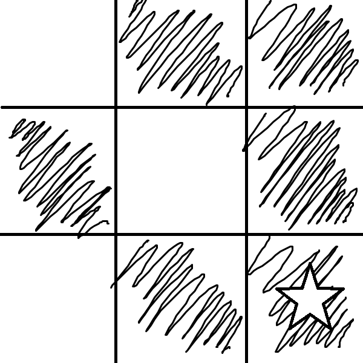
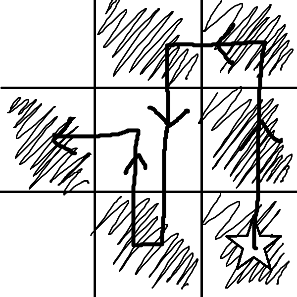
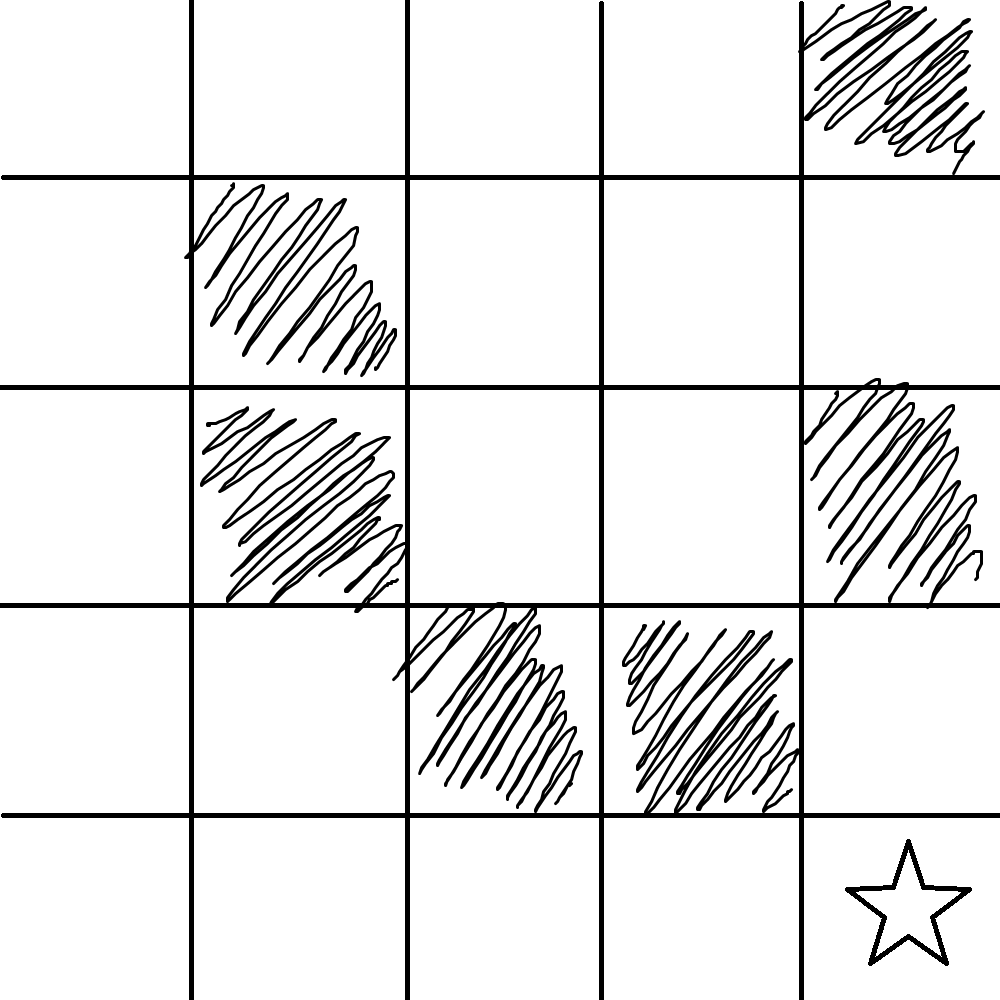
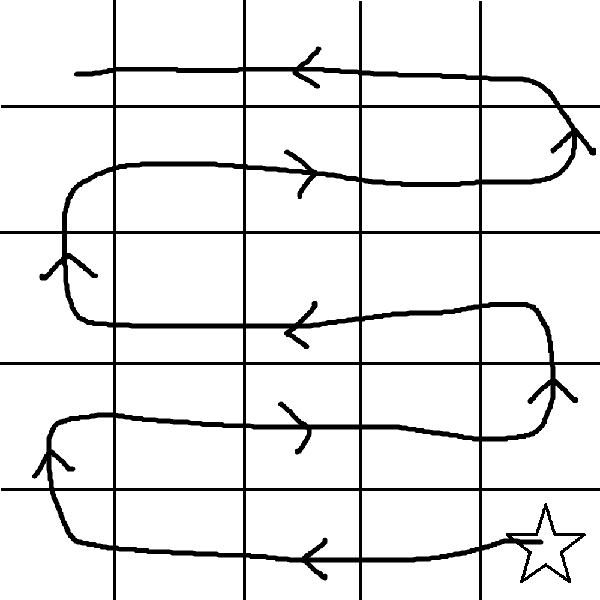
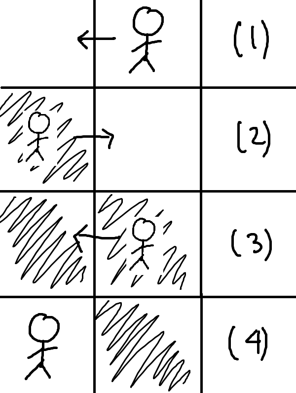
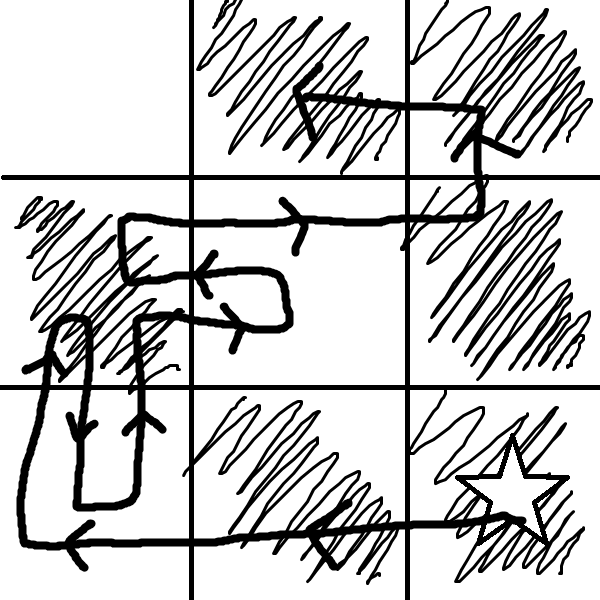

+++
title = "Mettamatika vol. 1,5: Scara's Mathematical Adventure in Inazuma"
date = "2024-11-09"
description = "Mettamatika volume 1,5: Scara's Mathematical Adventure in Inazuma"
tags = [
    "Mettamatika",
    "Mettamatika vol. 1,5",
    "Mettamatika Paruh"
]
+++

**Sinopsis**: Scara sedang melakukan *treasure hunt* di Inazuma, tetapi untuk mendapatkan *treasure* tersebut, Scara harus menyelesaikan suatu *puzzle* terlebih dahulu. Scara terlihat kesulitan untuk memecahkan *puzzle* tersebut. Bisakah kalian membantu Scara untuk mendapatkan *treasure*-nya?

# Intro

Pada suatu hari, Scara menemukan peta harta karun yang berisi sebuah lokasi dan suatu *clue*. 

Setelah tiba di lokasinya, Scara menemukan sebuah *tile*. Setelah diinjak, *tile* tersebut menyala dan *tile* berukuran 3x3 pun muncul. Kemudian ia mencoba untuk menginjak *tile* sebelahnya dan *tile* tersebut menyala. Namun, saat Scara kembali ke *tile* awal, lampunya menjadi kembali mati. Setelah mencoba beberapa kali, Scara menyimpulkan bahwa mekanisme *puzzle*-nya adalah sebagai berikut:

*	Terdapat satu *tile* tunggal dalam keadaan mati, ditandakan dengan bintang dalam *clue*-nya, sebut saja titik pijak awal.
*	Ketika *tile* tersebut diinjak, *tile* tersebut akan menyala dan 8 *tile* lainnya akan muncul sehingga membentuk *grid* berukuran 3x3.
*	Scara hanya bisa bergerak ke atas, bawah, kiri, atau kanan [tidak bisa diagonal].
*	Ketika diinjak, *tile* yang awalnya mati akan menyala, dan sebaliknya, jika diinjak lagi, *tile* yang awalnya menyala akan menjadi mati.
*	*Tile* yang berbintang pada *clue* adalah *tile* yang pertama kali diinjak.
*	Pada *clue*, *tile* yang berwarna hitam artinya menyala, dan *tile* yang berwarna putih artinya mati.
*	*Puzzle*-nya selesai ketika konfigurasi nyala-mati dari tile-nya sesuai dengan *clue* yang diberikan.

Jika dilihat dari *clue* sebelumnya, sepertinya Scara harus membuat pola yang sama dengan yang ada di *clue*. Dapatkah kamu mencoba untuk mencari jalur supaya *puzzle* tersebut terpecahkan? Setelah mencoba, Scara menemukan jalur ini yang dapat menyelesaikan *puzzle*-nya.

Perhatikan bahwa *tile* yang ditengah diinjak dua kali sehingga keadaan akhir *tile* tersebut adalah mati. Sekarang, bisakah kalian menemukan jalur berbeda untuk menyelesaikan *puzzle* di atas?

# Perumusan

Beberapa hari kemudian, Scara menemukan *puzzle* yang sama, tapi kali ini lebih besar, berukuran 5x5. Dapatkah kalian menyelesaikan *puzzle* ini?

Ternyata, semua *puzzle* berukuran m x n dapat memiliki solusi. Namun, sebelum mencapai kesimpulan itu, Scara menemukan beberapa observasi kecil terlebih dahulu.

Pertama, *grid* berukuran m x n dapat diubah menjadi *grid* berukuran 1 x mn dengan cara mengular. Maka, jika Scara dapat menyelesaikan semua *puzzle* yang lurus, maka dia dapat menyelesaikan *puzzle* dengan ukuran apa pun.

Kedua, Scara dapat mengubah kondisi *tile* yang sedang diinjaknya sambil maju sebanyak 1 *tile*.

*Ilustrasi langkah-langkah yang Scara lakukan untuk menyalakan tile yang sedang diinjaknya.*

Perhatikan bahwa setelah melakukan langkah di atas, Scara bergerak ke *tile* sebelahnya, dan *tile* sebelumnya berubah dari mati menjadi menyala.

Dari kedua observasi di atas, dapat dibuat sebuah langkah umum untuk menyelesaikan semua *puzzle* dengan ukuran apa pun. Pertama, ubah *grid*-nya menjadi suatu garis lurus, dan injak *tile* pertama. Kemudian, jika *tile* yang sekarang sedang diinjak sudah sesuai dengan *clue*, maju saja ke *tile* berikutnya. Namun, jika *tile* yang sekarang diinjak tidak sesuai dengan *clue*, maka lakukan langkah flip and move seperti dijelaskan di atas, yaitu maju, mundur, dan maju lagi. Setelah itu, ulangi langkah sebelumnya sampai *puzzle* selesai.

Sekarang, kita bisa menyelesaikan *puzzle* di awal dengan cara ini. 

Apakah jalur yang kalian temukan sama dengan jalur yang dibuat oleh langkah ini? Apakah jalur ini adalah jalur yang tercepat (dengan langkah tersingkat) untuk menyelesaikan *puzzle* ini? Apakah kalian bisa memikirkan cara untuk mencari jalur yang tercepat? Apakah setiap *puzzle* dapat diselesaikan dengan menggunakan langkah di atas?

Ternyata, dengan cara ini, semua *puzzle* berukuran apa pun dapat diselesaikan. Fakta ini dapat dibuktikan secara matematis sehingga kebenarannya dapat diverifikasi. Untuk pembuktiannya silakan cek di [1], dan untuk referensi puzzle-nya dapat dilihat di [2] dan [3].

# Daftar Pustaka
1. arisu and geq0, “General Solutions to the Light-Up *tile* Puzzles,” 2024, [Online]. Available: https://github.com/aris-uu/papers/blob/main/General%20Solutions%20to%20the%20Light-Up%20Tile%20Puzzles.pdf 
2. “Light-Up *tile* Puzzle”. [Online]. Available: https://genshin-impact.fandom.com/wiki/Light-Up_Tile_Puzzle 
3. “Lost Riches 2021-08-06”. [Online]. Available: https://genshin-impact.fandom.com/wiki/Lost_Riches/2021-08-06 

Mettamatika vol. 1,5

Tim:
* adriantom9
* Furra
* Rubi
* AuvioraA
* ReaVix
* arisu
* Celestia Alucard
* vicerne28
* izzako

Mettamatika vol. 1,5 – Petualangan Scara

Text: arisu

Cover: ReaVix

Spearhead Circle @ F-02/03 Comic Frontier 19