+++
title = "Mettamatika vol. 2,5: Selamat Datang di Hotel Hilbert"
date = "2025-11-15"
description = "Mettamatika volume 2,5: Selamat Datang di Hotel Hilbert"
tags = [
    "Mettamatika",
    "Mettamatika vol. 2,5",
    "Mettamatika Paruh"
]
+++

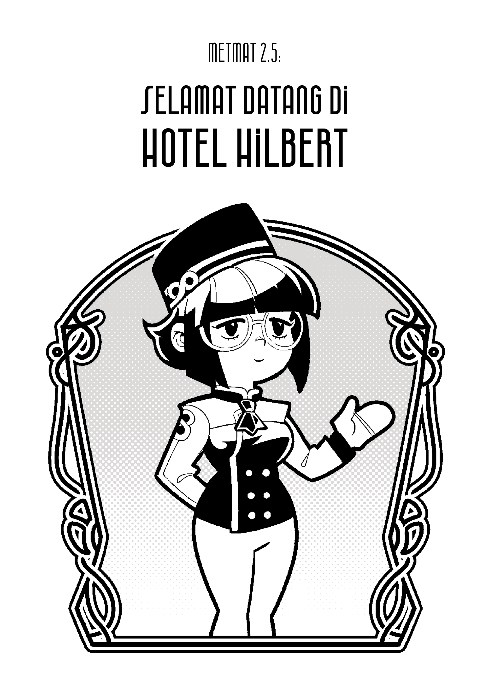

# Hotel Hilbert

Tidak terhingga adalah konsep yang sering
dijumpai di matematika. Tidak terhingga adalah
konsep yang merepresentasikan benda yang
sangat besar, yang tidak memiliki batas.

Contoh benda yang tidak terhingga adalah
himpunan bilangan asli. BIlangan asli dimulai dari
1, kemudian 2, 3, dan seterusnya. Untuk setiap
bilangan asli, selalu ada bilangan asli yang
lebih besar. Oleh karena itu, himpunan bilangan
asli merupakan himpunan tidak terhingga.

Tapi sebenarnya himpunan tidak terhingga itu sebesar apa sih, dan apakah semua himpunan yang tidak terhingga memiliki
ukuran yang sama? Hotel Hilbert adalah sebuah
eksperimen pikiran yang digunakan David
Hilbert untuk menjelaskan konsep himpunan
tidak terhingga. Hari ini kita akan
belajar tentang himpunan tidak terhingga
bersama Metta yang sedang mendaftar
untuk kerja magang sebagai resepsionis di Hotel
Hilbert.

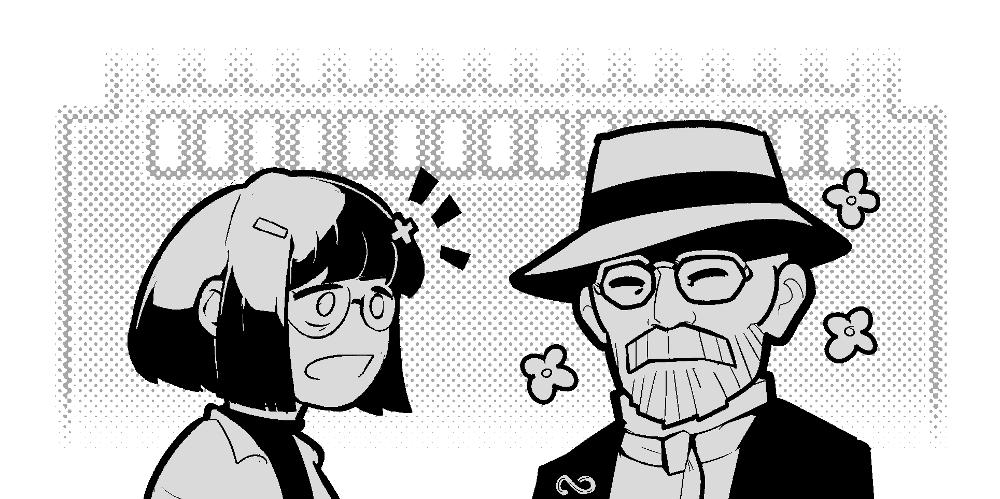

“Wah David, hotelmu besar sekali!”

“Tentu saja Metta, hotelku kan punya kamar
sebanyak semua bilangan asli. Hotelku tidak
terhingga.”

“Bolehkah saya bekerja di sini?”

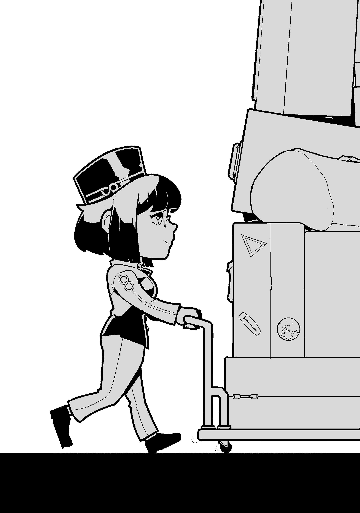

# Hari Pertama: Satu Orang Tamu

Ini hari pertama Metta bekerja sebagai resepsionis Hotel Hilbert. Hari ini, semua kamar sudah ditempati tamu, karena sedang ada Comic Frontier ∞ di gedung sebelahnya. Hotel ini tampaknya sudah penuh. Namun, bisakah hotel ini memuat satu orang tamu lagi?

Satu orang tamu tiba di Hotel Hilbert.

“Permisi mbak, bolehkah saya memesan
satu kamar untuk malam ini?”

“Hmmm, sekarang semua kamar sudah
ada isinya mas, tapi bisa diatur kok.”

“Hah? Kalau semua kamar udah ada tamunya,
hotelnya penuh dong? Emangnya bisa gimana
lagi?”

“Hotel Hilbert kan besar sekali mas, tidak
terhingga kamarnya.”

Metta mengeluarkan sebuah papan
tulis. Kemudian dia mulai menjelaskan prosedur
standar untuk mengakomodasi satu tamu di
Hotel Hilbert. Jadi gini, tamu baru harus
ditempatkan di kamar nomor 1. Kemudian,
tamu dari kamar nomor 1 kami pindahkan
ke kamar nomor 2. Kemudian, 2 ke 3, 3 ke 4,
dan seterusnya. Intinya, tamu dari kamar
nomor N berpindah ke N+1.

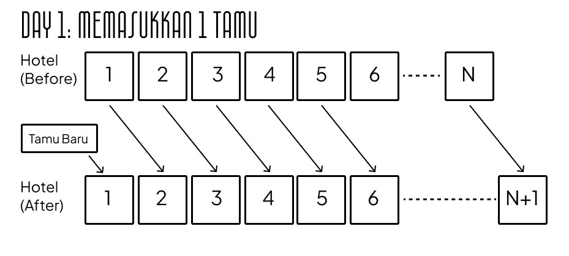 

Tentu saja proses ini tidak bisa dilakukan di hotel biasa. Di hotel biasa dengan banyaknya
kamar yang terhingga, akan selalu ada kamar terakhir dengan nomor terbesar. Tamu dari kamar
itu tidak akan bisa pindah ke kamar yang baru.

Namun di Hotel Hilbert yang tak terhingga, semua tamu pasti bisa pindah ke kamar yang baru.

“Wah, ternyata mudah sekali ya mbak prosedur-nya”

“Iya mas, tapi sekarang ada bagian yang susah buat saya.”

“Bagian apa tuh?”

“Ngangkat-ngangkat koper tamu.”

Dengan susah payah, Metta bisa menambah-
kan satu tamu ke Hotel Hilbert yang sudah penuh.

Tampaknya, tak hingga tambah satu masih tak hingga.

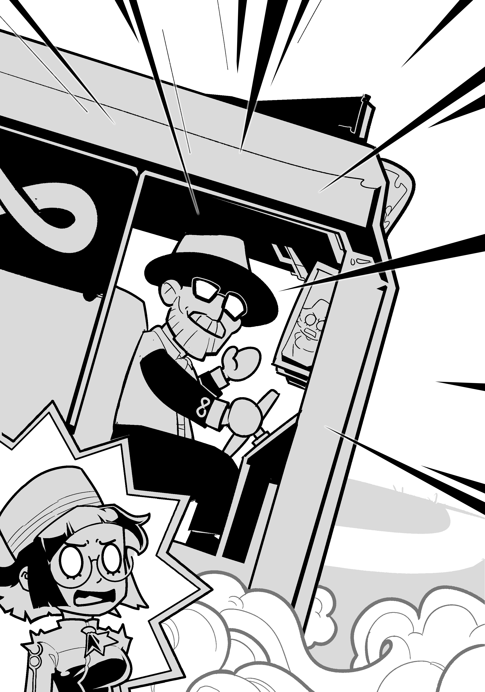 

# Hari Kedua: Bus Pariwisata Hilbert

Hari kedua diawali dengan sebuah kejutan untuk Metta. Sebuah bus yang sangat panjang masuk ke parkiran Hotel Hilbert. Tampaknya
bus ini panjangnya tak hingga.Kira-kira, apakah Metta bisa menambahkan tak hingga tamu ke Hotel Hilbert yang sudah penuh?

Tiba-tiba David Hilbert muncul dari kursi
pengemudi bus.

“Selamat pagi Metta! Ini bus usaha sampingan
saya, Bus Pariwisata Hilbert.”

“Wah David, busmu besar sekali!”

“Terimakasih Metta, sama seperti hotelku, bus
ini punya kursi sebanyak himpunan bilangan
asli.”

“Kalau begitu, izinkan saya mulai briefing untuk
penumpang busnya ya”.

Metta mulai menjelaskan cara menempat-
kan penumpang dari Bus Hilbert di Hotel Hilbert.

Pertama, kami pindahkan tamu yang sudah ada di hotel. Tamu dari kamar nomor 1 kami pindahkan ke kamar nomor 2. Kemudian 2 ke 4, 3 ke 6, dan
seterusnya. Intinya, tamu dari kamar bernomor N dipindahkan ke kamar bernomor 2N. Sekarang, semua kamar bernomor genap ada isinya, sementara kamar bernomor ganjil kosong.

Kemudian, kami tempatkan penumpang dari bus di kamar bernomor ganjil. Penumpang dari kursi nomor 1 kita tempatkan di kamar nomor 1.
Kemudian 2 di 3, 3 di 5, dan seterusnya. Intinya, penumpang dari kursi bernomor N ditempatkan di kamar bernomor 2N-1. Begitulah caranya menambahkan tamu dari Bus Pariwisata Hilbert yang tidak terhingga.

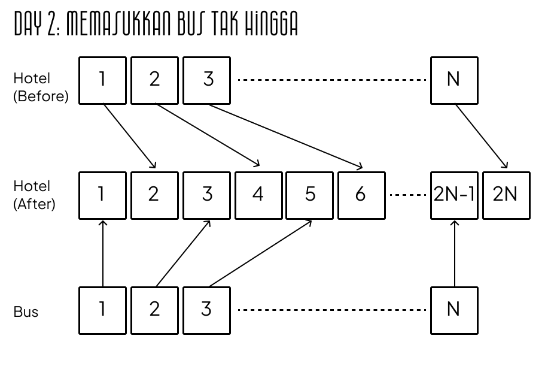 

“Bagus sekali Metta, kamu lolos tantangan
hari ini.”

“Terima kasih Pak David. Kalau boleh tahu,
apakah ada hadiahnya?”

“Tergantung, memangnya kamu mau hadiah
apa?

“Tolong bantuin saya ngangkat koper pak.”

Dengan susah payah, Metta dan David
Hilbert bisa menambakan tidak terhingga tamu ke
Hotel Hilbert yang sudah penuh. Tampaknya,
tidak terhingga dikali dua tetaplah tidak
terhingga.

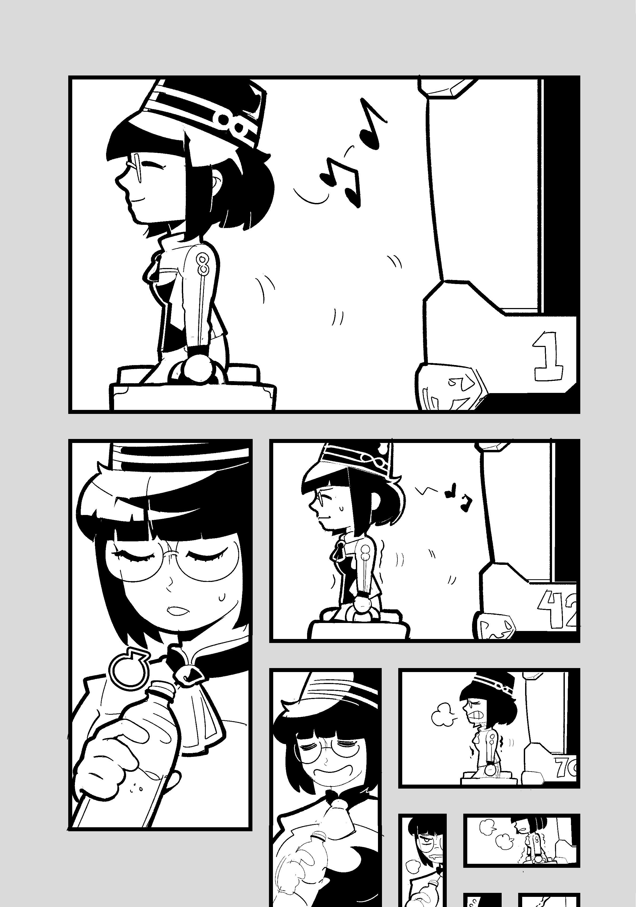 

# Hari Ketiga: Konvoi Bus Hilbert

Pada hari ketiga, terdapat kejutan yang lebih besar lagi untuk Metta. Tampaknya Bus Pariwisata Hilbert sedang laris manis, dan terdapat tidak terhingga banyaknya bus di parkiran, masing-masing dengan penumpang
sebanyak tak terhingga. Metta kebingungan. Bagaimana caranya memasukan tidak terhingga dikalikan tidak terhingga ke dalam hotel? Metta
pun memanggil David Hilbert.

“David, tolongin David...”

“Ada apa Metta?”

“Wah David, konvoi punyamu besar sekali!
Jadi, bagaimana cara memasukan tak hingga
bus ke dalam hotel?”

“Ingat Metta, bilangan prima juga banyaknya
tak hingga.”

“Hmmm, lalu bagaimana dong?”

“Kita bisa gunakan operasi pangkat.”

Metta mulai merumuskan metode menggunakan bilangan prima dan operasi
pangkat.

* Tamu hotel dari kamar ke-N, kita pindahkan ke kamar bernomor 2^N.
* Penumpang dari bus pertama dan kursi ke-N, kita tempatkan di kamar bernomor 3^N.
* Penumpang dari bus kedua dan kursi ke-N, kita tempatkan di kamar bernomor 5^N.

Dan seterusnya.

Karena bilangan prima ada tak hingga banyaknya, tiap bus bisa mendapatkan
sebuah bilangan prima yang berbeda. Dan karena bilangan prima tidak saling membagi, tidak akan ada dua penumpang yang ditempatkan di
kamar yang sama. Dengan metode ini, bahkan ada sangat banyak kamar yang masih kosong, contohnya kamar nomor 6 dan 10 tidak ada isinya.

Untuk penjabaran lebih jauh bisa dilihat pada grafik di bawah.

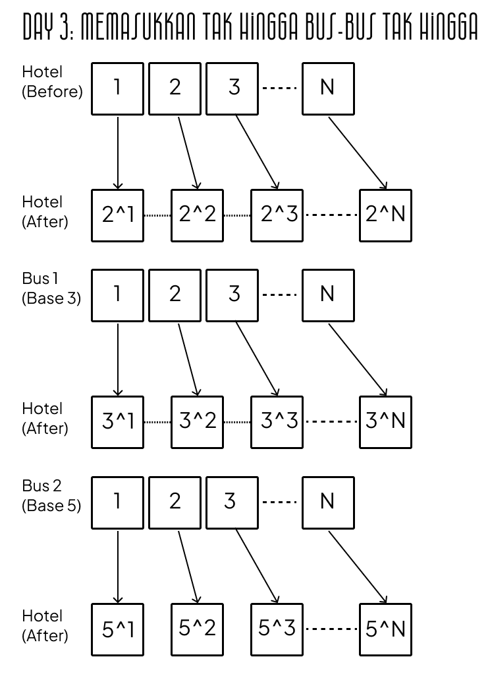 

Instruksinya sudah lengkap, saatnya kita ngangkat-ngangkat koper!

“Hari ini kamu jadi belajar matematika
banyak ya, Metta?”

“Bukan hanya matematika sih pak.”

“Memangnya kamu hari ini belajar apa lagi?”

“Belajar bersabar kalau nanti bakal ngebawa
koper banyak banget kayak gini lagi.”

Dengan bantuan David Hilbert, Metta bisa menambahkan tidak terhingga banyaknya bus, masing-masing dengan tidak terhingga banyaknya tamu, ke Hotel Hilbert yang sudah penuh. Ternyata, tak hingga bus dikalikan tak
hingga penumpang, masih muat di dalam tak hingga kamarnya Hotel Hilbert.

“Pak David, Apakah tak hingga ukurannya
sama semua?”

“Belum tentu Metta, karena ada tak hingga
yang lebih besar daripada Hotel Hilbert.”

“Contohnya bagaimana tuh?”

“Mungkin besok kita akan lihat contohnya...”

“Waduh... Kaya gimana ya?

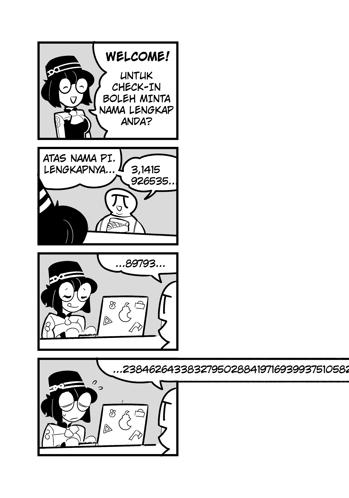 

# Hari Keempat: Hotel Hilbert Vs Paguyuban Riil

Keesokan hari, rombongan yang sangat besar tiba di lobby Hotel Hilbert.

“Selamat pagi- Wah! Rombongan kalian besar sekali!”

“Real mbak, karena kami rombongan Paguyuban Riil. Kami mau pesan kamar di sini.”

“Boleh saya lihat KTP kalian untuk pendaftaran tamu?”

Tiap anggota Paguyuban Riil mengeluarkan KTP yang panjangnya tidak terhingga. Ini karena nama lengkap dari sebagian besar anggota adalah bilangan riil, yang ketika ditulis dengan bilangan desimal, panjangnya tidak terhingga.

“Perkenalkan, nama saya π. Kalau nama panjangannya 3,14159...”

“Kalau saya √2 bin 21⁄2, kepanjangannya jadi 1.4142...”

Metta mulai memikirkan sistem untuk menempatkan tamu dari Paguyuban Riil.
Tampaknya sangat sulit, karena sangat banyak. Metta mulai bingung. Tiba-tiba, muncullah Georg Cantor dari kolong meja resepsionis.

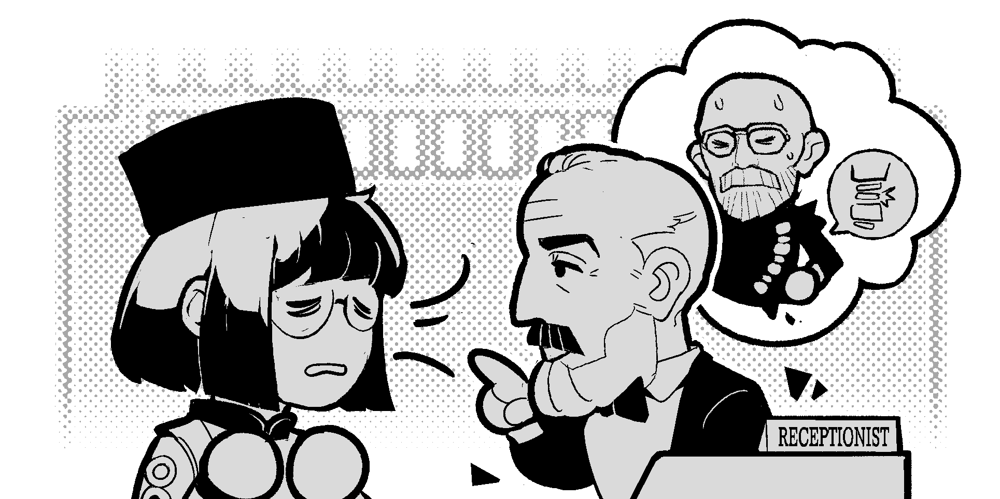 

“Loh, Bapak Georg Cantor, sedang apa di sini?”

“Hari ini saya gantiin David jaga hotel, dia lagi sakit punggung, karena dari dua hari yang lalu ikut bantuin bawa koper.”

“Owalah! semoga beliau cepat sembuh. Maaf agak dadakan, tapi bolehkah saya minta bantuan Bapak Cantor hari ini? Ada banyak tamu dari Paguyuban Riil.”

“...Waduh, kalau ini gak bisa sih Metta. Soalnya, bilangan riil itu himpunan yang tidak terhitung.”

“Artinya apa itu pak?”

“Himpunan tidak terhitung adalah himpunan tidak terhingga yang lebih besar dari himpunan bilangan asli.”

Cantor mulai menjelaskan mengapa himpunan bilangan riil itu tidak terhitung. Bagaimanapun sistem yang dibuat untuk memuat bilangan riil di
hotel Hilbert, kami selalu bisa menemukan minimal satu orang tamu tertinggal, yang belum kebagian kamar.

Caranya adalah menulis bilangan riil yang baru, yang berbeda dari bilangan riil yang sudah dapat kamar. Dari tamu di kamar nomor 1, kita lihat digit pertama di KTP bilangan riil nya. Kalau digit pertamanya bukan 0, kita tulis 0 sebagai digit pertama dari bilangan baru kita. Kalau digit pertamanya 0, kita tulis 1 sebagai digit pertama.

Kita ulangi di kamar-kamar berikutnya. Untuk menulis digit ke-2 dari bilangan baru kita, kita melihat kamar bernomor 2. Dari tamu di dalam
kamar ke-2, kita lihat digit ke-2. Kalau bukan 0, kita tulis 0 sebagai digit ke-2 bilangan baru kita. Kalau 0, kita tuliskan 1. Kita ulangi untuk tak terhingga kamar, dan kita peroleh bilangan baru yang panjangnya tak hingga.

Karena Paguyuban Riil memuat semua bilangan riil, pasti ada tamu misterius dengan nomor KTP dengan bilangan riil yang baru ini.
Bilangan ini memiliki digit pertama yang berbeda dengan tamu kamar nomor 1. Digit ke-N nya juga berbeda dengan tamu kamar nomor N. Artinya si tamu misterius ini belum dapat kamar! Dia merupakan tamu yang tertinggal.

Bagaimanapun sistem yang kita buat untuk memasukkan anggota Paguyuban Riil ke Hotel Hilbert, kita pasti akan menemukan bilangan baru lagi, sehingga selalu akan ada tamu yang tidak dapat kamar.

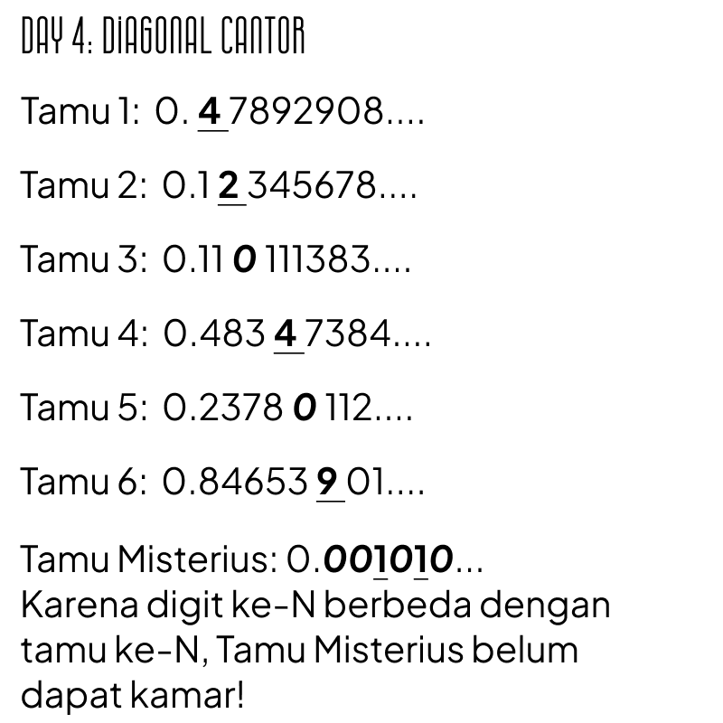 

Metta dan Cantor dengan berat hati harus menolak tamu dari Paguyuban Riil. Paguyuban Riil pun kecewa dan mulai marah-marah. Review jelek dari Paguyuban Riil mulai masuk di Google Maps.

“Katanya hotelnya gede, tapi Paguyuban Riil kita kok gak dikasih kamar?! 1 bintang.”

“Ini diskriminasi dari bilangan asli terhadap bilangan riil! 1 bintang.”

“Hotelnya jelek, tapi resepsionisnya cakep sih. 2 bintang.”

Akhirnya Hotel Hilbert terpaksa tutup karena review bintang satu dari Paguyuban Riil yang kecewa.Ternyata ada himpunan tak terhingga yang lebih besar dari bilangan asli, yaitu bilangan riil.

Mettamatika vol. 2,5

Tim:
* adriantom9
* Furra
* Rubi
* AuvioraA
* sekarjoget
* Blabyblab

Mettamatika vol. 2,5 – Selamat Datang di Hotel Hilbert

Text: Rubi

Illustration: Blabyblab

Cover: Blabyblab

Spearhead Circle @ M-02/03 Comic Frontier 21