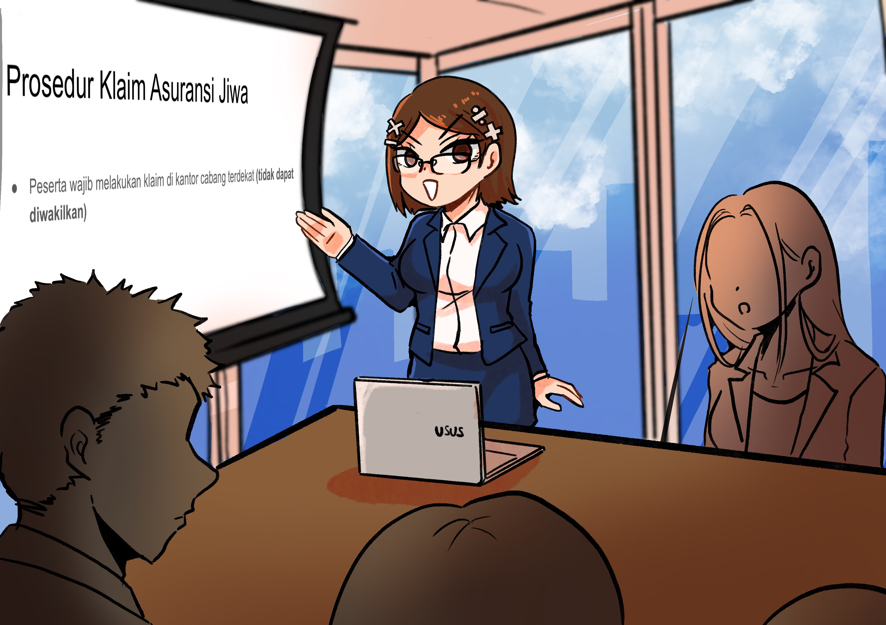
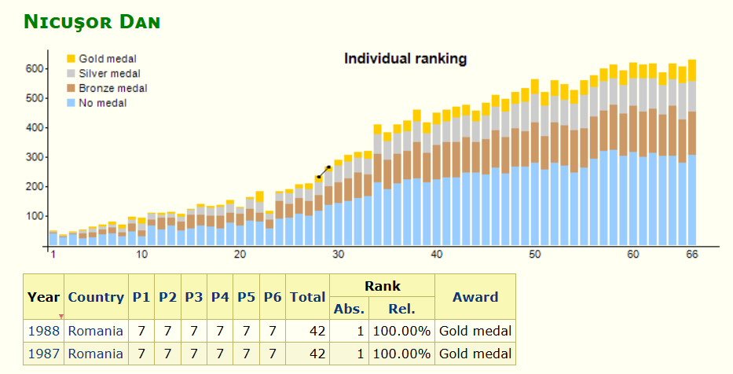
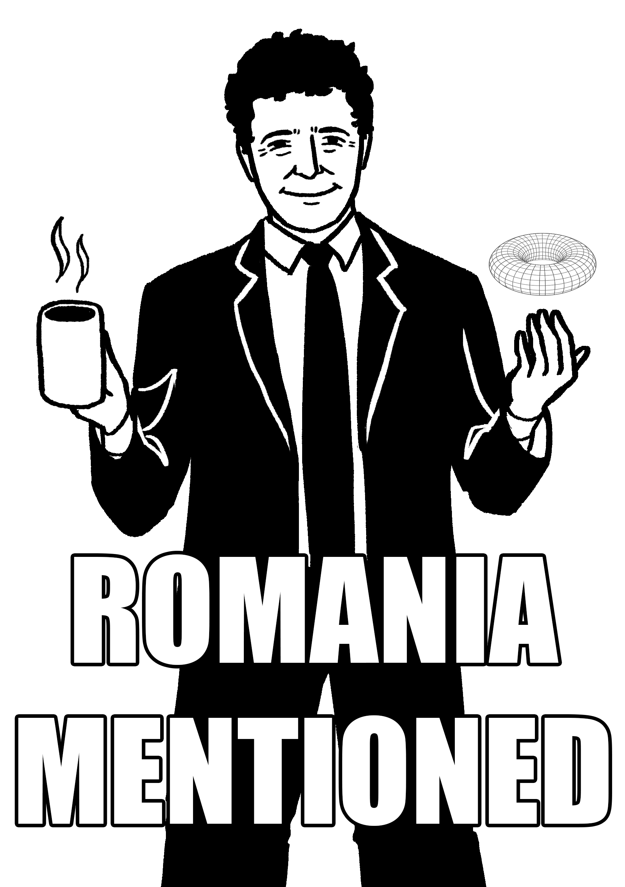

+++
title = "Mettamatika vol. 2,5: Prospek Kerja Jurusan Matematika"
date = "2025-11-15"
description = "Mettamatika volume 2,5: Prospek Kerja Jurusan Matematika"
tags = [
    "Mettamatika",
    "Mettamatika vol. 2,5",
    "Mettamatika Paruh"
]
+++

**Sinopsis**: Metta, saat kelas 12, tentunya pernah juga bingung memilih jurusan perkuliahan. Sesuai namanya, ia sangat menyenangi matematika. Tapi seperti biasa, tentunya cukup sedikit terlintas di benak Metta untuk mengambil jurusan matematika untuk kuliah. Akan tetapi, banyak orang-orang di sekitar Metta yang berkata "kuliah matematika ngitung-ngitung doang", atau "kuliah matematika prospeknya jadi guru, kalau ga dosen, tau aja gaji dosen berapa...". Banyak yang berkata seperti itu, mulai dari guru BK, tetangga, sampai pegawai BK.

Jadi, apakah mereka benar? Sebenarnya kuliah di jurusan matematika
itu ngapain sih? Terus kuliah matematika lulusannya bisa jadi apa?
Apakah salah menanyakan prospek kerja dari suatu jurusan? Apakah
salah untuk berkuliah pada saat kita tahu kondisi dunia sedang tidak
baik baik saja? Jangan khawatir, pada buklet Mettamatika yang sedang
kita baca ini, kita akan coba menjawab tiga pertanyaan pertama. Untuk
dua pertanyaan terakhir, entahlah, kita serahkan kepada pembaca
sebagai latihan.

# Part 1a: Kenapa masuk jurusan matematika?

Mungkin beberapa pembaca yang "suka berhitung” pernah disarankan
untuk masuk jurusan matematika. Lalu terkadang terlintas di benak:
memangnya jurusan matematika ngapain? Apakah menghitung
bilangan yang lebih besar lagi? Apakah menambah rumus yang lebih
belibet lagi? Kan sudah ada kalkulator? ChatGPT? Gemini?

Pertanyaan terakhir tidak dijawab di buklet ini, sudah beda topik. Tapi,
apa saja yang bakal diajarkan di jurusan matematika? Kalau disebut
secara kasarnya sih, biasanya mata kuliah yang diajarkan bakal seperti
ini, dengan penjelasan cukup-singkat:

* **Kalkulus,** kalkulus lanjut, analisis real, analisis kompleks,
silakan lihat di buku Mettamatika pertama. (sebenarnya tidak ada
analisis kompleks tapi ehh)

* **Statistika,** bisa dilihat di buku Mettamatika kedua.

* **Aljabar linear,** matriks-matriksan dan vektor-vektoran versi
lanjut dikit. Mungkin masuk Mettamatika ketiga? Hehehehehe.

* **Pemodelan matematika,** anggap matematika versi ngoding lah.

* **Struktur aljabar,** alias aljabar abstrak. Mungkin judul mata
kuliahnya sudah menjelaskan untuk saat ini...

* **Kombinatorika,** ilmu cacah-cacahan, kombinasi, permutasi on
steroids

Sedikit iklan juga, kalau penasaran ``versi serius” dari mata kuliah jurusan matematika, silakan ikuti proyek blog penulis beserta kawan-
kawan di morfID, sementara tersedia di IG [@morfid.math](https://www.instagram.com/morfid.math/) dan wordpress [morfidmath.wordpress.com](morfidmath.wordpress.com). Udah lah ikutin aja hehehehe.

Nah, apakah mata kuliah-mata kuliah di atas juga memerlukan banyak
perhitungan? Sayangnya tidak, kan sudah ada kalkulator dan komputer.
Tapi sebenarnya, yang dipelajari dalam jurusan matematika adalah *cara berpikir abstrak, dalam bahasa matematis.* Kalau ditarik pada intinya,
mata kuliah-mata kuliah yang telah ditulis di atas sebenarnya
mengajarkan suatu hal yang serupa: cara berpikir secara abstrak. Atau
*cara berlogika.*

Sebentar, memangnya apa gunanya hal seperti ini di dunia nyata?
Memangnya kita perlu membuktikan untuk setiap epsilon lebih besar
dari nol selalu ada delta lebih besar dari nol sehingga untuk setiap x...

Betul, memang permasalahan di mata kuliah mata kuliah matematika
jarang ditemukan secara eksplisit di dunia nyata. Sama halnya seperti
kita hampir tidak pernah menemukan orang yang membeli enam puluh
buah semangka lalu ditambah dengan tiga puluh tujuh tandan pisang.
Kecuali di pasar induk.

Akan tetapi, melatih cara berpikir lewat matematika dapat dimisalkan
(meminjam bukunya Jordan Ellenberg, How not to be Wrong) seperti
latihan nge-gym untuk pesepakbola. Tentunya, sewaktu main bola, kita tidak akan diminta untuk angkat-angkat barbel atau lari-lari di treadmill. Tapi tentunya, kita semua tahu bahwa kegiatan gym berguna untuk meningkatkan massa otot, yangmana tentunya akan berpengaruh untuk
kebugaran pada saat bertempur di lapangan.

Nah, anggaplah belajar matematika seperti itu, tapi untuk otak.

Di sisi lain, latihan berpikir secara abstrak sangat berguna untuk
menghadapi hal-hal baru, masalah-masalah kiwari yang tidak pernah
dihadapi para leluhur sebelumnya; sebut saja seperti hukum lalu lintas
bagi mobil tanpa pengemudi, bagaimana cara mengatasi pencucian
uang dengan kriptokurensi, ataupun memilih waifu terbaik antara Kana
Arima dan Akane Kurokawa. Meskipun untuk permasalahan terakhir,
sudah jelas Aqua cocok-cocok saja dengan Kana dan Akane lebih cocok
dengan saya.

# Part 1b: Kenapa masuk jurusan matematika? 

Dijawab oleh dosen-dosen Matematika ITB

Untuk menambah-nambah alasan, penulis memutuskan untuk bertanya kepada beberapa dosen ITB. Berikut penulis kutip jawabannya, secara verbatim:

Pak **Hendra Gunawan:**

* Kamu suka matematika? Atau malah jago matematika? Lulus
SMA ntar, ambil program studi matematika aja. Jangan
tanggung-tanggung, daftar ke FMIPA-MA ITB sekalian.
Lulusannya bisa kerja di banyak perusahaan. Mau studi lanjut
lagi juga bisa. Jadi doktor matematika, keren kan!

Pak **Aleams Barra,** versi pendek:

Ya hasutannya kurang lebih : di era disrupsi oleh AI orang yang berbekal
dengan kemampuan matematika akan bisa survive :\)

Pak **Aleams Barra,** versi panjang:

William Thurston, seorang matematikawan ternama, pernah
mengatakan bahwa matematika bukanlah tentang angka, persamaan,
atau algoritma. Matematika sepenuhnya tentang understanding.
Memilih jurusan matematika memang sering terasa seperti keputusan
yang tanpa peta karier yang jelas. Tidak ada satu nama pekerjaan
spesifik yang otomatis menanti setelah lulus. Namun justru di era
disrupsi AI seperti sekarang, ketika semakin banyak pekerjaan berbasis
prosedur dan hafalan dapat digantikan mesin, kemampuan memahami
secara mendalam menjadi modal yang paling langka dan paling bernilai.

Belajar matematika melatih Anda untuk berpikir jernih dan sistematis:
mendefinisikan masalah dengan tepat, bekerja di dalam kerangka asumsi yang jelas, memecah persoalan kompleks menjadi bagian-bagian yang dapat ditangani, mengenali pola, melihat abstraksi dari contoh spesifik, serta menguji kebenaran dengan ketelitian dan kerendahan hati intelektual. Kemampuan-kemampuan ini tumbuh karena seorang matematikawan, sejak awal, dilatih untuk tidak puas hanya dengan jawaban. Ia selalu menuntut pemahaman. Di masa depan, yang unggul bukanlah mereka yang hanya bisa menggunakan AI, melainkan mereka yang mampu mengarahkan penggunaannya,
memformulasikan masalah dengan tepat, dan menilai kebenaran serta
relevansi jawaban AI. Itulah kekuatan lulusan matematika.

Pak **Aditya P. Santika:**

* Skill utama yang harapannya didapet sbg lulusan matematika itu problem solving, ga hanya pengetahuan matematika yg spesifik. Kita belajar banyak bidang matematika tentu saja ga semuanya akan dipake di dunia kerja, termasuk bidang akademik sekalipun. Jadi, yang seharusnya nempel selama belajar matematika itu cara nyelesain suatu masalah. Dari mulai
adaptasi solusi masalah yg udah ada sampai ke nemuin solusi yang bener-bener baru. Makanya lulusan matematika biasanya bisa masuk jadi apa aja, karena pada dasarnya kita jack of all trade, tapi jangan jadi akademisi di negara tercinta kita ini ya...

Seperti buku-buku matematika pada umumnya, kesimpulan dari
kutipan-kutipan di atas diserahkan kepada pembaca sebagai latihan.

# Part 2: Jadi, lulusan matematika bisa jadi apa saja?

Pertama, kita harus mengonfirmasi suatu stereotipe yang lazim beredar
di masyarakat. Ya memang benar, salah satu prospek lulusan
matematika adalah jadi dosen atau guru. Perihal apakah pekerjaannya
menghasilkan banyak uang... itu pertanyaan lain.

Jadi apa lagi sih prospek pekerjaan yang lain bagi lulusan matematika?
Salah satu opsi lazim lain adalah menjadi ASN. Tetapi ini juga pekerjaan
mainstream menurut penulis, jadi tidak akan dibahas lebih lanjut. Oh,
kita juga tidak memperhitungkan management trainee yang lazim
diselenggarakan perusahaan-perusahaan besar, lahwong biasanya
lowongan beginian terbuka untuk umum.

(cr: Risu – Mettamatika vol. 2)

Jadi, apa saja opsi-opsi pekerjaan menarik yang tersedia **dan relevan dengan keilmuan** lulusan matematika?

Yang pertama, *aktuaris,* suatu pekerjaan yang menghitung "risiko”.
Posisi ini biasanya lazim ditemui pada perusahaan-perusahaan asuransi
(bukan sales!!!), lebih tepatnya di bagian yang menghitung “berapa
premi yang harus Anda bayar”?

Memang benar bahwa ilmu risiko masih menyinggung-nyinggung
ekonomi, akan tetapi ilmu ekonomi yang terkait dengan bidang ini...
sangat matematis sekali. Terkhususnya, penulis sering mendengar
komentar dari kolega penulis bahwa studi lanjut ekonomi sangat
memerlukan fondasi matematika yang kuat. Penulis juga pernah
mendengar bahwa mantan menteri ekonomi Indonesia sering meminta
bantuan kepada salah satu profesor matematika ITB pada saat
keduanya sekampus S3. Identitas diserahkan kepada pembaca sebagai
latihan.

Tapi mungkin pembaca bertanya-tanya; *kan* sudah ada jurusan aktuaria,
kenapa tidak masuk jurusan sana? Penulis menjawab, kalau jujur,
jurusan aktuaria itu sangat spesifik. Lebih mudah bagi lulusan
matematika belajar aktuaria dibandingkan lulusan aktuaria belajar
matematika. Dan juga, meskipun lulusannya menjamur, tetap saja jalan
masih panjang untuk menjadi seorang aktuaris sejati (maksudnya, yang
bersertifikasi). Pada tengah 2010an memang ada propaganda
"Indonesia perlu seribu aktuaris”. Meskipun propagandanya sudah tidak
terlalu bergaung sekarang, penulis masih dibisiki oleh salah satu praktisi industri bahwa industri Indonesia masih perlu banyak aktuaris (yangsudah mapan). Untuk pembahasan lebih lanjut tentang aktuaria, silakan baca buku Mettamatika kedua tentang statistika. Hehehehe.

(cr: nunu - Mettamatika vol. 2)

Yang kedua, data analyst. Kalau kita percaya bootcamp-bootcamp yang
beredar di dunia maya, memang benar semua orang bisa jadi data
analis. Akan tetapi, skill dasar data analyst (atau data-dataan lain) berasal dari matematika, utamanya di bagian pengolahan data dan
pemodelan.

Yang ketiga, *quant.* Ga ada di Indo sih, cuman anggap saja mereka
mainnya di pasar saham lah. Detilnya bisa dilihat di internet, tapi jujur
saja, pekerjaan ini sangat-sangat-sangat-cuan.

Tapi, sebenarnya apa lagi *sih* prospek kerja lulusan matematika?

Tentunya, tidak semua lulusan matematika bekerja "sesuai bidangnya”.
Tapi kalau kata saya sih, santai aja. Toh sewaktu kita lulus kuliah,
misalkan pada umur dua puluh tiga tahun, perjalanan sebenarnya masih
panjang. Masih banyak opsi kehidupan yang bisa dilalui (kecuali kalo
dikejar-kejar syarat lowongan maksimal dua puluh lima tahun sih,
hadeh). Toh pada akhirnya hidup juga tidak selamanya lurus-lurus saja.
*Lahwong* lulusan kehutanan aja bisa jadi presiden.

Sebelum melanjutkan, mungkin kalian bertanya-tanya; kenapa penulis
sendiri memilih masuk jurusan matematika? Kilas balik ke masa SMA,
penulis memang sering ikut kompetisi matematika (perihal apakah
menang atau tidak, itu topik pembahasan lain). Jadi, penulis sudah
merasa bahwa "wah matematika ternyata tidak se’menghitung’ itu”.
Oleh karena itu, penulis sempat galau tentang memilih jurusan; apakah
matematika, atau ilmu komputer?

Penulis mendapatkan jawaban utamanya saat bertemu pak Aleams
Barra pada saat kelas 12, yang secara singkatnya memberikan
wejangan yang serupa dengan yang penulis sekarang. Khususnya,
beliau berkata kepada penulis,

“Ya, jurusan matematika fleksibel sih, bisa jadi *apa saja*”.

Waktu itu, penulis mengira apa saja merujuk ke pekerjaan-pekerjaan di
atas. Tapi, kilas maju beberapa tahun kemudian, penulis makin merasa
wejangan pak Barra di atas makin benar.

Sebut saja Richard Garfield, seorang mahasiswa matematika University
of Pennsylvania yang suka membuat permainan kartu. Bahkan saat
kuliah, beliau mengorbankan teman-teman kuliahnya sebagai kelinci
percobaan untuk mengetes permainan-permainan buatannya. Lulus S3
di Pennsylvania, beliau sempat mengajar di kampus lain selama
setahun. Akan tetapi, setahun kemudian dia memutuskan untuk keluar
dan mewujudkan game buatannya menjadi kenyataan...

...dan salah satu dari *game* tersebut adalah Magic: the Gathering.

Karena pada awal buklet ini penulis mengaitkan matematika dan
olahraga, penulis perlu membahas John Urschel, seorang mantan
pemain *American football* era 2010-an. Pada saat aktif di NFL (liga
*American football* terbesar di dunia), beliau pulang-pergi mengambil
studi S3 matematika di MIT. Beberapa waktu kemudian, ia memutuskan
pensiun setelah membaca riset tentang risiko cedera otak pensiunan
NFL, dan memutuskan menjadi matematikawan penuh-waktu. Sekarang beliau masih di MIT, mengabdi sebagai dosen di almamaternya sendiri. Ohya, jerseynya juga dipakai Metta untuk cover buklet ini.

Masih di dunia olahraga, tapi kembali ke Indonesia lebih tepatnya ke
almamater penulis, kita bisa lihat Ratu Tisha. Dulunya beliau aktif di unit sepakbola universitasnya, lebih tepatnya sebagai manajer. Lulus kuliah, beliau sempat berkarir melanglangbuana di perminyakan (jangan salah, perminyakan juga mengincar kemampuan pemodelan matematika!). Akan tetapi, beliau memutuskan untuk mengambil studi S2 disponsori FIFA. Lepas S2, beliau banting setir dari perminyakan untuk berkarir di sepakbola Indonesia, berujung menjadi wakil ketua PSSI (pada saat
tulisan ini dibuat, November 2025).

Dalam kasus agak terbalik, kita beralih ke Romania untuk melihat
Nicusor Dan. Pada saat SMA, beliau dua kali mendapatkan nilai
sempurna dua kali saat menjadi peserta International Mathematical
Olympiad, ya secara kasarnya kompetisi matematika antar negara
paling prestisius untuk siswa sekolah.

Lulus SMA, beliau melanjutkan karir sebagai matematikawan dan
mengambil S3 di Perancis. Akan tetapi, selepas lulus, beliau
memutuskan kembali di Romania dan mengembangkan institusi
pembelajaran matematika Școala Normală Superioară București untuk
mengembangkan riset matematika di Romania (fakta sampingan: dosen
pembimbing penulis sempat mengenyam pendidikan di sini).

DI sisi lain, beliau juga menjadi aktivis politik di Romania dani kemudian hari terpilih menjadi walikota Bucharest, ibukota Romania. Lima tahun menjadi walikota di sana, nama beliau populer sebagai simbol antikorupsi pada saat itu. Dan pada 2025, beliau memutuskan maju
menjadi presiden Romania dan ternyata berhasil terpilih. Selamat!

Sedikit catatan kaki: Lee Hsien Loong, perdana menteri Singapura,
sempat juga mengenyam pendidikan jurusan matematika di Cambridge.
Beliau sempat menjadi Senior Wrangler, sebutan untuk mahasiswa
dengan nilai tertinggi di angkatan universitas Cambridge, dan sempat
diprediksi akan menjadi matematikawan kelas dunia. Akan tetapi, beliau
memutuskan untuk kembali mengabdi kepada negeri sebagai politisi.

Dan masih berbicara kepemimpinan, kita perlu bahas juga tentang
seorang lulusan matematika Vilanova University yang sekarang pindah
ke Vatikan untuk menjadi pemimpin negaranya (dan juga mendapat title
Paus Leo XVI).

Tentunya, masih banyak lagi lulusan matematika yang banting setir ke
jurusan yang “bukan bidangnya”. Untuk menutup buklet ini, penulis
mewawancarai salah satu teman penulis yang sama-sama lulusan
matematika, tetapi sekarang berkarir sebagai ilustrator lepas penuh
waktu.

# Part 3: Testimoni seorang alumni Matematika

Seperti yang penulis katakan di bab sebelumnya, lulusan matematika
bisa tersebar di mana-mana. Untuk membuktikan hal ini, penulis
berhasil mewawancarai salah satu kawan penulis sesama lulusan
matematika (tapi beda univ), sebut saja Koucha. Setelah lulus dari salah
satu universitas top di Indonesia, beliau memutuskan untuk meneruskan
keilmuannya untuk menjadi ilustrator penuh-waktu di internet. Karena
buklet ini tipis, kita langsung saja ke inti pertanyaan.

Ohya, kalau tertarik lebih lanjut tentang beliau, silakan lihat-lihat karya beliau di Twitter: @ChabashiraRibon. Penulis tidak bertanggungjawab
atas isi konten dari akun tersebut.

F: Furra (penulis), K: Koucha

**F: Jadi kenapa Anda memutuskan "banting setir” menjadi ilustrator? Bagaimana motivasinya?**

K: Yg memulai itu ketika SMA kelas 12, karena di masa itu sekolah
sudah mau selesai, dan sudah ga ada lagi lomba2 yg perlu difokuskan.
Jadi, pertanyaan yg muncul tentunya "apakah cuma begini kedepannya
hidupku, disekitar math doang dan ga ada yg lain?"

Intinya mencari kesibukan lain dan apa yg aku suka. Karena waktu itu
jaman2nya suka anime related stuff dan terutama musiknya. Dari situ
muncul banyak imajinasi di kepala, dan aku mikir 'alangkah indahnya
kalo aku bisa menggambarkan apa yg aku pikirkan di kepala (mostly
suasana alam)' Ga kelihatan seperti banting setir ya kyknya? lebih kyk...
gradually pindah haluan sepanjang masa kuliah, keep up dengan
perkuliahan + fokus mengembangkan skill menggambar diwaktu
senggang. Tapi juga, bukan berarti sebelum masuk kuliah aku udah
menetapkan jadi illustrator, karena aku sendiri ga yakin aku bisa gbr.

Kemudian ketakutan ini berubah sedikit demi sedikit, pertama dari
pengalaman magang di suatu perusahaan, yg bikin aku lebih mikir ke
'ini bukan sibuk di kantor, tapi karena di kantor ini aku ga bisa ngerjain gambar, nyatanya disana ga terlalu sibuk apa2 (pas itu begitu)' Jadi bukan sibuk, aku lebih ga suka ngelihat wasted time ku yg ada dimagang ini, mestinya bisa buat hal lain Kedua, ketakutan dengan skill gambarku diringankan dengan melihat bagaimana actual pasarnya pas itu, tidak setinggi itu skill requirementnya, dan tidak serendah itu penghasilannya (assuming anda bermain langsung di pasar luar), tentunya ini gamble, tapi akhirnya aku memilih ini. (Lets go gambling) Butuh waktu sekitar setahun setelah lulus sebelum akhirnya aku bisa stabil di pergambaran. Di waktu itu, kebutuhan hidup masih setengahnya disupport ortu.

Yes its a gamble. Kalo dalam span setahun itu aku ga berhasil di
pergambaran, aku beneran berniat balik di kerja yg related dengan data
science

**F: Pernah berada di persimpangan jalan dalam karir tersebut?**

K: Tentu. Jadi ada hal2 yg aku takutkan dan juga hal2 yg aku rasa seru
untuk didalami di math. Perkuliahan ini mengenalkanku ke banyak
konsep baru di math yg bikin math jadi seru lagi untuk dipelajari. Waktu
itu aku suka apapun yg berurusan dengan Image processing, jadi
naturally konsep Linear Algebra dan apapun yg related dengan matrix
itu bagian favoritku. Di semester2 akhir aku juga mulai tertarik dengan
data science.

Tapi hal itu juga diinspirasi dari pertanyaan "Gimana caranya aku
menggambar sebagai seorang mathematician?" <--- mungkin aku
merasa butuh failsafe in case aku ga berhasil belajar menggambar Jadi,
choicenya itu Image processing / Data science vs Illustrator. Dari dua
pilihan itu, hal yg aku takutkan adalah

Kalo kerja kantoran di bidang itu, khawatir kesibukannya ga bikin aku
sempet belajar gambar (karena di posisi ini aku masih mikir gambar
sebagai side hobby aja). Kalo kerja illustrator, ga yakin bisa survive atau bahkan bisa dapet duit apapun dari sini, skill masih rendah.

**F: In hindsight, apakah Anda bakal tetap di jalan ini?**

K: Lebih ke "harus" tetap di jalan ini. Karena aku sudah memilih untuk
tidak terikat waktu dan tempat lagi, ga akan masuk akal untuk aku
memilih kembali diikat oleh dua hal itu. Sebisa mungkin, berjuang agar
tetap disini. Ini idealis, in fact, ga semuanya bisa seenak ini memilih
keterikatannya.

**F: In hindsight apakah Anda bakal pindah jurusan dari matematika ke senirupa/yang berkaitan gegambaran dari awal? Kenapa?**

K: Dari awal milihnya matematika dan ga akan pindah. Kenapa? aku
gabisa gambar (pas itu) wkwkw

**F: Coba berikan cocoklogi tentang kemampuan matematis yang berguna di pekerjaan sekarang.**

K: Begini cara belajarku:

Sebutlah anda melihat suatu gambar, dan gambar itu memunculkan
suatu impresi tertentu di pikiran anda (Perasaan tertentu, Kesan
tertentu) Tugas anda skrg adalah mencari faktor apa saja yang
membuat hal itu berhasil (menimbulkan kesan di pikiran anda) Hal
seperti ini bisa spesifik sampai ke level helaian rambut dan pilihan
warna. Jadi, berteorilah sesuka anda, apapun yg membuat
reasoningnya valid bagi diri anda adalah hal yg valid.

Ketika ada gambar kedua menghasilkan impresi yang sama, anda bisa
evaluasi lagi apakah faktor2 yg sebelumnya anda asumsikan sebagai
kontributornya juga ada di gambar yg kedua ini, lalu koreksi lagi teori
anda. Jadi secara simplenya, untuk setiap pemetaan dua gambar ke
impresi yg sama, mestinya terdapat basis yg menentukan hal dasar
penentu impresi itu. Untuk setiap impresi terdapat vector space berisi
kumpulan gambar dengan basisnya adalah hal dasar penentu impresi.

Salah satu faktor yg bakal anda temukan nantinya adalah artstyle. Untuk
hal ini, fokusku adalah style dalam menggambar anime style. Yg aku
temukan itu setiap artstyle didasarkan dari 3 hal, Anatomy, Color choice,
dan Habit.

Gambar seseorang pada dasarnya adalah kombinasi dari 3 hal ini dalam
komposisi yg berbeda2. Kalo artstyle disebut sebagai Module dengan
komposisi gambar sebagai skalarnya, berarti terdapat Module
Homomorphism untuk mengubah style gambar orang ke style gambar
kita.

Tapi sebenarnya, yg paling useful dari mathnya itu sih ya... logic nya dan
kebiasaan untuk ngeprove everything. Jadi semua hal gw tanyain 'why'.

**F: Ada insight untuk bisa survive di industri ini?**

K: Ini both blessing and curse. Dalam pergambaran, fokuskan branding
anda dalam satu hal tidak umum yang digemari sekumpulan orang
spesifik (dibaca : fetish). Assuming gambar anda udah cukup decent,
sekalinya anda ditemukan mereka, anda akan secara rutin dikomis oleh
mereka.

Pro : Anda technically punya stable income.

Con : Anda terjebak menggambar satu hal yg sama berulang2.

Pastikan yg anda pilih tidak terlalu jauh dari kegemaran anda, otherwise
income anda bakal jadi biaya recovery mental anda

**F: Pesan untuk pembaca, terutama yang ‘banting setir`?**

Time > Money. Ubah semua kesempatan finansial anda menjadi waktu
senggang. Jika anda memang berniat untuk banting setir, saatnya invest
more dalam kesempatan untuk banting setir itu.

Untuk jurusan math, skill math itu sifatnya universal (bisa diaplikasikan
di semua bidang, if you think hard enough), jika anda benar2 paham
konsepnya dan bukan sekedar hafalan, hal itu bisa digunakan untuk
mempermudah anda memahami hal apapun.

# Penutup

Terima kasih sudah membaca buklet singkat ini. Buklet ini merupakan
bagian dari serial Mettamatika 2.5, seri zine singkat tentang matematika
oleh Spearhead Circle dalam bahasa Indonesia. Lewat buklet singkat
ini, semoga pembaca dapat tercerahkan tentang apa saja yang bisa
dilakukan lulusan matematika

Terima kasih terhadap tim Spearhead atas kesediaannya membantu
terwujudnya buku ini. Terima kasih terkhusus ditujukan kepada Thomas,
yang dengan sabar me-layout buku ini meskipun skripnya bahkan baru
terpikir beberapa minggu sebelum CF. Terima kasih terhadap pak
Hendra, pak Barra, dan pak Adit atas sumbangan kutipannya. Terima
kasih untuk akun twitter @catuaries atas diskusi terkait aktuaria dan
Koucha atas kesediaan diwawancara. Terima kasih terhadap illustrator
utama bullet ini, Tara, dan Risu (@examorhca) serta nunu
(@nununununbit) atas kesediaan menyumbang ilustrasi untuk buklet ini.

Mohon doa juga agar penulis bisa menyelesaikan buku disertasi dan
mendapat kejelasan tentang pekerjaan selanjutnya. Tentunya penulis
sudah menerapkan ilmu yang dituliskan di zine ini, pake nanya.

Ohya, silakan beli proyek utama kami, Mettamatika #1 dan #2, buku
matematika berilustrasi tentang kalkulus dan statistika. Lumayan, untuk
bantu penulis pulang kampung. Silakan kontak Spearhead Circle untuk
informasi lebih lanjut. Tunggu juga pengumuman tentang Mettamatika
#3, segera.

Sydney, November 2025.

Furra ( [afifurra.github.io](afifurra.github.io) )

Mettamatika vol. 2,5

Tim:
* adriantom9
* Furra
* Rubi
* AuvioraA
* sekarjoget
* Blabyblab

Mettamatika vol. 2,5 – Prospek Kerja Jurusan Matematika

Text: Furra

Illustration: sekarjoget

Cover: sekarjoget

Spearhead Circle @ M-02/03 Comic Frontier 21