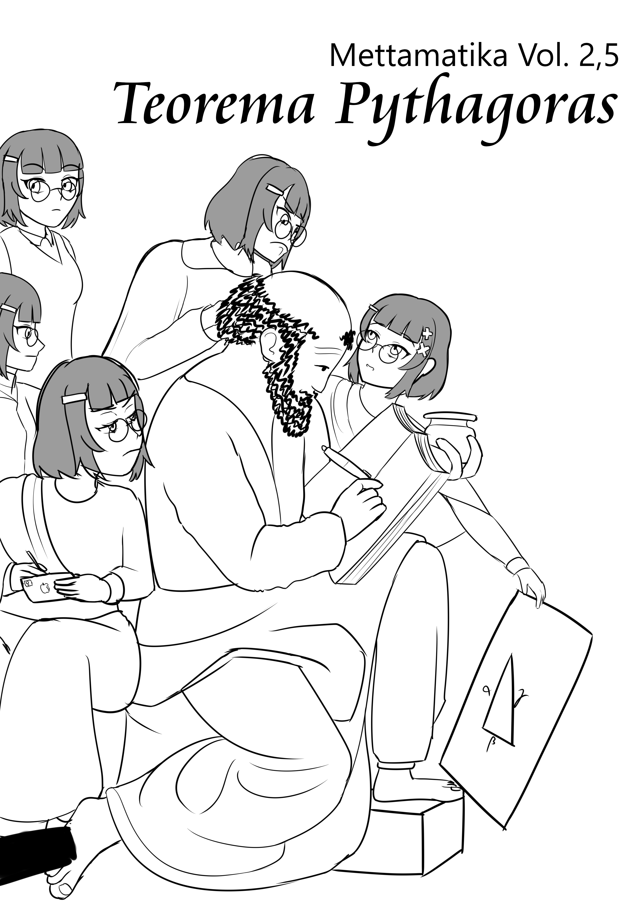
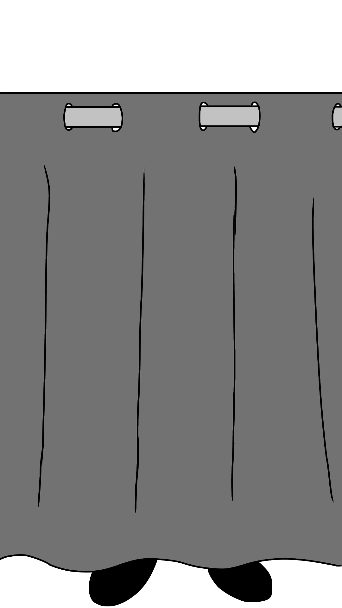
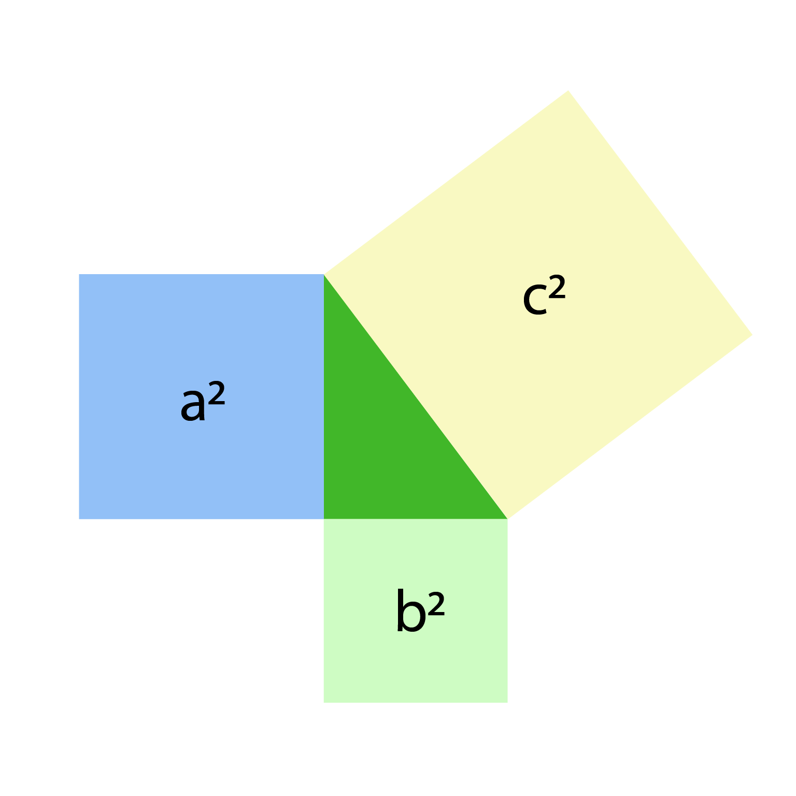
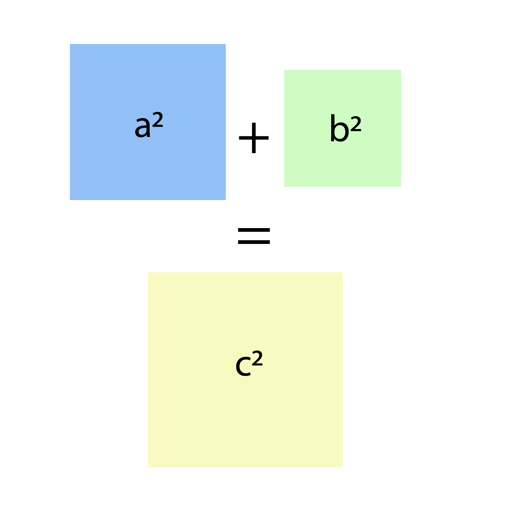
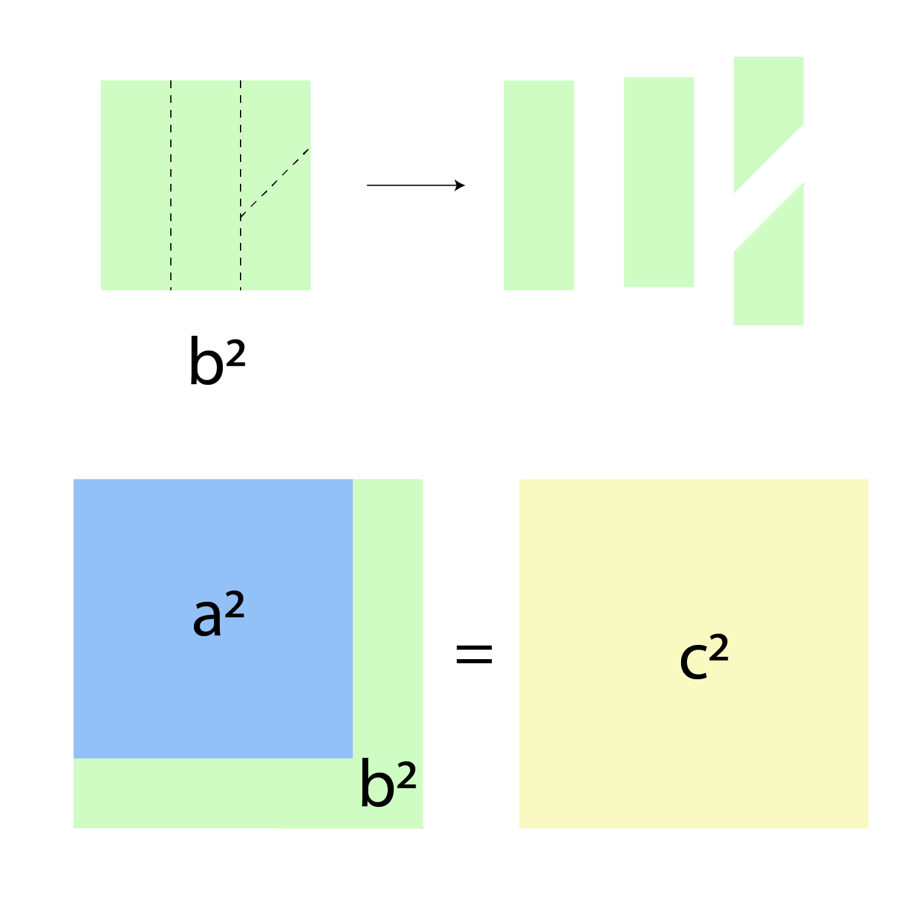
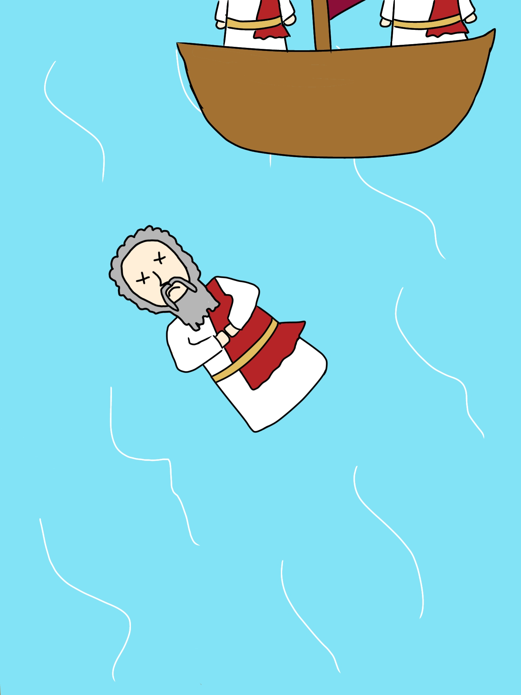

+++
title = "Mettamatika vol. 2,5: Pythagoras Theorem"
date = "2025-11-15"
description = "Mettamatika volume 2,5: Pythagoras Theorem"
tags = [
    "Mettamatika",
    "Mettamatika vol. 2,5",
    "Mettamatika Paruh"
]
+++

**Sinopsis**: Bayangkan kamu menjadi seorang MC anime; punya face card mantap, badan atletis, teman banyak, dan bahkan seorang pacar,
tapi kamu tidak paham Teorema Pythagoras, salah satu teorema geometri paling fundamental yang bahkan anak SD saja tahu. Sangat tidak keren bukan? Oleh karena itu, mari kita mempelajari Teorema Pythagoras dan sejarah dibaliknya!

# Intro

Pada awalnya, aku cukup polos tentang dunia anak SMA
zaman sekarang. Hingga suatu ketika, aku berkenalan
dengan seorang anak SMA zaman sekarang. Tinggi,
badan atletis, teman di sana-sini, dan bahkan punya
seorang pacar. Ya, gambaran sempurna dari karakter
utama kartun Jepang bukan? Hingga saatnya aku belajar
matematika bersamanya. Ketika kami belajar materi
geometri, DIA LUPA TEOREMA PYTHAGORAS!!
Bayangkan, kamu adalah seorang MC anime, dan ketika
mengerjakan matematika, kamu lupa atau bahkan tidak
tahu teorema Pythagoras, teorema sederhana yang
menjadi fondasi geometri?! Aku jamin kamu akan
menjadi no rizz aura -1000 dalam kedipan mata. Bahkan,
kalau aku penulis ceritanya sih, aku akan segera
mencabut titel ‘MC anime’ mu itu. Jadi, sebelum kalian
pergi ke dunia lain dan menjadi MC anime, mari kita ulas
teorema Pythagoras bersama-sama! 

Gambar 1. Gambaran MC Anime yang memahami Teorema
Pythagoras (Paham Teorema Pythagoras tidak membuat hutang
gorenganmu di kantin sekolah auto lunas)

# Sekilas Tentang Pythagoras dan Doktrinnya

Meskipun sejarah terkait ilmuwan ini banyak simpang siur
karena kurangnya bukti peninggalan yang tersisa, tidak
ada salahnya sebelum membahas teoremanya, kita
berkenalan dengan sang penggagas teoremanya terlebih
dahulu. Tak kenal tak sayang bukan?

Pythagoras merasa dirinya adalah seorang filsuf. Dia
adalah seorang yang sangat bijak dan dihormati karena
sifat bijaknya. Lahir dan besar di Samos, sebuah pulau di
Yunani, beliau pun kemudian pergi dari Samos untuk
kabur dari tirani Polycrates dan berkelana dari negara ke
negara untuk menimba ilmu terutama ilmu geometri dan
astronomi. Setelah menimba cukup banyak ilmu, dia pun
mendirikan sekolah di Crotone untuk perkembangan
Magna Graecia dan mengumpulkan banyak murid yang
sangat patuh dan taat padanya.

Di sekolah ini, Pythagoras menanamkan doktrin-doktrin
filosofis yang kuat sehingga sangat amat dipatuhi oleh
pengikutnya. Beberapa di antaranya adalah veganisme,
reinkarnasi, dan yang tidak kalah penting adalah angka
sebagai pondasi kehidupan. Mereka percaya bahwa semua hal di dunia ini dapat diwakili oleh angka dan
angka adalah akar dari segala hal di dunia. Pada
dasarnya mereka percaya bahwa alam semesta bersifat
rasional, terukur, dan dapat dideskripsikan dengan
perbandingan pecahan.

Selain itu, Pythagoras juga mengakui adanya hierarki
dalam berfilosofi. Oleh karenanya, para kandidat yang
mendaftar ke sekolah ini diobservasi terlebih dahulu dari segala aspek kehidupannya, mulai kegiatan sehari-
harinya, hingga hubungan dengan keluarganya. Setelah diterima pun, para murid masih harus menjalani masa
probasi hingga maksimal 5 tahun. Setelahnya, murid
dikelompokkan menjadi dua kelompok, Hearers atau
Akousmatikoi, dan Students atau Mathematikoi,
tergantung dari penilaian selama probasi.

Hearers adalah murid yang hanya dapat mendengar
materi dari Pythagoras tanpa tatap muka. Bukan,
maksudnya bukan belajar daring via Zoom tentu saja, ini
masih abad sebelum masehi. Maksud dari tidak tatap
muka adalah, selama mengajar Pythagoras berada di
balik tirai dan menggunakan pasir yang terhampar
sebagai media untuk menggambarkan atau menuliskan
sesuatu, jadi murid-murid secara harfiah tidak bertatap muka dengan Sang Guru. Beda halnya dengan Students,
mereka konon dapat bertatap muka dengan Sang Guru,
bahkan berdiskusi dengannya. Ya, perbedaan strata
sangat terasa di sini.

Selain pengelompokkan seperti itu, banyak hal lain yang
mungkin terdengar cukup aneh di sekolah ini. Seperti
Pythagoras yang dikabarkan hanya menyebarkan
pelajaran melalui ucapan (inilah salah satu alasan
mengapa bukti sejarah perjalanan hidupnya sangat
jarang ditemui), pengagungan terhadap bilangan rasional
dan perbandingan pecahan, larangan untuk
menyebarkan penemuan baru ke luar lingkungan
sekolah, dan masih banyak lagi peraturan ketat lainnya.
Ya, peraturan sekolah pada masa sebelum masehi masih
jauh lebih ketat dari seleksi wakil presiden di era modern
ini ya. Namun, meskipun seperti itu, banyak orang yang
ingin menjadi pengikut Pythagoras, karena pada
zamannya Pythagoras sudah cukup progresif. Seperti
misalnya, membolehkan wanita untuk bersekolah dan
bergabung dengan sekolahnya ketika pada saat itu
wanita masih dilarang untuk bersekolah.

Gambar 2. Penampilan Pythagoras menurut Hearers (ga keliatan coy)

# Penemuan Teorema Pythagoras

Sekarang, mari kita menuju inti pembahasan, yaitu
teorema Pythagoras. Sebenarnya Pythagoras bukanlah
orang yang pertama kali menemukan teorema ini. Jauh
sebelumnya orang Babilonia, Cina, India telah
menggunakan teorema ini. Namun, Pythagoras terlanjur
dikenal sebagai penemu teorema ini.

Jadi, inti dari teorema itu adalah, jika ada segitiga siku-
siku dengan panjang sisi a, b, dan c, dengan c adalah sisi miringnya, maka sisi-sisi tersebut akan memenuhi
persamaan $(a^2+b^2=c^2)$. Untuk lebih jelasnya, kalian bisa melihat gambar di bawah ini

Gambar 3. Segitiga siku-siku

Gambar di atas adalah gambar segitiga siku-siku dengan
tinggi berukuran a, alas berukuran b, dan berukuran c.
Segitiga siku-siku yang normal kan?
Nah, sekarang, untuk setiap sisi segitiga, dibuat persegi
dengan panjang sisi sesuai dengan sisi segitiga yang
berkaitan seperti gambar berikut.

Gambar 4. Segitiga siku-siku dan persegi berukuran sesuai dengan panjang sisi segitiga yang bersinggungan

Dapat dilihat bahwa persegi yang berada di sebelah kiri
memiliki panjang sisi a yang juga merupakan ukuran dari
tinggi segitiga, sehingga luasnya adalah $(a^2)$. Hal yang sama juga berlaku untuk persegi di bawah segitiga yang bersinggungan dengan alas segitiga, dan persegi di kanan yang bersinggungan dengan sisi miring segitiga.

Dari sini, Pythagoras dapat berteori kalau kuadrat dari masing-masing panjang alas dan tinggi segitiga dijumlahkan, hasilnya akan sama dengan kuadrat dari
sisi miringnya, atau secara matematis dapat ditulis $(a^2+b^2=c^2)$ dengan a dan b adalah sisi alas dan tinggi segitiga siku-siku, dan c adalah sisi miring segitiga tersebut. Harap ingat bahwa kuadrat dari panjang sisi tersebut sama dengan luas persegi yang bersinggungan,
sehingga persamaan tersebut dapat kita gambarkan sebagai berikut.

Gambar 5. Ilustrasi dari persamaan Pythagoras

Mungkin di antara kalian masih ada yang belum yakin kalau jumlah luas persegi $(a^2)$ dan $(b^2)$ akan sama dengan luas persegi $(c^2)$. Oleh karena itu, mari kita buktikan kalau jumlah luas persegi itu sama.

Gambar 6. Pembuktian teorema Pythagoras

Pada Gambar 6, persegi $(b^2)$ dipotong-potong sebagaimana digambarkan, setelahnya, potongan-potongan itu diputar dan dibalik sehingga dapat membentuk persegi yang lebih besar bersama dengan
persegi $(a^2)$. Nah, persegi baru ini besarnya akan sama dengan besar persegi $(c^2)$.

Nah, itu lah teorema Pythagoras, sederhana bukan? Tapi, meskipun sederhana, ini adalah pondasi penting
dari ilmu geometri. Seperti yang kalian ketahui, segitiga siku-siku dapat kita temui di mana mana. Atap, dudukan
handphone, tenda, dan masih banyak lagi. Dari banyaknya segitiga siku-siku di sekitar kita, kalian paham kan seberapa pentingnya teorema ini? Oleh karenanya,
setelah Pythagoras menemukan teorema ini, saking bahagianya, dia mengadakan syukuran dengan berkurban 100 sapi. Alhamdulillah akhirnya ada teorema
Pythagoras.

Gambar 7. Ilustrasi syukuran di sekolah Pythagoras dalam rangka
telah ditemukannya teorema Pythagoras (Pythagoras di balik tirai seperti biasa)

“Huh? Berkurban? Bukannya tadi dibilang dia vegan ya?”
Mungkin di antara kalian ada yang masih ingat filosofi Pythagoras yang dibahas sebelum ini dan bertanya-
tanya.

Nah, terkait hal ini, ada sumber yang menyatakan kalau Pythagoras memang benar-benar berkurban, namun
beberapa sumber lainnya menyatakan kalau pernyataan itu tidak bermakna sebenarnya, karena Pythagoras merupakan seorang vegan. Jadi, silakan percayai apa
yang ingin kalian percayai.

# Bilangan Irasional

Kalau kalian pikir sekolah Pythagoras semakin jaya setelah ditemukannya teorema tersebut, maka kalian salah. Tanpa diduga-duga, ternyata penemuan teorema
Pythagoras ini juga merupakan gerbang krisis dari sekolah tersebut. Coba kalian bayangkan sebuah segitiga siku-siku yang panjang alas dan tingginya masing-masing 1. Berapa sisi miringnya? Kalau kalian
baca bab sebelumnya, tentu saja kalian akan menemukan panjang sisi miringnya √2.

Nah, dari perhitungan tersebut kalian sudah sadar kan
kalau ini merupakan suatu hal yang gawat? Uh, belum?
Oke, mari kita ingat bahwa sekolah ini sangat
mengagungkan bilangan rasional. Sementara, mari kita
telaah lagi, apakah √2 merupakan bilangan rasional?
Apakah √2 dapat diekspresikan dengan pecahan? Ya,
jawaban dari kedua pertanyaan itu adalah bukan.

Penemuan ini melawan filosofi Pythagoras bahwa alam
semesta bersifat rasional dan dapat diekspresikan
dengan perbandingan pecahan. Sehingga, tidak lama
setelah penemuan segitiga siku-siku, sekolah ini
mengalami kekacauan hingga dirumorkan bahwa salah seorang murid Pythagoras bernama Hippasus
ditenggelamkan di Laut Mediterania karena
membocorkan penemuan ini.

Gambar 8. Hippasus yang mati tenggelam di Laut Mediterania
(hanya ilustrasi, bukan gambar sebenarnya)

# Penutup

Ya, kurang lebih seperti itulah kisah tentang Pythagoras
dan teoremanya. Meskipun sejarahnya tidak bisa
dipastikan kebenarannya karena, kembali lagi,
kurangnya peninggalan sejarah yang tersisa (mungkin
kita harus salahkan Pythagoras yang tidak suka menulis),
tidak dapat dipungkiri teorema ini merupakan teorema
fundamental bagi perkembangan ilmu geometri.

Akhir kata, terima kasih telah membaca racauan
pembahasan terkait teorema Pythagoras ini, mohon maaf
atas salah kata yang ada, dan selamat menjadi MC di
kehidupan masing-masing!

# Daftar Pustaka
1. The Pythagorean Sourcebook and Library: An Anthology of Ancient Writings Which Relate to
Pythagoras and Pythagorean Philosophy. (2025). United
States: Red Wheel Weiser.
2. Maor, E. (2010). The Pythagorean Theorem: A
4,000-Year History. United Kingdom: Princeton
University Press.

Mettamatika vol. 2,5

Tim:
* adriantom9
* Furra
* Rubi
* AuvioraA
* sekarjoget
* Blabyblab

Mettamatika vol. 2,5 – Teorema Pythagoras

Text: AuvioraA

Illustration: AuvioraA, sekarjoget

Cover: adriantom9

Spearhead Circle @ M-02/03 Comic Frontier 21